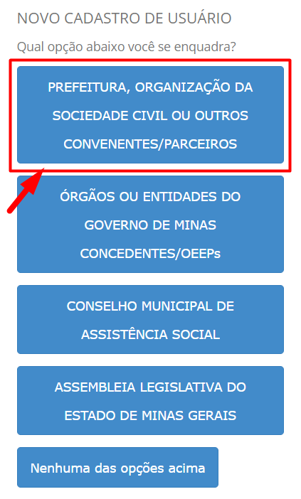

# Consulta de informações e relatórios

Os remanejamentos e indicações realizados podem ser consultados nas próprias telas em que foram solicitados, mas o SIGCON-SAÍDA permite a visualização concisa dessas informações em relatórios. Os relatórios podem ser acessados a partir do menu “Emendas” &gt; “Relatórios”, conforme a imagem abaixo:

## **Lista de Incisos**

O relatório “Lista de Incisos” exibe todos os incisos do parlamentar, discriminando o seu valor inicial, o seu valor após os remanejamentos para outros incisos, e o montante indicado. Diversos filtros podem ser utilizados na geração do relatório, caso o usuário deseje visualizar somente os incisos de um determinado órgão, por exemplo.

**O usuário pode gerar o relatório em PDF, para impressão, ou em CSV, caso deseje trabalhar os dados no excel.**

## **Lista de Remanejamento de Incisos**

O relatório “Lista de Remanejamento de Incisos” exibe as solicitações de remanejamento realizadas, exibindo as informações tanto do inciso de origem e quanto da solicitação. O relatório em CSV também apresenta os dados do usuário que solicitou o remanejamento e da data e horário em que as solicitações foram realizadas.

## **Lista de Totalização**

Pode ser que o parlamentar possua vários incisos na mesma unidade orçamentária, com a mesma ação e com o mesmo grupo de despesa. O relatório “Lista de Totalização” exibe a soma dos valores dos incisos de acordo com esses critérios, permitindo uma visualização mais abrangente de como os recursos de emenda do parlamentar estão distribuídos.

## **Lista de valores indicados**

O relatório “Lista de valores indicados” exibe todas as indicações encaminhadas pelo parlamentar. Vale ressaltar que, as indicações que foram canceladas pelo usuário, reprovadas pelo órgão para o qual foram indicadas, ou retornadas para ajuste do tipo de atendimento só serão exibidas no relatório se esta opção estiver selecionada.

**Selecionar esta opção para que sejam exibidas as indicações canceladas/reprovadas/retornadas.**

**O relatório em CSV também contém os dados do usuário responsável pela aprovação ou reprovação da indicação, a data em que ela foi aprovada ou reprovada, e a justificativa nos casos de reprovação.**

O “Relatório de Valores Indicados” é muito útil para acompanhar o andamento das indicações realizadas, pois permite a visualização em uma única interface de todas as indicações que ainda precisam ser aprovadas. Além disso, como a data de aprovação e reprovação das indicações é um fator determinante para a disponibilidades dos recursos em futuras indicações e remanejamentos, vale a pena conferir o relatório em CSV, já que ele exibe essas datas, bem como o usuário responsável e a justificativa de reprovação, conforme o caso.

