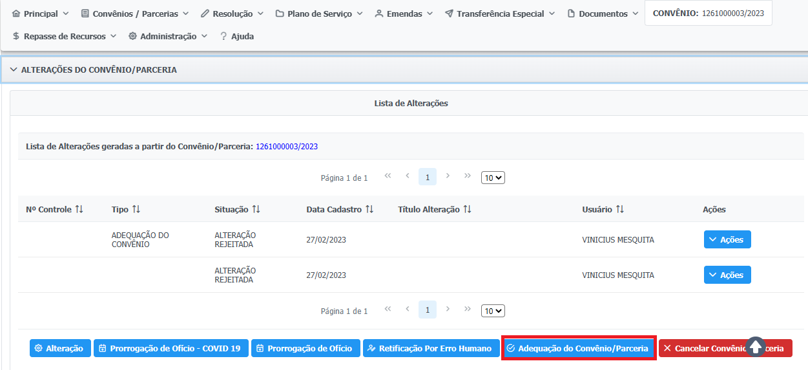

# Adequação de Concedente no SIGCON


Essa opção deve ser utilizada SOMENTE para os órgãos e entidades estaduais que eventualmente não tenham efetuado a Adequação do Concedente no prazo previsto no art. 141 da Lei Estadual nº 23.304/2019


Uma vez que os instrumentos e saldos de órgãos e entidades extintos foram migrados pelo SIAFI na mudança do exercício (Tabela de Conversão de Unidades), os convênios e parcerias também precisam ser adequados no Sigcon-MG – Módulo Saída em conformidade com a migração já realizada no SIAFI. Portanto, as alterações no Sigcon-MG – Módulo Saída devem ser realizadas em conformidade com a conversão já realizada no SIAFI (Tabela de Conversão de Unidades anexa), sob pena de inviabilizar a posterior publicação de termos aditivos e outras alterações, empenhos, liquidações e pagamentos.


Tabela de Conversão de Unidades


## Cadastramento


**Perfil necessário:** Analista Técnico e Responsável pela Publicação no órgão de origem e de destino do instrumento.


**1.** Expanda a aba “Alterações do Convênio/Parceria” e clique em `“Adequação do Convênio/Parceria”`:

<figure><figcaption></figcaption></figure>

**2.** Preencha os dados e clique em `“Salvar e Encaminhar para Aprovação”`:

<figure><figcaption></figcaption></figure>

<figure><figcaption></figcaption></figure>

<figure><figcaption></figcaption></figure>

**3.** Clique em `“Sim”` no _pop-up_ de confirmação:

 (1).png>)

## Aprovação


**Perfil necessário:** Encaminhador ou Ordenador do órgão de origem e de destino do instrumento.


**1.** Para a aprovação da Adequação, clique em `“Refletir no SIGCON”`:

.png>)

**2.** Clique em `“Sim”` no _pop-up_ de confirmação:

.png>)

**3.** A Adequação do Convênio mudará para o status **“VIGENTE”** e o processo será concluído:

.png>)
