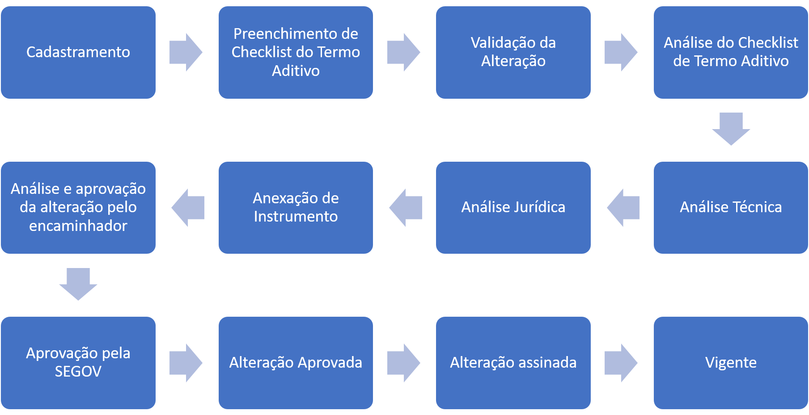

# Termo Aditivo

## Criar um Termo Aditivo

**1.** Para criar uma alteração, expanda a aba `"Alterações do Convênio/Parceria"` do instrumento em situação de Convênio/Parceria e clique em "Alteração":


**Perfil necessário**: Cadastrador.


.png>)

As alterações cadastradas serão exibidas na "Lista de Alterações", informando dados do cadastro, data, usuário que cadastrou, o status da alteração do convênio e o tipo de alteração do convênio.&#x20;


O sistema só permitirá a **criação de uma nova alteração** do Convênio se não houver outra alteração cadastrada ou se as alterações anteriores tiverem sido concluídas ou canceladas.


**3.** O [SIGCON Saída](http://sigconsaida.mg.gov.br/) irá criar novo registro de alteração com uma cópia idêntica às informações já preenchidas no Convênio:


**Altere somente as informações que necessitam de modificação** e mantenha inalteradas as que não precisarem.


.png>)

**3.** Contudo, não são todos os campos do convênio que podem ser alterados fazendo-se um **Termo Aditivo**. São eles:

* **Identificação do Concedente:** são as informações do Órgão Concedente. O Convenente não precisa se preocupar com o preenchimento dessa seção, mas podem ocorrer mudanças nos dados do Representante Legal do Concedente, conforme os usuários do Concedente necessitem alterá-los.
* **Razão social e CNPJ do Órgão Concedente**: estão bloqueados e não há a opção para pesquisar outro CNPJ (como no cadastro da [Proposta de Plano de Trabalho](broken-reference)). Se houver a necessidade de trocar o Órgão Concedente, a operação deve ser realizada por meio da "[Transposição](adequacao/)".
* **Identificação do Convenente:** estão preenchidos conforme o registro no [CAGEC ](https://www.portalcagec.mg.gov.br/)e também estão bloqueados. Os que não estão bloqueados para preenchimento são dados que não foram preenchidos no CAGEC. Caso ocorra alguma mudança nos dados do Convenente, **a alteração deve ser realizada no CAGEC**. Após realizar a alteração no [CAGEC](https://www.portalcagec.mg.gov.br/), é necessário clicar no ícone de lupa (ao lado do CNPJ do convenente) para que o sistema atualize as informações do CAGEC no Convênio.

### Tipo de Atendimento

Um novo "Tipo de Atendimento" poderá ser cadastrado no **Termo Aditivo**, mas é necessário que o Convenente esteja atento às restrições do art. 51, §1º, do Decreto Estadual nº 46.319/2013:

> “É vedada a alteração do objeto do Convênio de Saída e do respectivo Plano de Trabalho que resulte na **modificação do núcleo da finalidade do convênio**”.

Embora o sistema não identifique se a alteração provoca ou não a modificação do núcleo da finalidade do convênio, esta análise é feita pelo Órgão concedente durante a [Análise Técnica](broken-reference).

**1.** Expanda a aba "Caracterização da Proposta" da Alteração do Convênio e encontre a seção "Tipo de Atendimento". Selecione os campos de Gênero, categoria e especificação. Clique em `"+ Incluir"`:

.png>)

**2.** A "Lista de tipos de atendimento" deve ser modificada se for necessário alterar os valores do Convênio, como para aumentar ou diminuir o repasse do Concedente, a Contrapartida ou incluir valores de saldo em conta e rendimentos. Clique no ícone de lápis da coluna `"Editar"`:

.png>)

**3**. Será exibida a tela para edição dos valores. Preencha os campos conforme e a necessidade e clique em `"Salvar".`


Para **reduzir** algum valor, digite o valor com o símbolo de "-"


**4.** Se necessário alterar a "Vigência" do Convênio, preencha o campo “Proposta de vigência” com o total de dias que o Convênio terá **após** o aditivo, ou seja, o número de dias da **vigência inicial do convênio MAIS o número de dias que serão acrescidos**.&#x20;

.png>)

## **Alterar vigência**

Se necessário alterar a "Vigência" do Convênio, preencha o campo “Proposta de vigência” com o total de dias que o Convênio terá **após** o aditivo, ou seja, o número de dias da **vigência inicial do convênio**: **MAIS o número de dias que serão acrescidos**.&#x20;

.png>)

## **Salvar e Encaminhar Alterações**

**1.** Após realizar corretamente as devidas alterações, clique em `“Salvar e encaminhar alterações”` no final da página:

.png>)


Para que as alteração do Convênio sejam enviadas para o Órgão Concedente, é necessário que o **Responsável Legal do Convenente aprove** antes.


## Trâmite do Termo Aditivo


Para que o concedente/OEEP analise o checklist, é essencial que o Responsável Legal assine e encaminhe a documentação.


1. **Cadastramento:** Situação inicial do termo aditivo, no qual o usuário alterará os campos desejados. Nesse momento, a alteração ainda não é um termo aditivo, pois o sistema só identifica a alteração do convênio como um termo aditivo após o encaminhamento para validação do responsável legal, e somente se for alterado algum campo que não esteja incluído no rol de exceções que configuram alterações simples. Veja quais são esses campos na seção [**Alteração Simples**](alteracao.md).
2. **Preenchimento de Checklist de Termo Aditivo:** O usuário deve inserir todos os documentos obrigatórios e outros (quando orientado dessa forma). Depois clicar no botão abaixo:

&#x20;

1. **Validação da Alteração:** O Responsável Legal da instituição convenente (Prefeitos ou Presidentes de entidades) analisam o pedido de alteração e a encaminhem para o órgão concedente. É a última etapa de responsabilidade do convenente, as demais etapas são executadas pelo órgão concedente. O Responsável Legal deve acessar o termo aditivo e depois clicar no botão abaixo:

1. **Análise do Checklist de Termo Aditivo:** Nesta etapa o órgão concedente verificará se o convenente encaminhou todos os documentos necessários para a alteração do convênio. A documentação exigida varia conforme o objeto do convênio – se é uma obra, ou a aquisição de bens, ou a execução de um serviço, ou a realização de um evento – e o tipo de convenente – prefeitura ou entidade. Você pode consultar os checklists para a alteração de convênios no portal.&#x20;
2. **Análise Técnica:** Análise técnica do concedente sobre os critérios técnicos da alteração do convênio proposta pelo convenente.
3. **Anexação do Instrumento**: caso ainda não tenha sido inserido o Termo do Instrumento, neste status isso deve ser feito.
4. **Análise Jurídica:** Análise Jurídica do concedente sobre o cumprimento dos requisitos legais para a celebração do termo aditivo.
5. **Análise e aprovação da alteração pelo encaminhador:** O usuário encaminhador é último à tramitar o termo aditivo no órgão concedente, é ele o responsável por encaminhar o termo aditivo para análise da SEGOV.
6. **Aprovação da SEGOV** (SEGOV – Designação do plano de trabalho, Análise e emissão de parecer, aprovação do plano de trabalho)**:** Análise da alteração do convênio, conforme estipulado no art. 6º do Decreto Estadual nº 46.281/2013.
7. **Alteração Aprovada:** Depois que o termo aditivo é aprovado pela SEGOV, resta apenas assina-lo e publica-lo, essa etapa é para que seja preenchida a data de assinatura do termo aditivo.
8. **Alteração Assinada:** Depois que o termo aditivo foi assinado pelas partes, resta apenas publica-lo, esta etapa é justamente para que o usuário preencha a data em que o convênio foi publicado no Diário Oficial do Estado de Minas Gerais.&#x20;
9. **Vigente:** Depois de publicado, o termo aditivo está vigente, as alterações feitas serão aplicadas ao convênio.


