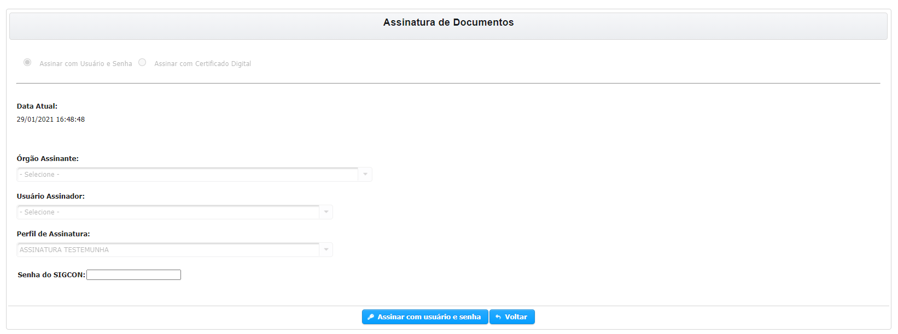

# PROCESSO DE ASSINTURA - Convenente

Prezados, agora com o **PROCESSO ELETRÔNICO** sendo cadastrado no SIGCON - Saída é necessário que o **REPRESENTANTE LEGAL** e uma **TESTEMUNHA** assine com Login e Senha o Plano de Trabalho.

## ASSINAR COMO TESTEMUNHA


**PRÉ-REQUISITO:** O usuário pode ter qualquer perfil no sistema desde que não seja Responsável Legal do Convenente nem Representante Legal do Concedente e o Plano de Trabalho deve estar em Status de PROCESSO DE ASSINATURA - CONVENENTE.

O usuário também deve ter permissão de Assinar com Login e Senha \([SOLICITAR ASSINATURA LOGIN e SENHA](../../processo-eletronico/solicitar-assinatura-login-senha.md)\)


**PASSO 1** - Após entrar no Plano de Trabalho que esta no Status de **PROCESSO DE ASSINATURA - CONVENENTE**, você deve ira para parte inferior da tela e clicar no botão  .

> Você somente poderá assinar como testemunha apenas uma vez.

**PASSO 2** - Na tela que se abre você deve digitar novamente sua senha e clicar em **ASSINAR COM USUÁRIO E SENHA.**

## ASSINAR COMO RESPONSÁVEL LEGAL


**PRÉ-REQUISITO:** O usuário deve ter o Perfil de Responsável Legal do Convenente e o Plano de Trabalho deve estar em Status de PROCESSO DE ASSINATURA - CONVENENTE.


**PASSO 1** - Após entra no Plano de Trabalho que esta no Status de **PROCESSO DE ASSINATURA - CONVENENTE**, você deve ira para parte inferior da tela e clicar no botão \[**ASSINAR CONVÊNIO/PARCERIA - Convenente\]**

Após a assinatura no Instrumento o Plano será encaminhado para o **Concedente** para assinatura e continuidade do processo.

