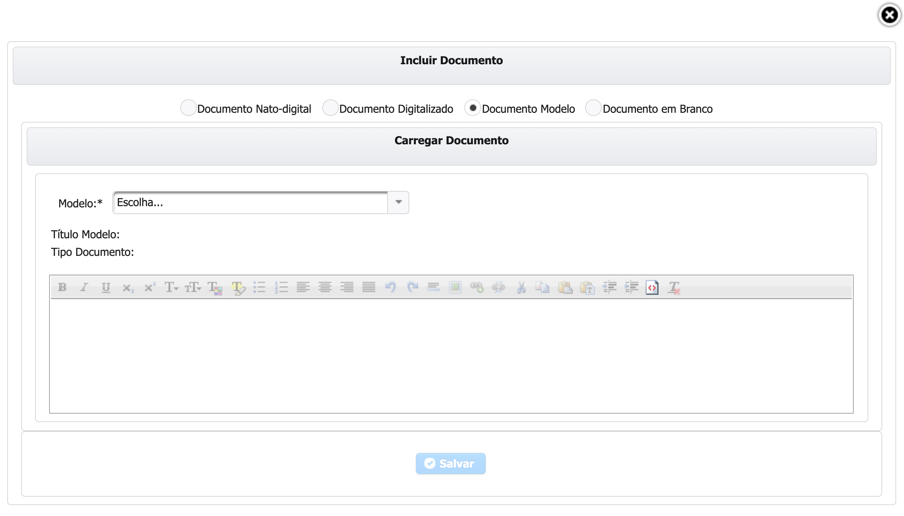

# Documento Modelo

Selecionar a opção de **Documento Modelo.**

Na opção de Inserir documento proveniente de um **Modelo** basta você selecionar o Modelo que deseja que ele será carregado para posterior edição, podendo ser alterado na maneira que desejar.

Após o preenchimento dos campos obrigatórios clicar em   e verificar se o sistema exibe mensagem de sucesso.  . Após exibir a mensagem de Sucesso você ja pode voltar ao fluxo anterior que o Documento ja aparecerá em **Documentos Anexados.**

