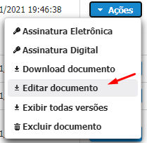
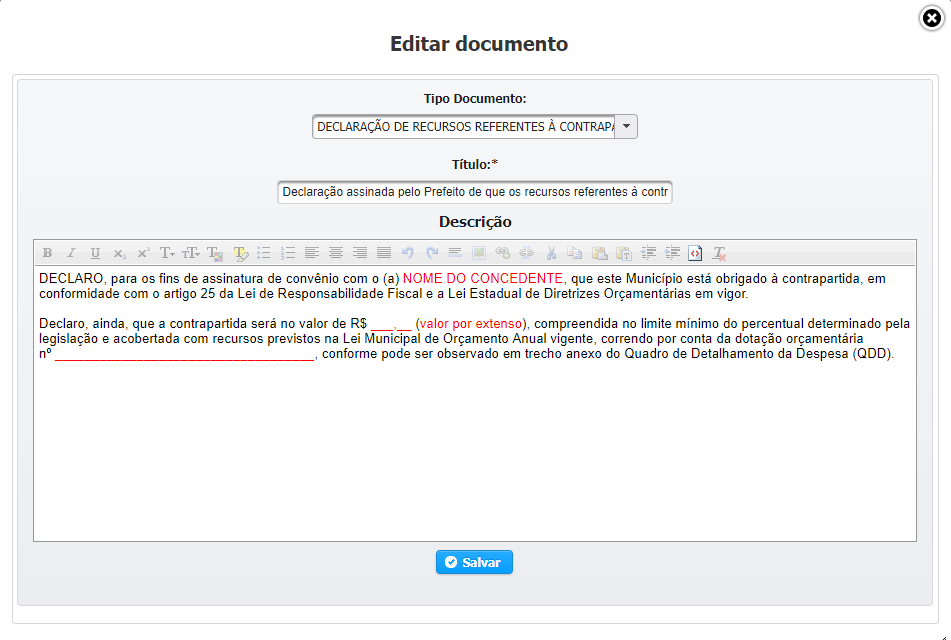

# Documento Modelo

## INSERIR DOCUMENTO DE UM MODELO

Selecionar a opção de **Documento Modelo.**

Na opção de Inserir documento proveniente de um **Modelo** basta você selecionar o Modelo que deseja que ele será carregado para posterior edição, podendo ser alterado na maneira que desejar.

Após o preenchimento dos campos obrigatórios clicar em   e verificar se o sistema exibe mensagem de sucesso.  . Após exibir a mensagem de Sucesso você ja pode voltar ao fluxo anterior que o Documento ja aparecerá em **Documentos Anexados.**

## EDITAR DOCUMENTO MODELO

Para edição do Documento inserido basta você localizar o Documento na Listagem de Documentos anexados, Clicar no botão de **AÇÃO** e **EDITAR DOCUMENTO**  

Na tela que se abre basta você realizar as alterações necessárias e clicar em  para salvar suas alterações.

> OBS 1: Somente é permitido **EDITAR** um documento anexado em Proposta quando a mesma encontra-se no Status de **Cadastramento.**
>
> OBS 2: Caso o Documento  tenha sido Assinado \([Assinar Documento](assinar-documento.md)\) anteriormente, o sistema irá perguntar, ao SALVAR, se você deseja que as Assinaturas sejam Invalidadas; sempre que você edita um Documento ja Assinado o mesmo perde as Assinaturas realizadas anteriormente.

## EXCLUIR DOCUMENTO

