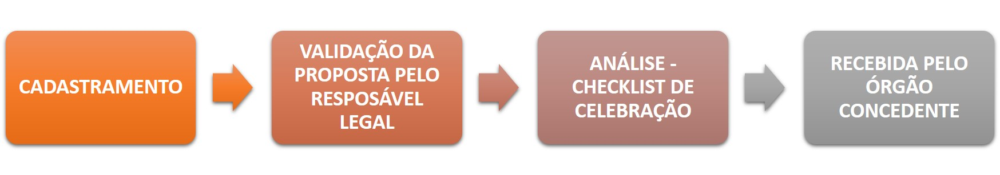

# CRIAÇÃO DE PROPOSTA DE PLANO DE TRABALHO

### A proposta de plano de trabalho é o documento a ser apresentado à Administração Pública do Poder Executivo Estadual pelo interessado em celebrar convênio de saída, contendo, no mínimo, os dados necessários à avaliação do programa, projeto, atividade, inclusive reforma ou obra, serviço, evento ou aquisição de bens



Conforme art. 7º da Resolução Nº 004/2015, Parágrafo único: **Não poderá preencher proposta de Plano de Trabalho o interessado que estiver com registro de inadimplência no Sistema Integrado da Administração FInanceira – SIAFI-MG – ou apresentar irregularidade no Cadastro Geral de Convenentes – CAGEC** , salvo exceções previstas na Lei de Diretrizes Orçamentárias.


