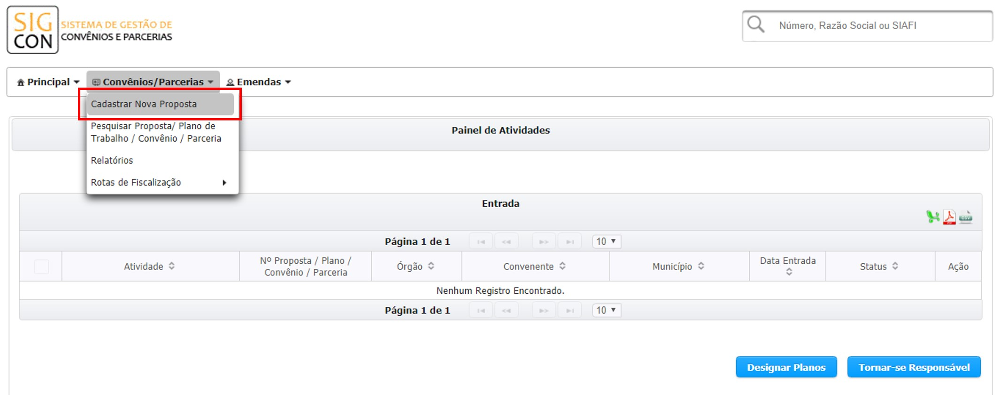
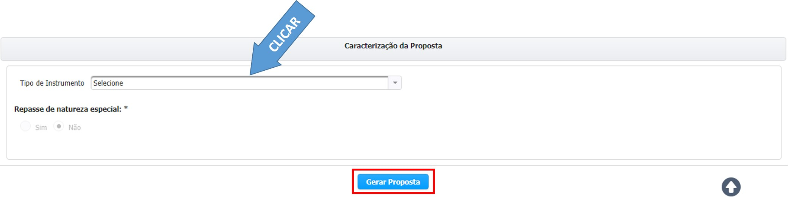
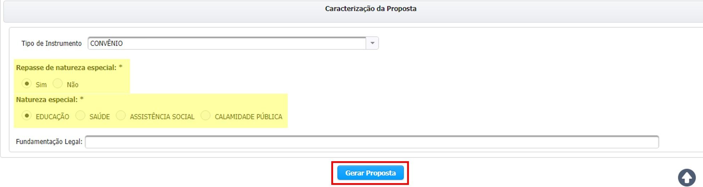

# CADASTRAMENTO

Após entrar no sistema, clique no menu "Convênios" e na opção de "Cadastrar Nova Proposta de Plano de Trabalho"

## Agora, você está na criação da proposta.

Concedente é o órgão ou entidade pertencente à Administração Pública Estadual de Minas Gerais responsável pela liberação dos recursos e análise da viabilidade técnica e jurídica do convênio. Ele também é o responsável pelo acompanhamento e fiscalização da execução do objeto conveniado, bem como pela aprovação da prestação de contas dos recursos utilizados

> **Passo-a-passo**
>
> 1. Escolha o concedente/órgão ou entidade parceira.
> 2. Na aba de "Identificação do Convenente/OSC Parceira", insira o CNPJ da instituição que irá receber os recursos. Caso não saiba o CNPJ, faça uma pesquisa clicando no ícone de

### Pesquisa de CNPJ do CONVENENTE


O **Convenente** é a Administração Pública Municipal, a Entidade Sem Fins Lucrativos ou a Entidade Pública responsável pela execução do objeto conveniado.


Após clicar no ícone da lupa, uma caixa "Pesquisa" será carregada na tela

Você pode realizar a pesquisa por parte do CNPJ ou pela Razão Social do convenente. 

Depois, é só clicar em  

Após realizar a pesquisa, serão carregadas as instituições

> **Passo-a-passo**
>
> 1. Após o carregamento das entidades, selecione a desejada. A linha ficará azul, assim como na imagem acima
> 2. Clique no botão 


Para iniciar o preenchimento dos dados, é necessário que o Convenente já esteja cadastrado e com status REGULAR no CAGEC.


A mensagem de atenção na imagem acima é muito importante. 

Poderá ser cadastrada uma Proposta mesmo o Concedente estando BLOQUEADO no CAGEC caso ele se enquadre em um Tipo de Repasse Especial: **Educação, Saúde, Assistência Social, Calamidade Pública ou Repasse MGI – Calamidade Pública**


A única informação que não é obrigatória e que pode ser alterada ao ser importada do CAGEC é a data de vencimento do mandato do Responsável Legal e o Cargo.

Complete essas informações e prossiga


Caso algum dado esteja incorreto, siga as orientações do Manual de Utilização do CAGEC - [https://manual.portalcagec.mg.gov.br/atualizacoes/atualizacao-de-dados](https://manual.portalcagec.mg.gov.br/atualizacoes/atualizacao-de-dados)

Após a atualização voltar nessa tela e clicar novamente na lupa para carregar os dados novamente 


Por fim, selecione o "Tipo de Instrumento" e Clique em  

### Caso o Convenente permita Repasse de Natureza Especial e for o caso da proposta a ser gerada, selecione o tipo de instrumento e marque "sim" na opção de repasse e selecione, em seguida, a natureza especial. 

#### É muito importante, também, digitar a Fundamentação Legal

Seguiremos para o preenchimento da proposta!

