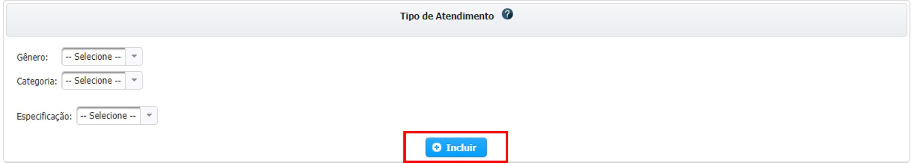

# Caracterização da Proposta - CONVÊNIO

## Caracterização da Proposta


**TÍTULO:** Campo obrigatório onde deve ser digitado a Finalidade Macro do Convênio

**REPASSE DE NATUREZA ESPECIAL:** Caso o convênio a ser celebrado se enquadre no Parágrafo 3º Art. 25 da LRF, deverá ser marcado a opção desejada, inserindo a respectiva **Fundamentação Legal**   


**ORIGEM DOS RECURSOS:** Deverá ser informada neste momento de onde os Recursos são provenientes

## Lista de Emendas Parlamentares

Caso for um repasse de “Emenda Parlamentar”, deverá ser marcado o “sim"

Se não for repasse de “Emenda Parlamentar”, basta marcar como “não” e dar prosseguimento na Proposta.

  
 Após ser selecionado “sim” o sistema exibirá lista ordenada por Tipo de Atendimento contendo os valores disponíveis para utilização em seguida basta clicar no ícone de   **Expandir**    ****para utilizar o valor da emenda

Após ter clicado em Expandir abrirá tela onde conterá a lista de Valores a serem Utlizados separado por Responsável da Indicação


Para utilizar o Valor na Proposta de Plano de Trabalho, deverá ser clicado em **Editar** para abrir opção onde deverá ser digitado o valor desejado


Após ser digitado o valor você deverá clicar no ícone CHECK para ser validado e salvo o valor.

Para sair basta clicar no ícone de SAIR no campo superior direito.

Somente aparecerá recursos de emendas caso o próprio recurso já esteja APROVADO e DISPONÍVEL para utlização. Você podera consultar em quais Propostas ou Planos de Trabalhos tenham sido utilizados os recursos da Emenda específica bastando clicar na lupa da Coluna de Saldo

Caso queira saber todas as Emendas disponíveis para o Convenente específico da Proposta basta clicar em Visualizar Indicações que você será direcionado para tela de consulta das indicações

Para mais informações sobre recursos de “Emenda Parlamentares” por gentileza procurar o Parlamentar que indicou o recurso.

## Contrapartida


Caso tenha selecionado **Contrapartida** na Origem de Recursos,você deverá inserir a "Dotação Orçamentária de Contrapartida Financeira" e o "Valor". Depois, clique em salvar

### Lista de Dotações Orçamentárias


Enquanto a proposta estiver no Status de **CADASTRAMENTO** você poderá editar ou excluir as dotações adicionadas bastando clicar nos respectivos botões de **Ação** na tabela de **Lista de Dotações Orçamentárias**

## Tipo de Atendimento

O tipo de atendimento descreve, em resumo, quais serão os atendimentos realizados no Convênio, divididos em três níveis, Gênero, Categoria e Especificação



* Reforma ou Obra
* Serviços












 Para adicionar o Tipo de Atendimento comece selecionando o Gênero, depois a Categoria e posteriormente a Especificação, clicando em **Incluir**


Caso você tenha utilizado algum recurso de Emenda, já virá listado o Tipo de Atendimento proveniente da Emenda, podendo ser alterado apenas os valores de Interveniente e Contrapartida.




Se não encontrar o Tipo de Atendimento que se enquadre, você deverá entrar em contado com o Concedente do Convênio e solicitar mais informações.



Após adicionar o Tipo de Atendimento ele aparecerá na **Lista de Tipos de Atendimento**, para inserir os valores respectivos as Origens de Recursos anteriormente selecionada basta clicar no ícone   e as opções estarão disponíveis.

## Endereço da obra ou local do evento, de prestação de serviço ou de entrega do bem \(dependendo do objeto\)


Para procurar por CEP o endereço basta digitar o número do mesmo no espaço apropriado e clicar em BUSCAR.

Para localizar a Latitude e Longitude, é necessário ter preenchido o campo de Número/KM\* e clicar em Buscar Coordenadas por Endereço. Após ter preenchido os campos basta clicar em SALVAR ENDEREÇO para adicionar o endereço na Lista de Endereços do futuro Convênio.

### Lista de Endereços

A Justificativa Fundamentada deve

## Pessoas Beneficiadas Diretamente


Na caixa "Descrição" escolha o tipo de pessoas beneficiadas pelo convênio

 Logo em seguida, digite a “Quantidade” de pessoas beneficiárias

## Vigência


Campo destinado ao número de dias “próximo a realidade”, do tempo necessário para a execução completa do objeto do Convênio,

## Conta Específica



Preencher todos os campos corretamente. A correta informação da conta, facilita o pagamento rápido e correto do convênio/parceria.


## Equipe executora do Convênio/Parceria de saída


Preencher como se pede, os campos referentes a “Equipe executora do Convênio/Parceria. Digitar as Obrigações dos intervenientes, somente se houver

Responsável pela documentação de celebração e termos aditivos

Responsável pelo monitoramento da execução do Convênio/Parceria de saída

Responsável pela prestação de contas

