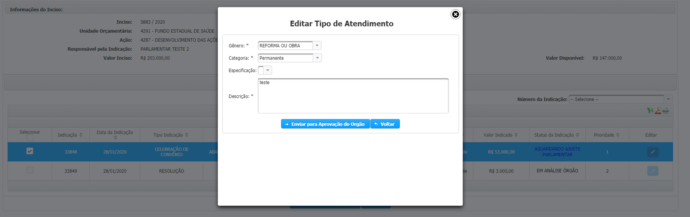

# Ajuste do Tipo de Atendimento


O **ajuste de indicações** é um procedimento limitado às indicações de emenda parlamentar do tipo **"Instrumento Jurídico"**  que são

* Celebração de Convênios/Parceria
* Termos de Fomento
* Termos de Colaboração


Para ser realizado, o parlamentar precisa entrar em contato com o órgão ou entidade gestora da emenda.   
  
O órgão ou entidade gestora deverá avaliar a necessidade da correção da categoria e da especificação do tipo de atendimento em conformidade com a documentação apresentada. Estando, de acordo com o ajuste, o órgão ou entidade gestora deverá desvincular a indicação do plano de trabalho e solicitar à SCGI o retorno da indicação. 

Retornada a indicação, o órgão ou entidade gestora deverá clicar em "Retornar indicação\(ões\) para Ajuste Parlamentar".  A indicação ficará no status **AGUARDANDO AJUSTE PARLAMENTAR** e o parlamentar poderá proceder com a modificação da categoria e da especificação do tipo de atendimento conforme os procedimentos contidos neste manual até a data especificada na ultima resolução Segov publicada, que pode ser conferida no seguinte link [http://www.sigconsaida.mg.gov.br/emendas/](http://www.sigconsaida.mg.gov.br/emendas/) na aba legislação.  
  
Posteriormente, o órgão ou entidade gestora e a SCGI deverão realizar nova aprovação da indicação, com o novo tipo de atendimento.   
  
Aprovada a indicação com o novo tipo de atendimento, ela deve ser novamente vinculada no plano de trabalho.


**Conforme art. 1º, inciso IV, da Lei nº 23.648/2020, e art. 15 da Resolução SEGOV nº 743/2020 \(alterada pela Resolução SEGOV nº 755/2020\), o prazo para a realização de \*ajuste de categoria e especificação de tipo de atendimento de indicações no SIGCON para Celebração de Convênio/Parceria** de emendas parlamentares impositivas, inclusive indicações Covid-19, termina dia 22/06/2020.


O ajuste permite a mudança da categoria e da especificação do tipo de atendimento de indicações aprovadas para Celebração de Convênios/Parcerias, desde que mantido o grupo de despesas, a ação orçamentária e o beneficiário. Essa mudança permite compatibilizar a indicação com a documentação entregue.   
  
Portanto, até o dia 22/06/2020, seria possível a modificação de tipos de atendimento indicados pelos parlamentares e blocos, por exemplo:   
  
**1\)**  “REFORMA OU OBRA - Construção - Prédio Público” para “REFORMA OU OBRA - Reforma - Mercado Municipal”;   
**2\)**  “REFORMA OU OBRA - Pavimentação- Via urbana” para “REFORMA OU OBRA - Calçamento - Via urbana”; **3\)**”AQUISIÇÃO DE BENS - Permanente - Mobiliário” para “AQUISIÇÃO DE BENS - Permanente - Equipamento de Informática”   
**4\)** “AQUISIÇÃO DE BENS - Consumo - Gêneros Alimentícios” para “AQUISIÇÃO DE BENS - Consumo - Kit emergencial”.

## Premissas para o ajuste de indicações

Os órgãos são responsáveis por retornar as indicações para os parlamentares no SIGCON-SAÍDA para que sejam realizados os ajustes, afinal, os órgãos são responsáveis por verificar a ocorrência de impedimentos de ordem técnica e o ajuste só pode ser realizado com anuência deles.

O ajuste de indicações consiste na alteração do tipo de atendimento das indicações, que caracterizam o objeto do instrumento que será celebrado a partir da indicação. 

O tipo de atendimento, por sua vez, é composto por três níveis de detalhamento: 

1. Gênero
2. Categoria
3. Especificação. 

## Realizando o ajuste de indicações no SIGCON-SAÍDA

Sempre que uma indicação é retornada pelo Órgão para ajuste, o status dela é alterado para _`Aguardando ajuste parlamentar`_, no qual será possível editar o seu tipo de atendimento. Além disso, é enviado um e-mail de notificação para que o parlamentar saiba que há uma indicação que deve ser ajustada.

A alteração do tipo de atendimento é realizada na tela de visualização das indicações do inciso. Primeiramente, o usuário deverá acessar o menu Emendas &gt; Gerenciar Indicações &gt; Indicação de Recursos.

Em seguida, o usuário deverá localizar a indicação que foi retornada para ajuste através do inciso, clicando sobre o ícone na coluna “Expandir Inciso”, ou pelos campos de busca disponíveis:

Os campos de pesquisa do inciso e da indicação podem facilitar a localização da indicação que deve ser ajustada.

Para visualizar as indicações do inciso, o usuário deverá clicar em “Expandir Inciso”.

Na tela de indicações do inciso, a indicação será exibida com o status “Aguardando Ajuste Parlamentar”.

**Ao clicar sobre o ícone “Editar” é exibida uma janela para alteração do tipo de atendimento.**

**Ao clicar sobre o status da indicação é exibida a justificativa de retorno para ajuste, preenchida pelo Órgão em que a indicação foi realizada**.

Reparem que o status da indicação fica realçado quando ela for retornada para ajustes. Ao clicar sobre o status dela é possível visualizar a justificativa de retorno para ajuste inserida pelo Órgão:

Ao clicar sobre o ícone de edição é exibida uma janela para alteração do tipo de atendimento:


Após a alteração do tipo de atendimento é só clicar em **“Enviar para Aprovação do Órgão”.**



Após o ajuste da indicação é necessário que o órgão para qual ela foi indicada aprove a alteração.


