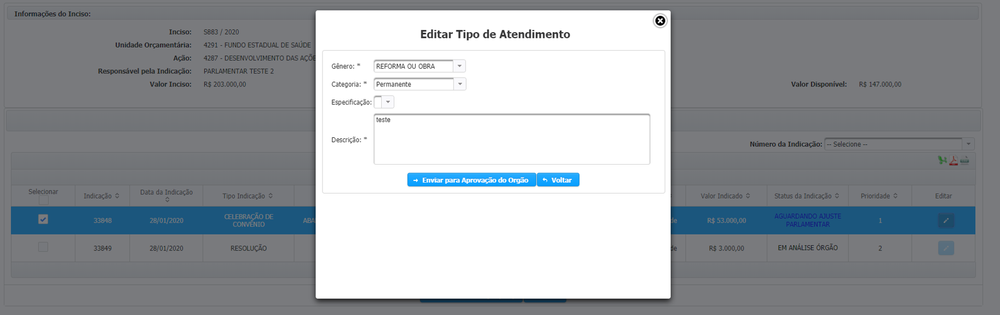

# Parlamentar

## Realizando o ajuste de indicações no SIGCON-SAÍDA

Sempre que uma indicação é retornada pelo Órgão para ajuste, o status dela é alterado para _`Aguardando ajuste parlamentar`_, no qual será possível editar o seu tipo de atendimento. Além disso, é enviado um e-mail de notificação para que o parlamentar saiba que há uma indicação que deve ser ajustada.

A alteração do tipo de atendimento é realizada na tela de visualização das indicações do inciso. Primeiramente, o usuário deverá acessar o menu Emendas &gt; Gerenciar Indicações &gt; Indicação de Recursos.

Em seguida, o usuário deverá localizar a indicação que foi retornada para ajuste através do inciso, clicando sobre o ícone na coluna “Expandir Inciso”, ou pelos campos de busca disponíveis:

Os campos de pesquisa do inciso e da indicação podem facilitar a localização da indicação que deve ser ajustada.

Para visualizar as indicações do inciso, o usuário deverá clicar em “Expandir Inciso”.

Na tela de indicações do inciso, a indicação será exibida com o status “Aguardando Ajuste Parlamentar”.

**Ao clicar sobre o ícone “Editar” é exibida uma janela para alteração do tipo de atendimento.**

**Ao clicar sobre o status da indicação é exibida a justificativa de retorno para ajuste, preenchida pelo Órgão em que a indicação foi realizada**.

Reparem que o status da indicação fica realçado quando ela for retornada para ajustes. Ao clicar sobre o status dela é possível visualizar a justificativa de retorno para ajuste inserida pelo Órgão:

Ao clicar sobre o ícone de edição é exibida uma janela para alteração do tipo de atendimento:


Após a alteração do tipo de atendimento é só clicar em **“Enviar para Aprovação do Órgão”.**



Após o ajuste da indicação é necessário que o órgão para qual ela foi indicada aprove a alteração.


