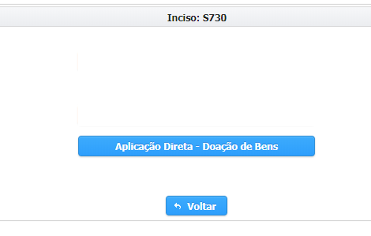

# Aplicação Direta - Doação de Bens

Procedimentos necessários para a transmissão do bem, no caso de indicações com forma de execução de doação de bens móveis.


Na hipótese de indicação para a forma de execução de doação de bens móveis, a documentação de que trata o caput deverá ser enviada no Sistema Eletrônico de Informações - SEI.


### Seleção de Beneficiário

Na página seguinte, preencha os campos de acordo com o passo-a-passo abaixo!

> **Passo-a-passo**
>
> 1.  ****Preencher o CNPJ, a razão social ou o município do beneficiário para pesquisar
> 2. Clicar em “Pesquisar”
>
>    Selecione a caixinha com o ✅ para marcar o beneficiário de interesse
>
> 3. Clique em "Adicionar" beneficiário
> 4. Selecione o Tipo de Aplicação
> 5. Preencha a Descrição
> 6. Insira o  valor
> 7. Clique em "Enviar Indicações"


**Cuidado para selecionar um tipo de aplicação que não condiz com o grupo de despesa do inciso – na dúvida, consultem a Resolução SEGOV vigente no ano.**


Caso haja uma indicação sem os dados preenchidos, o sistema verificará que o preenchimento está incompleto e não permitirá que o usuário salve os dados das demais indicações. 

Por outro lado, se o preenchimento for realizado de forma correta, o sistema exibirá uma mensagem de confirmação do envio.


A indicação deve ser aprovada pelo órgão em que foi indicada e em seguida pela SEGOV, para somente então ser concluída.


