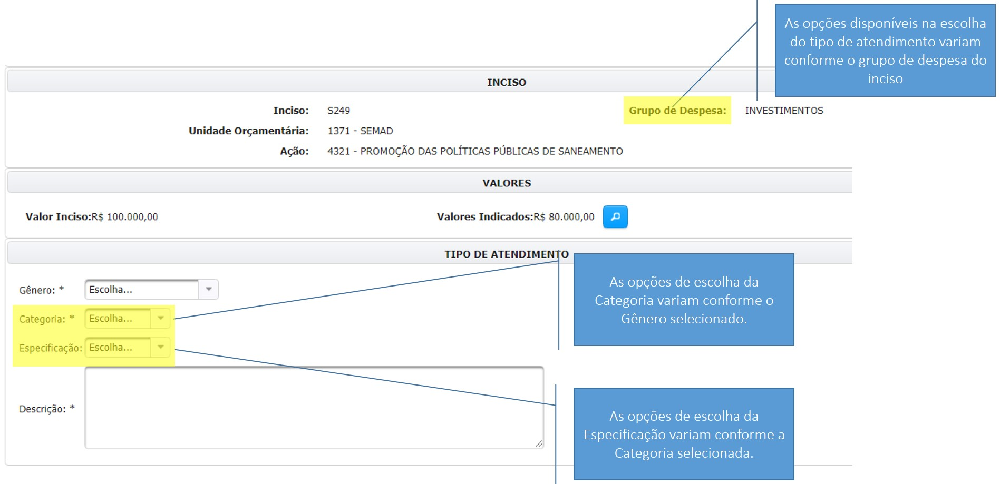
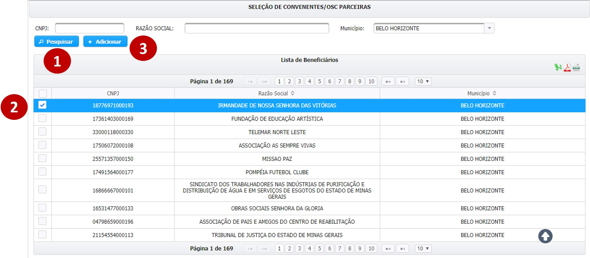
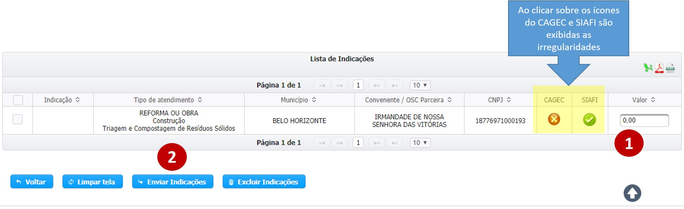

# Celebração de Outros Instrumentos Jurídicos

A indicação de recursos do tipo “Celebração de Outros Instrumentos Jurídicos” resultará na disponibilização de recursos para a celebração de convênios ou parcerias entre o Estado \(que repassará os recursos indicados pelo parlamentar\) e a prefeitura, consórcio ou OSC definidos como beneficiários da indicação \(que irão executar o serviço, evento, obra ou aquisição para qual a indicação foi realizada\).

Antes de selecionar a opção de indicação do tipo “Instrumento Jurídico”, convém verificar no anexo da Resolução SEGOV vigente no ano, se o mesmo item não está disponível através da opção “Execução Direta”.

A indicação de recursos para a celebração de outros instrumentos jurídicos é realizada em três etapas:

1. **Como** os recursos serão utilizados
2.  **Quem** receberá os recursos
3. **O montante** que será indicado.


A definição de como os recursos serão utilizados é feita através do preenchimento do tipo de atendimento e da descrição do objeto.


 É importante ressaltar que as opções de preenchimento do tipo de atendimento são exibidas conforme o grupo de despesa do inciso, por exemplo

Se o grupo de despesa do inciso for **Investimentos**, não será possível selecionar a combinação de gênero e categoria como “AQUISIÇÃO DE BENS – Consumo”, pois essa classificação configura uma despesa de custeio.


**As opções disponíveis na escolha do tipo de atendimento variam conforme o grupo de despesa do inciso. As opções de escolha da Categoria variam conforme o Gênero selecionado. As opções de escolha da Especificação variam conforme a Categoria selecionada**


Para selecionar o beneficiário da indicação de recursos, o usuário pode realizar uma pesquisa pelo CNPJ, pela Razão Social ou pelo Município do convenente ou OSC.

Os resultados são exibidos na tabela. Para selecionar um beneficiário é necessário marcar a _checkbox_ ao lado esquerdo do CNPJ, inclusive é possível selecionar mais de um beneficiário de uma vez. Em seguida, clique no botão 

> **Passo-a-passo**
>
> 1. Clique em pesquisar após preencher a razão social ou o município do beneficiário da indicação
> 2. Selecione no resultado da pesquisa para quem será indicado os recursos \(pode ser selecionada mais de uma opção\).
> 3. Clique em “Adicionar” para realizar indicações para os beneficiários selecionados

Depois disso, desça a página e vá para a Lista de Indicações

Os beneficiários adicionados são exibidos na tabela “Entrada”, na qual também são dispostos os dados do tipo de atendimento, e na qual é preenchido o valor da indicação de recursos. Após preencher o valor das indicações é necessário marcar a checkbox e depois clicar em “Enviar Indicações”.

> **Passo-a-passo**
>
> 1. Preencha o valor da indicação
> 2. Clique em “Enviar Indicações”.

O sistema verifica se todas as informações foram preenchidas corretamente e exibe uma mensagem confirmando que a operação foi realizada com sucesso.


A indicação deve ser aprovada pelo órgão em que foi indicada e em seguida pela SEGOV, para somente então ser disponibilizada durante o cadastro de convênios ou parcerias pelo beneficiário da indicação.


