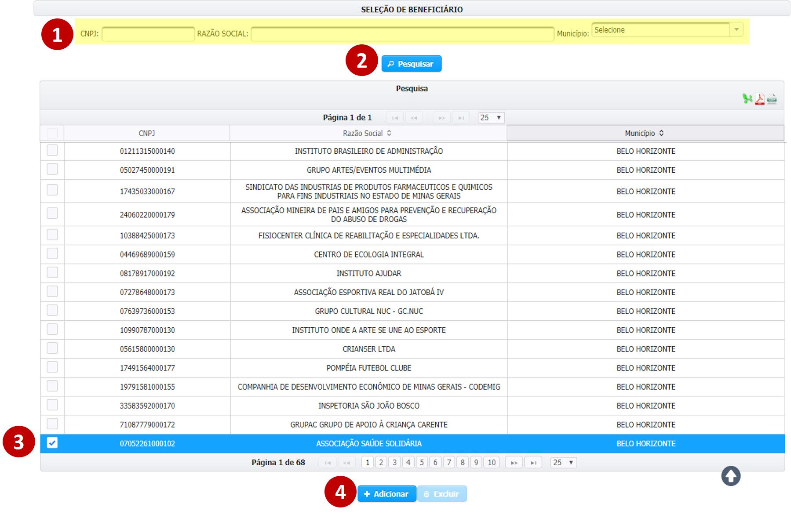
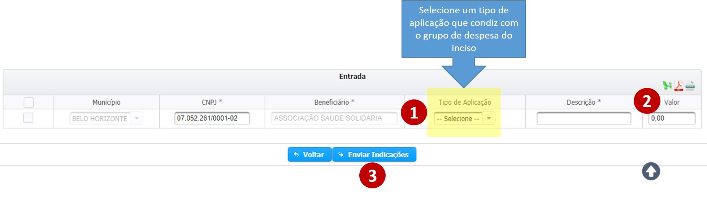
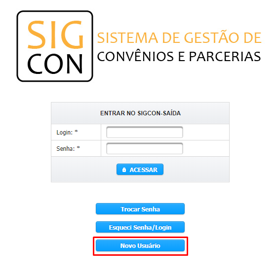

# Aplicação Direta - Execução Direta

A indicação do tipo “Execução Direta” consiste na alocação de recursos da emenda parlamentar para a execução de um determinado objeto pelo próprio Estado, como a doação de bens móveis, por exemplo.

A indicação de recursos para a Execução Direta é realizada em três etapas 

1. A escolha de **quem** receberá os recursos
2. A **finalidade** na qual os recursos serão aplicados
3. O **montante** que será indicado.

A escolha de quem receberá os recursos é feita através da seleção de beneficiários. 


**Para cada indicação deve ser selecionado apenas um beneficiário.**


Primeiramente, siga os passos abaixo

> **Passo-a-passo**
>
> 1.  ****Preencher o CNPJ, a razão social ou o município do beneficiário
> 2. Clicar em “Pesquisar”
> 3. Selecione os beneficiários
> 4. Clique em “Adicionar”.


É possível selecionar mais de um beneficiário, o que pode ser útil, caso se pretenda cadastrar mais de uma indicação de execução direta naquele inciso para beneficiários do mesmo município, já que isso agiliza a pesquisa.


Os beneficiários adicionados são exibidos na tabela de “Entrada”, na qual devem ser preenchidas as informações relativas à finalidade na qual os recursos serão aplicados e o montante que será indicado para isso.

> **Passo-a-passo**
>
> 1. Selecione o tipo de aplicação
> 2. Preencha o valor da indicação
> 3. Clique em "Enviar Indicações"


**Cuidado para selecionar um tipo de aplicação que não condiz com o grupo de despesa do inciso – na dúvida, consultem a Resolução SEGOV vigente no ano.**


Caso haja uma indicação sem os dados preenchidos, o sistema verificará que o preenchimento está incompleto e não permitirá que o usuário salve os dados das demais indicações. 

Por outro lado, se o preenchimento for realizado de forma correta, o sistema exibirá uma mensagem de confirmação do envio.


A indicação deve ser aprovada pelo órgão em que foi indicada e em seguida pela SEGOV, para somente então ser concluída.


