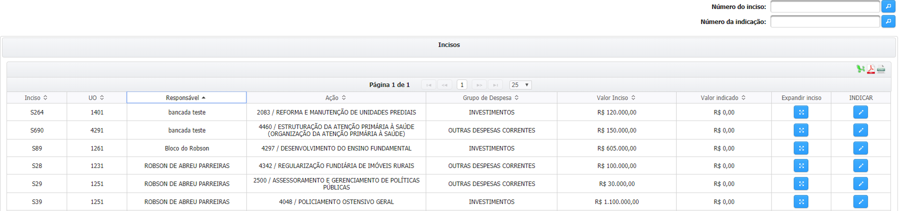
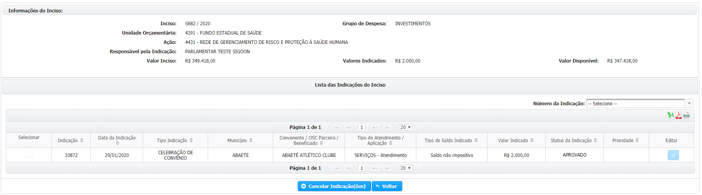

# Como Indicar Recursos?


**Perfil necessário**

Apenas usuários com o perfil de “Parlamentar” que podem indicar recursos e para emendas de Bloco é necessário ser “Responsável pelo BLOCO”


Para indicar os recursos de emenda parlamentar o usuário deve acessar o menu`Emendas > Gerenciar Indicações > Indicação de Recursos`, conforme a imagem abaixo:

No menu de indicação de recursos são exibidos os incisos do parlamentar, assim como as informações relativas à **unidade orçamentária**, à **ação**, ao **grupo de despesa** e aos **valores disponíveis** para indicação. 

### Indicações Individuais


A busca pode ser feita pelo nome do responsável \(_1, no lado esquerdo da tela_\), por número do inciso ou número da indicação \(_2, canto direto da tela_\)  



Utilize os campos de pesquisa para agilizar a busca por um determinado inciso


### **Indicações Bloco**


Somente o responsável pelo Bloco pode fazer a indicação e os demais integrantes podem visualizar.



Se o parlamentar for o responsável pelo Bloco no grid serão mostrados os incisos do Bloco e do parlamentar.


A opção de “EXPANDIR INCISO”  exibe as indicações realizadas naquele inciso.

Para indicar os recursos, o usuário deve clicar sobre o ícone do lápis  na coluna “INDICAR”, no canto direito da tabela de incisos. 


As **formas de execução** que estarão disponíveis no inciso irão depender da **unidade orçamentária**, **ação** e **grupo de despesa** daquele inciso


Formas de Execução: 

* **Celebração de Outros Instrumentos Jurídicos**
* **Transferência Fundo a Fundo \(Resolução SES\)**
* **Aplicação Direta - Execução Direta**
* **Aplicação Direta - Doação de Bens**
* **Aplicação Direta - Caixa Escolar**
* **Transferência Especial**

Como exemplo, após clicar em editar  a seguinte tela aparece com as opções permitidas para o inciso S964.

## Forma de Execução

Dependendo da forma de execução a ser celebrado a indicação segue um procedimento diferente.

Clique no quadro desejado para ser encaminhado para o tipo de instrumento













