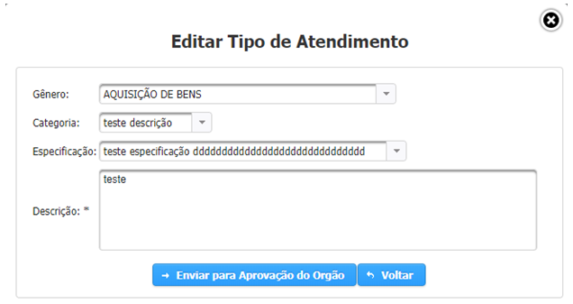

# Como Ajustar uma Indicação?

Nos termos do art. 38-E, §3°, I da Lei de Diretrizes Orçamentárias e do art. 5°, IV, a da Resolução SEGOV N° 688/2018, **o parlamentar poderá realizar ajustes nas indicações a fim de sanar determinado impedimento de ordem técnica, desde que haja anuência do órgão executor**. 

Conforme o art. 2°, VII da Resolução SEGOV n° 688/2018, entende-se por ajuste o “procedimento por meio do qual se permite a modificação do tipo de atendimento \(gênero, categoria e especificação\), observado o beneficiário, o valor da emenda e a dotação orçamentária”. 


O **ajuste de indicações** é um procedimento limitado às indicações de emenda parlamentar do tipo **"Instrumento Jurídico"**  que são

* Celebração de Convênios
* Termos de Fomento
* Termos de Colaboração


## Premissas para o ajuste de indicações

Como a finalidade do ajuste de indicações é sanar um impedimento de ordem técnica, é necessário que tenha ocorrido um impedimento de ordem técnica para que esse procedimento seja realizado. Em termos práticos, não é facultado aos parlamentares ajustar as indicações sem que haja uma orientação dos órgãos em que elas foram realizadas, ou mesmo em um momento anterior à análise da indicação por parte destes. 

Os Órgãos são responsáveis por retornar as indicações para os parlamentares no SIGCON-SAÍDA para que sejam realizados os ajustes, afinal, os órgãos são responsáveis por verificar a ocorrência de impedimentos de ordem técnica e o ajuste só pode ser realizado com anuência deles.

O ajuste de indicações consiste na alteração do tipo de atendimento das indicações, que caracterizam o objeto do instrumento que será celebrado a partir da indicação. 

O tipo de atendimento, por sua vez, é composto por três níveis de detalhamento: 

1. Gênero
2. Categoria
3. Especificação. 

Gênero é o nível mais amplo de detalhamento, ele define se o objeto do instrumento a ser celebrado será a realização de uma obra, de um evento, a prestação de serviços ou a aquisição de bens. Justamente por definir o objeto do instrumento que será celebrado, o Gênero não poderá ser alterado após o prazo estabelecido para a entrega de propostas de plano de trabalho, que é de 80 dias após a publicação da LOA \(art. 5°, II da Resolução SEGOV n° 688/2018\) 

Já o ajuste de indicações relacionado somente à alteração da Categoria e da Especificação poderá ser realizado em até 110 dias da publicação da LOA \(art. 5°, IV da Resolução SEGOV n° 688/2018\).

## Realizando o ajuste de indicações no SIGCON-SAÍDA

Sempre que uma indicação é retornada pelo Órgão para ajuste, o status dela é alterado para _`Aguardando ajuste parlamentar`_, no qual será possível editar o seu tipo de atendimento. Além disso, é enviado um e-mail de notificação para que o parlamentar saiba que há uma indicação que deve ser ajustada.

A alteração do tipo de atendimento é realizada na tela de visualização das indicações do inciso. Primeiramente, o usuário deverá acessar o menu Emendas &gt; Gerenciar Indicações &gt; Indicação de Recursos.

Em seguida, o usuário deverá localizar a indicação que foi retornada para ajuste através do inciso, clicando sobre o ícone na coluna “Expandir Inciso”, ou pelos campos de busca disponíveis:

Os campos de pesquisa do inciso e da indicação podem facilitar a localização da indicação que deve ser ajustada.

Para visualizar as indicações do inciso, o usuário deverá clicar em “Expandir Inciso”.

Na tela de indicações do inciso, a indicação será exibida com o status “Aguardando Ajuste Parlamentar”.

**Ao clicar sobre o ícone “Editar” é exibida uma janela para alteração do tipo de atendimento.**

**Ao clicar sobre o status da indicação é exibida a justificativa de retorno para ajuste, preenchida pelo Órgão em que a indicação foi realizada**.

Reparem que o status da indicação fica realçado quando ela for retornada para ajustes. Ao clicar sobre o status dela é possível visualizar a justificativa de retorno para ajuste inserida pelo Órgão:

Ao clicar sobre o ícone de edição é exibida uma janela para alteração do tipo de atendimento:

Após a alteração do tipo de atendimento é só clicar em “Enviar para Aprovação do Órgão”.

Após o período de 60 dias da publicação da LOA, não será mais permitido a indicação de recursos de emenda parlamentar individual com execução orçamentária e financeira obrigatória. 

Não obstante, nos termos do art. 38-E, §3°, I, da LDO para o exercício de 2019, caso ocorra algum impedimento de ordem técnica relacionado ao tipo de atendimento da indicação, o órgão poderá retornar a indicação para que o parlamentar proceda com o ajuste necessário.

Assim que o órgão retornar a indicação para ajuste do tipo de atendimento o SIGCON-SAÍDA enviará um e-mail automaticamente para o parlamentar, justificando a necessidade do ajuste. Segue abaixo o modelo do e-mail:

## SECRETARIA DE ESTADO DE GOVERNO - SEGOV

Prezado\(a\) informamos que a indicação nº: 2973, da emenda parlamentar de autoria de PARLAMENTAR TESTE SIGCON, foi retornada para ajuste.

Será permitida, neste momento, somente a modificação do tipo de atendimento, observada a legislação.

Seguem abaixo os dados relativos à indicação correspondente:

* Código de indicação: 2973
* Nº do Inciso / Nº da Emenda: S530 / 175
* Beneficiário: HMLG PREFEITURA MUNICIPAL DE BELO HORIZONTE
* Tipo de indicação: CELEBRAÇÃO DE CONVÊNIO
* Tipo de atendimento / Tipo de aplicação: AQUISIÇÃO DE BENS - Permanente - Equipamento
* Valor: R$ 2.000,00
* Responsável: FERNANDO KATSUMI DE ABREU HADA - [fernando.hada@governo.mg.gov.br](mailto:fernando.hada@governo.mg.gov.br)
* Data/Hora: 24/01/2019 12:00:35
* Justificativa: Tipo de atendimento inadequado em relação ao projeto apresentado pelo convenente

Atenciosamente,

COORDENAÇÃO DO SIGCON-SAÍDA

Para proceder com o ajuste o usuário deve acessar o menu “Emendas &gt; Gerenciar Indicações &gt; Indicação de Recursos”, conforme a imagem abaixo:

Em seguida, o usuário deverá identificar o inciso que contém a indicação a ser ajustada e clicar sobre o ícone para “Expandir Inciso”:

**Clique sobre o ícone “Expandir Inciso”**

O SIGCON-SAÍDA exibirá as indicações cadastradas inciso selecionado, o usuário identificará aquela que necessita ser ajustada pelo status “Aguardando ajuste parlamentar”.

**Clique sobre o ícone “Editar”.**

Após clicar em “Editar”, o sistema exibirá a interface para que o tipo de atendimento seja alterado:

**Clicar em “Enviar para Aprovação do Órgão” após alterar as informações do tipo de atendimento da indicação.**

Após o ajuste da indicação é necessário que o órgão para qual ela foi indicada aprove a alteração.

Vale ressaltar que, conforme o art. 5°, III e VI, da Resolução SEGOV n° 688/2018, o ajuste de indicações deverá ser realizado em até 80 após a publicação da LOA, excetos nos casos em que o ajuste trate apenas da edição da categoria e especificação da indicação, neste caso o ajuste poderá ser realizado em até 110 dias após a publicação da LOA. Ou seja, a funcionalidade de ajuste de indicações estará disponível após 60 dias da publicação da LOA; em até 80 dias da publicação da LOA será permitida a alteração do “Gênero” do tipo de atendimento; no período compreendido entre 81 e 110 dias da publicação da LOA será permitida a alteração somente da categoria e da especificação.

