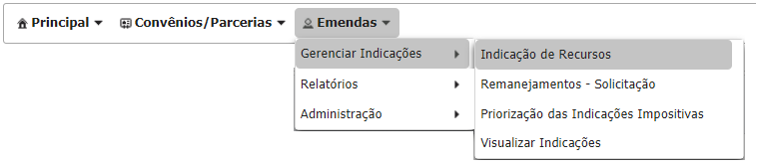

# Parlamentar

## Realizando o ajuste de indicações no SIGCON-SAÍDA

Sempre que uma indicação é retornada pelo Órgão para ajuste, o status dela é alterado para `Aguardando ajuste parlamentar`, no qual será possível editar o seu tipo de atendimento. Além disso, é enviado um e-mail de notificação para que o parlamentar saiba que há uma indicação que deve ser ajustada.

**1.** A alteração do tipo de aplicação é realizada na tela de visualização das indicações do inciso. Primeiramente, o usuário deverá acessar o menu `Emendas > Gerenciar Indicações > Indicação de Recursos`.

**2.** Em seguida, o usuário deverá localizar a indicação que foi retornada para ajuste através do inciso, clicando sobre o ícone na coluna “Expandir Inciso”, ou pelos campos de busca disponíveis:

Os campos de pesquisa do inciso e da indicação podem facilitar a localização da indicação que deve ser ajustada.

> Na tela de indicações do inciso, a indicação será exibida com o status `Aguardando Ajuste Parlamentar`.

**3.** O status da indicação fica realçado quando ela for retornada para ajustes. Ao clicar sobre o status dela é possível visualizar a justificativa de retorno para ajuste inserida pelo Órgão:

**4.** Ao clicar sobre o ícone `Editar` é exibida uma janela para alteração do `Tipo de Aplicação`.

**5.** Após a alteração do tipo de aplicação, clicar em `Salvar` . 

**6.** O status da indicação alterará de **`Aguardando Ajuste Parlamentar`** para **`Em Análise Órgão`**.


**Após o ajuste da indicação, é necessário que o órgão para qual ela foi indicada aprove novamente.**


