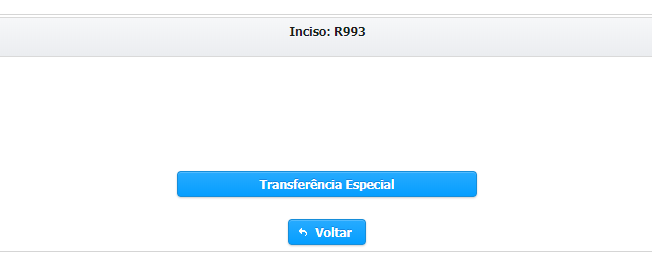
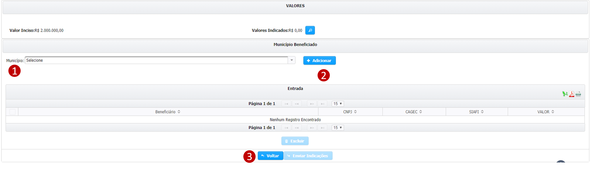
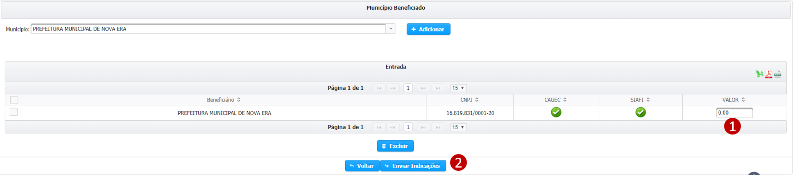

# 🗂 Transferência Especial

A modalidade de transferência exclusivamente a municípios de recursos estaduais decorrentes de programações incluídas na LOA 2020 por emendas individuais, de blocos e de bancadas, disciplinada pela Emenda à Constituição nº 101, de 20 de dezembro de 2019, que independe da celebração de convênio ou de instrumento congênere para realização dos repasses.

#### Selecione o Município

Selecione o município e clique em adicionar

> **Passo-a-passo**
>
> 1.  ****Selecione o município
> 2. Clique em "Adicionar"

#### Informe o valor da indicação

> **Passo-a-passo**
>
> 1. Preencha o valor da indicação
> 2. Clique em “Enviar Indicações”

\*\*\*\*

Após o preenchimento correto, o sistema irá gerar uma mensagem como a abaixo

