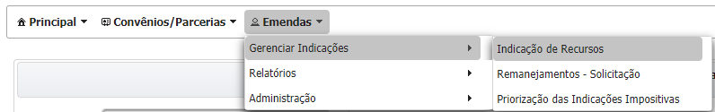
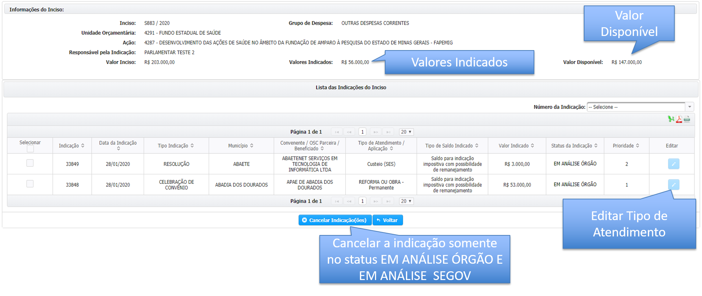
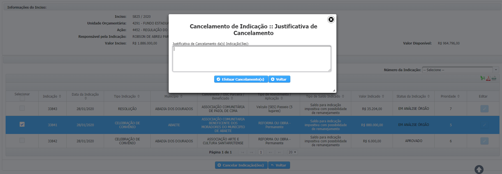

# Cancelar um indicação

O cancelamento da indicação pode ser acessado a partir do menu “Emendas” &gt; “Gerenciar Indicações”&gt; "Indicação de Recursos", conforme a imagem abaixo:

### Na próxima tela será exibido todos os incisos do parlamentar ou do bloco caso o mesmo seja responsável um bloco/bancada.


A busca pode ser feita pelo nome do responsável \(_1, no lado esquerdo da tela_\), por número do inciso ou número da indicação \(_2, canto direto da tela_\)  


### **Clique no ícone**  **em expandir inciso** 


Na próxima tela será exiba todas as indicações para o inciso selecionado.


Para cancelar um indicação clica no botão "Cancelar Indicação\(ões\)" e insira a justificativa conforme imagem abaixo.

