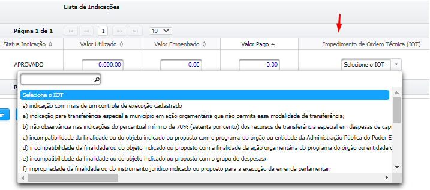

# Controle de Execução (Valores Utilizados)

> Tendo em vista a necessidade de aprimoramento das formas de acompanhamento das execuções das emendas parlamentares impositivas indicadas nas formas de execução direta, cuja gestão não está totalmente incluída no Sigcon-MG - Módulo Saída, informamos que encontra-se disponível no módulo de emendas do sistema a funcionalidade "Cronograma de Execução".
>
> A nova ferramenta contribui para a transparência da gestão e controle acerca da operacionalização das emendas impositivas, ao centralizar as informações em um único sistema, conforme recomendação do Tribunal de Contas de Minas Gerais (TCEMG) expressa no Relatório Sobre a Macrogestão e Contas do Governador do Estado de Minas Gerais - Exercício 2019.
>
> Ressaltamos a importância do preenchimento das informações constantes no Cronograma de Execução de forma a refletir a realidade do momento em que se encontram as execuções das emendas impositivas nos órgãos e entidades, para acompanhamento dos parlamentares autores das emendas bem como do TCEMG.

**Perfil necessário:**


&#x20; **Analista de Viabilidade Técnica**


## Passo a Passo

**Para gerenciar os controles de execução o usuário deve acessar o Menu**\
\
`Emendas > Gerenciar Indicações > Controle de Execução`, conforme a imagem abaixo:

.png>)

#### **Nessa tela basta escolher o filtro para pesquisa e clicar no botão `Pesquisar`.**

#### **É possível pesquisar utilizando como filtro: Ano Exercício, Parlamentar, Nº de Controle de Execução ou Nº da Indicação.**

 (1).png>)

#### **Cadastrar Controle de Execução**

`Clique no botão "Cadastrar Controle Execução"`

 (1).png>)

`Na próxima tela selecione o Tipo de Indicação`

.png>)

### 1. Aplicação Direta - Caixa Escolar

**1.1.** Selecione o Tipo de Indicação `Aplicação Direta - Caixa Escolar`:

.png>)

**1.2.** Vinculação da indicação:

&#x20;    **1.2.1.** Escolha o Tipo de Indicação: Aplicação Direta - Caixa Escolar

&#x20;    **1.2.2.** Digite o Nº da Indicação

&#x20;    **1.2.3.** Clique em Adicionar

&#x20;    **1.2.4.** Digite os valores&#x20;

&#x20;    **1.2.5.** Clique em `Salvar`

 (1).png>)


**Atenção: O valor utilizado por padrão será o saldo da indicação**



**Condição para Impedimento de Ordem Técnica (IOT):**

Caso a condição abaixo seja atendida, irá gerar **Impedimento de Ordem Técnica (IOT)**, onde será obrigatório a escolha da Justificativa de Ordem Técnica:

&#x20;                   **Valor Utilizado < Valor Indicado**

&#x20;&#x20;



**Demais Condições:**

1. Valor Pago ≤ **** Valor Empenhado
2. Valor Empenhado ≤ Valor Utilizado
3. Uma indicação só pode ser desvinculada se houver pelo menos 2 indicações no mesmo controle de execução.


### 2.  Aplicação Direta - Doação de Bens

**2.1.** Selecione o Tipo de Indicação `Aplicação Direta - Doação de Bens`&#x20;

**2.2.** Escolha se há `Registro de Preços`

 (1).png>)

**2.3.** Caso seja marcado `SIM` para Registro de Preços, informe o Status do Registro de Preços:

 (1).png>)

**2.4.** Caso o seja marcado `NÃO` para Registro de Preços, informe o Status do Processo de Compra:

 (1).png>)

**2.5.** Informe o Nº do Processo de Compra / Nº do Registro de Preços (opcional) e a Data de Referência do Status, caso o mesmo tenha sido preenchido (obrigatório):

 (1).png>)

**2.6.** Os campos `Nº Contrato (SIAD)`, `Nº Autorização de (AF) ou Ordem de Serviço (OS)` , `Nº SEI Compras` e `Nº SEI Compras` são opcionais:

 (1).png>)

> **Nos campos acima, é possível a inserção de mais de 1 valor.**

**2.7.** Cadastrar o nº de Empenho:

 (1).png>)

> 1. **É possível o cadastro de mais de 1 empenho**
> 2. **O nº de empenho é obrigatório se o Valor Empenhado for maior que 0.**

**2.8.** Vinculação da Indicação:

&#x20;    **2.8.1.** Digite o Nº da Indicação

&#x20;    **2.8.2.** Clique em Adicionar

&#x20;    **2.8.3.** Digite os valores&#x20;

&#x20;    **2.8.4.** Clique em `Salvar`

 (1).png>)


**Atenção: O valor utilizado por padrão será o saldo da indicação**



**Condição para Impedimento de Ordem Técnica (IOT):**

Caso a condição abaixo seja atendida, irá gerar **Impedimento de Ordem Técnica (IOT)**, onde será obrigatório a escolha da Justificativa de Ordem Técnica:

&#x20;                   **Valor Utilizado < Valor Indicado**

&#x20;&#x20;



**Demais Condições:**

1. Valor Pago ≤ **** Valor Empenhado
2. Valor Empenhado ≤ Valor Utilizado
3. Valor Executado ≤ Valor Pago
4. Uma indicação só pode ser desvinculada se houver pelo menos 2 indicações no mesmo controle de execução.


### 3. Aplicação Direta - Execução Direta

**3.1.** `Com processo de compra`:

&#x20;    **3.1.1.** Escolher se há `Registro de Preços`:

 (1).png>)

&#x20;    **3.1.2.** Caso seja marcado `SIM` para Registro de Preços, informe o Status do Registro de Preços:

 (1).png>)

&#x20;    **3.1.3.** Caso o seja marcado `NÃO` para Registro de Preços, informe o Status do Processo de Compra:

 (1).png>)

&#x20;    **3.1.4.** Os campos `Nº Contrato (SIAD)`, `Nº Autorização de (AF) ou Ordem de Serviço (OS)` , `Nº SEI Compras` e `Nº SEI Compras` são opcionais:

 (1).png>)

&#x20;&#x20;

> **Nos campos acima, é possível a inserção de mais de 1 valor.**

&#x20;**3.1.5.** Cadastrar o `Nº de Empenho` :

 (1).png>)

> 1. **É possível o cadastro de mais de 1 empenho.**
> 2. **O nº de empenho é obrigatório se o Valor Empenhado for maior que 0.**

**3.1.6.** Vinculação da Indicação:

&#x20;    **3.1.6.1.** Digite o `Nº da Indicação`

&#x20;    **3.1.6.2.** Clique em `Adicionar`

&#x20;    **3.1.6.3.** Digite os `Valores`&#x20;

&#x20;    **3.1.6.4.** Clique em `Salvar`

 (1).png>)


**Atenção: O valor utilizado por padrão será o saldo da indicação**



**Condição para Impedimento de Ordem Técnica (IOT):**

Caso a condição abaixo seja atendida, irá gerar **Impedimento de Ordem Técnica (IOT)**, onde será obrigatório a escolha da Justificativa de Ordem Técnica:

&#x20;                   **Valor Utilizado < Valor Indicado**

&#x20;&#x20;



**Demais Condições:**

1. Valor Pago ≤ **** Valor Empenhado
2. Valor Empenhado ≤ Valor Utilizado
3. Uma indicação só pode ser desvinculada se houver pelo menos 2 indicações no mesmo controle de execução.


**3.2.** `Sem processo de compra`**:**

.png>)

&#x20;    **3.2.1.** Cadastrar o `Nº de Empenho`:

.png>)

> 1. **É possível o cadastro de mais de 1 empenho .**
> 2. **O nº de empenho é obrigatório se o Valor Empenhado for maior que 0.**

**3.2.2.** Vinculação da Indicação:

&#x20;    **3.2.2.1.** Digite o `Nº da Indicação`

&#x20;    **3.2.2.2.** Clique em `Adicionar`

&#x20;    **3.2.2.3.** Digite os `Valores`&#x20;

&#x20;    **3.2.2.4.** Clique em `Salvar`

 (1).png>)


**Atenção: O valor utilizado por padrão será o saldo da indicação**



**Condição para Impedimento de Ordem Técnica (IOT):**

Caso a condição abaixo seja atendida, irá gerar **Impedimento de Ordem Técnica (IOT)**, onde será obrigatório a escolha da Justificativa de Ordem Técnica:

&#x20;                   **Valor Utilizado < Valor Indicado**

&#x20;&#x20;



**Demais Condições:**

1. Valor Pago ≤ **** Valor Empenhado
2. Valor Empenhado ≤ Valor Utilizado
3. Uma indicação só pode ser desvinculada se houver pelo menos 2 indicações no mesmo controle de execução.


### 4. Outros Instrumentos

 (1).png>)

**4.1.** Caso o `Tipo de Instrumento` selecionado seja `Termo de Descentralização de Crédito Orçamentário (TDCO)` é obrigatório selecionar `SIM` ou `NÂO` para o campo `Processo de compras do órgão Gerenciador do Crédito`. Necessário também escolher o Órgão ou Entidade Estadual:

 (1).png>)

&#x20;**4.2.** Caso seja marcado `SIM` para Registro de Preços, informe o Status do Registro de Preços:

 (1).png>)

**4.3.** Caso o seja marcado `NÃO` para Registro de Preços, informe o Status do Processo de Compra:

 (1).png>)

**4.4.** Os campos `Nº Contrato (SIAD)`, `Nº Autorização de (AF) ou Ordem de Serviço (OS)` , `Nº SEI Compras` e `Nº SEI Compras` são opcionais:

 (1).png>)

> **Nos campos acima, é possível a inserção de mais de 1 valor.**

**4.5.** Cadastrar o `Nº de Empenho`:

 (1).png>)

> 1. **É possível o cadastro de mais de 1 empenho .**
> 2. **O nº de empenho é obrigatório se o Valor Empenhado for maior que 0.**

**4.6.** Vinculação da Indicação:

&#x20;    **4.6.1.** Digite o `Nº da Indicação`

&#x20;    **4.6.2.** Clique em `Adicionar`

&#x20;    **4.6.3.** Digite os `Valores`&#x20;

&#x20;    **4.6.4.** Clique em `Salvar`

 (1).png>)


**Atenção: O valor utilizado por padrão será o saldo da indicação**



**Condição para Impedimento de Ordem Técnica (IOT):**

Caso a condição abaixo seja atendida, irá gerar **Impedimento de Ordem Técnica (IOT)**, onde será obrigatório a escolha da Justificativa de Ordem Técnica:

&#x20;                   **Valor Utilizado < Valor Indicado**

&#x20;&#x20;



**Demais Condições:**

1. Valor Pago ≤ **** Valor Empenhado
2. Valor Empenhado ≤ Valor Utilizado
3. Uma indicação só pode ser desvinculada se houver pelo menos 2 indicações no mesmo controle de execução.


### 5. Resolução

.png>)

**5.1.** Vinculação da Indicação:

&#x20;    **5.1.1.** Digite o `Nº da Indicação`

&#x20;    **5.1.2.** Clique em `Adicionar`

&#x20;    **5.1.3.** Digite os `Valores`&#x20;

&#x20;    **5.1.4.** Clique em `Salvar`

 (1).png>)


**Atenção: O valor utilizado por padrão será o saldo da indicação**



**Condição para Impedimento de Ordem Técnica (IOT):**

Caso a condição abaixo seja atendida, irá gerar **Impedimento de Ordem Técnica (IOT)**, onde será obrigatório a escolha da Justificativa de Ordem Técnica:

&#x20;                   **Valor Utilizado < Valor Indicado**

&#x20;&#x20;



**Demais Condições:**

1. Valor Pago ≤ **** Valor Empenhado
2. Valor Empenhado ≤ Valor Utilizado
3. Uma indicação só pode ser desvinculada se houver pelo menos 2 indicações no mesmo controle de execução.



O campo "`Valor Utilizado`" se refere ao valor da indicação da emenda que será de fato aplicado pelo órgão/entidade gestora na execução do objeto indicado pelo parlamentar.

O preenchimento deste campo dependerá da forma de execução da indicação da emenda:

* **Celebração de Convênio/Parceria:** Valor da indicação vinculado no Plano de Trabalho ou na proposta de alteração. Esse dado é buscado automaticamente pelo sistema para o relatório e não há necessidade de preenchimento por usuário analista de viabilidade técnica;
* **Transferência Fundo a Fundo do FES - Resolução:** Valor contido nas Resoluções SES publicadas a ser repassado ao Fundo Municipal de Saúde, relativo ao beneficiário da indicação. Esse valor considera os preços de referência do Fundo Nacional de Saúde e do Portfólio de Emendas 2020;
* **Transferência Especial:** Valor da indicação a ser repassado contido na Resolução SEGOV publicada;
* **Aplicação Direta - Execução Direta:** Valor de referência ou resultante da aquisição/contratação para o objeto da indicação (Procedimento Licitatório/Dispensa/Inexigibilidade/Apostilamento/Aditamento) realizada para execução do objeto da emenda;
*   **Aplicação Direta - Doação de Bens**: Valor de referência ou resultante da aquisição/contratação para o objeto da indicação (Procedimento licitatório/Dispensa/Inexigibilidade/Apostilamento/Aditamento) realizada para aquisição do bem para doação, desde que os documentos entregues pelo autor da emenda ou pelo beneficiário estejam em conformidade com os requisitos legais e técnicos para formalização do termo de doação.

    _Ex.: Indicação no valor de R$ 50.000,00 para doação de dois bens. Beneficiário apresenta a documentação correspondente à doação somente de um bem. Valor de Referência unitário do processo licitatório: R$ 24.000,00. O Valor utilizado será R$ 24.000,00;_
* **Aplicação Direta - Caixa Escolar:** Valor constantes dos Termos de Compromisso Caixa Escolar a serem ou já formalizados;
* **Aplicação Direta - Outros Instrumentos:** Valor celebrado no instrumento jurídico.

Caso o `Valor Utilizado` seja inferior ao `Valor Indicado`, será necessário o preenchimento de justificativa para a diferença. Considerando o exemplo acima para "Aplicação Direta - Doação de Bens", a justificativa seria a entrega de documentação correspondente à doação somente de um dos dois bens indicados e a obtenção de preço mais vantajoso quando da obtenção de orçamentos para elaboração do mapa de preços de referência da licitação.


**6. Upload de dados em massa (planilha de Excel):**&#x20;

6.1. Para todos os tipos de indicação, é possível o upload de dados em massa. Para isso, acesso o Controle de Execução, e clique na aba `Importação de dados`:

 (1).png>)

6.2. Faça a escolha no Tipo de Importação a ser realizada: `Empenho ou Indicação`:

6.2.1. **Planilha Empenho:** com essa planilha é possível a importação do nº de empenho e data de registro do empenho. O preenchimento pode ser realizado em somente uma planilha para todos os Controles de Execução, mas a importação tem que ser realizada em cada Controle de Execução:

 (1).png>)

6.2.2. **Planilha Indicação:** com essa planilha é possível a importação do nº de indicação, valor empenhado e valor pago. O preenchimento pode ser realizado em somente uma planilha para todas indicações em diferentes Controles de Execução, mas a importação tem que ser realizada em cada Controle de Execução:

 (1).png>)

6.3. Após o preenchimento da planilha, faça o upload da mesma. Clique em `Procurar arquivo` e busque pela planilha a ser importada. Após isso, clique no botão `Importar`. Após a importação clique no Botão `Salvar` do Controle de Execução.


**ATENÇÃO:**

Instruções para importação dos dados:

1- Escolha o Tipo de Importação: Empenho ou Indicação;

&#x20;         ****          1.1- Dados do Empenho: Número Controle Execução, Número do Empenho e Data de Registro;&#x20;

&#x20;         ****          1.2- Dados da Indicação: Número Controle Execução, Número da Indicação, Valor Empenhado, Valor Pago;&#x20;

2- Realize o download do modelo da planilha para importação;&#x20;

3- Localize e importe o arquivo com os dados:&#x20;

&#x20;         **3.1- Não alterar o nome e ordem das colunas em destaque na 1ª linha;**&#x20;

&#x20;         ****          3.2- Formato de campos de Valor: 9.999,99;

&#x20;         ****          3.3- Os campos de Data devem estar formatados como tipo Data: Ex.: DD/MM/YYYY;&#x20;

&#x20;         **3.4- Formato do arquivo: Planilha deve ser salva no formato XLSX.**

