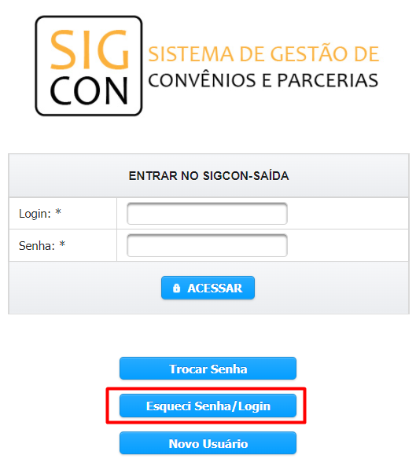

# Transferência Fundo a Fundo (Resolução SES)

A indicação do tipo “Resolução” consiste na transferência de recursos da emenda parlamentar para um fundo municipal de saúde ou para alguma unidade do sistema de saúde. Devido as suas características, a opção de indicação do tipo “Resolução” só está habilitada caso a unidade orçamentária do inciso seja referente à Secretaria de Estado de Saúde.

**1.** A indicação de recursos do tipo “Resolução” é realizada em três etapas:

&#x20;   a. **Quem** receberá os recursos

&#x20;    b. A **finalidade** na qual os recursos serão aplicados

&#x20;    c. O **montante** que será indicado.

**2.** A escolha de quem receberá os recursos é feita através da seleção de beneficiários:

 (1).png>)

> **Passo-a-passo**
>
> 1. &#x20;**** Preencher o CNPJ, a razão social ou o município do beneficiário
> 2. Clicar em “Pesquisar”.
> 3. Selecione os beneficiários.
> 4. Clique em “Adicionar”.
> 5. Repita os passos de 1 a 4 caso queira adicionar mais beneficiários.

**3.** Os beneficiários adicionados são exibidos na tabela de “Entrada”, na qual devem ser preenchidas as informações relativas à finalidade na qual os recursos serão aplicados e o montante que será indicado para isso.

 (1).png>)

> **Passo-a-passo**
>
> 1. Selecione o tipo de aplicação
> 2. Preencha o valor da indicação
> 3. Clique em "Enviar Indicações"


**Ao selecionar o Tipo de Aplicação, serão exibidos somente os tipos de acordo com o Grupo de Despesas (Outras Despesas Correntes ou Investimento).**


**4.** Caso haja uma indicação sem os dados preenchidos, o sistema verificará que o preenchimento está incompleto e não permitirá que o usuário salve os dados das demais indicações.&#x20;

**5.** Por outro lado, se o preenchimento for realizado de forma correta, o sistema exibirá uma mensagem de confirmação do envio:


A indicação deve ser aprovada pelo órgão em que foi indicada e em seguida pela SEGOV, para somente então ser concluída.

