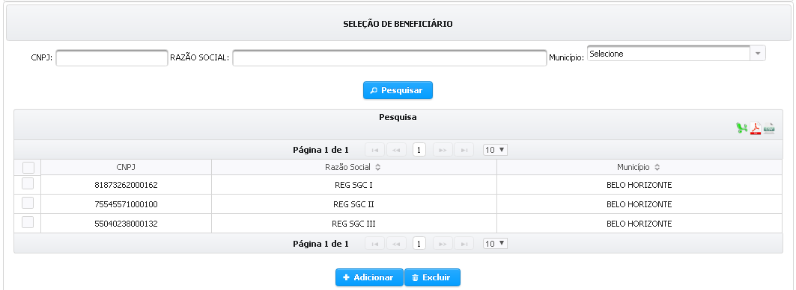
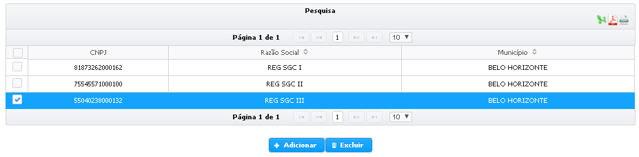
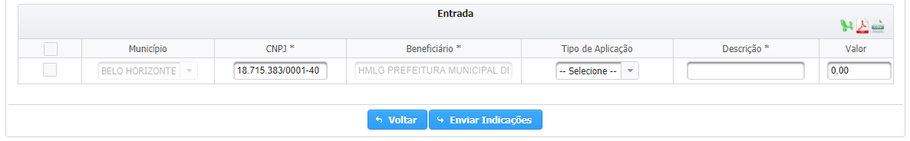
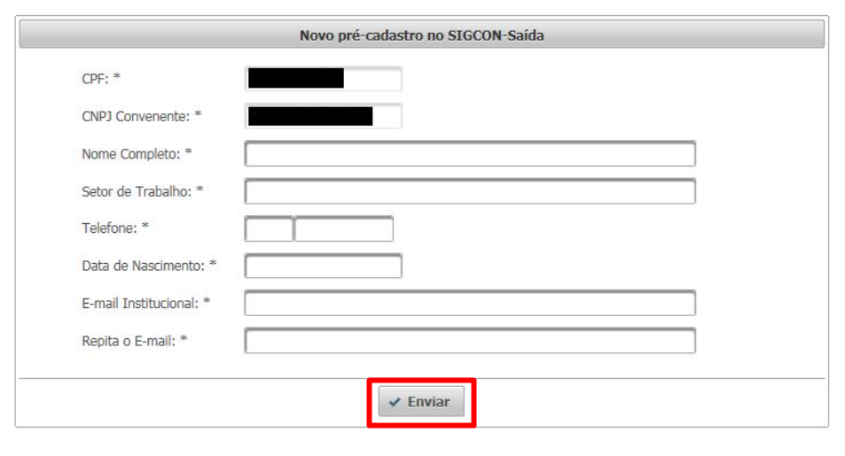
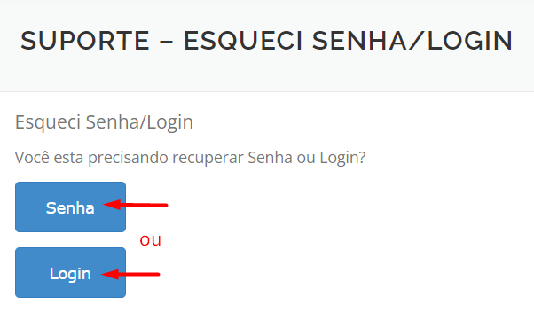
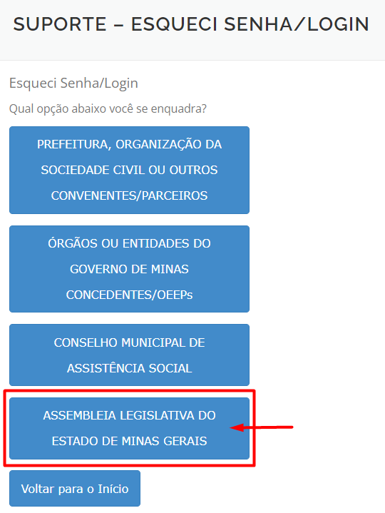
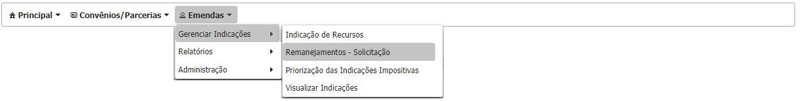
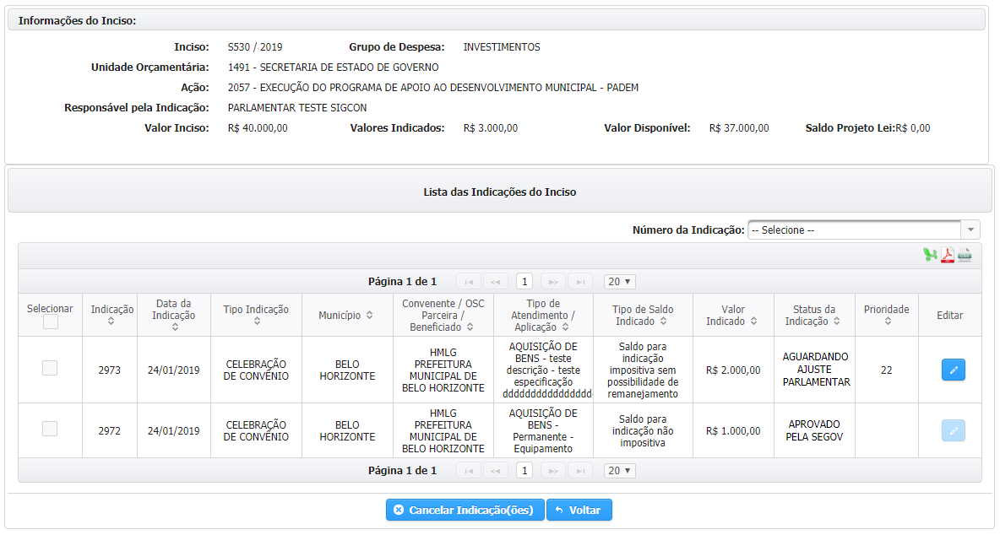
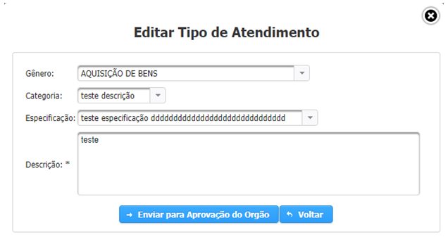

# Indicação de recursos por tipo de instrumento

## **Indicação Instrumento Jurídico**

A indicação de recursos do tipo “Instrumento Jurídico” resultará na disponibilização de recursos para a celebração de convênios ou parcerias entre o Estado, que repassará os recursos indicados pelo parlamentar, e a prefeitura, consórcio ou OSC definidos como beneficiários da indicação, que irão executar o serviço, evento, obra ou aquisição para qual a indicação foi realizada. Antes de selecionar a opção de indicação do tipo “Instrumento Jurídico”, convém verificar no anexo da Resolução SEGOV n° 688/2018 se o mesmo item não está disponível através da opção “Execução Direta”.

A indicação de recursos para a celebração de convênios e parcerias é realizada em três etapas

1. **Como** os recursos serão utilizados
2.  **Quem** receberá os recursos
3. **O montante** que será indicado.


A definição de como os recursos serão utilizados é feita através do preenchimento do tipo de atendimento e da descrição do objeto.


 É importante ressaltar que as opções de preenchimento do tipo de atendimento são exibidas conforme o grupo de despesa do inciso, por exemplo

Se o grupo de despesa do inciso for `Investimentos`, não será possível selecionar a combinação de gênero e categoria como “AQUISIÇÃO DE BENS – Consumo”, pois essa classificação configura uma despesa de custeio.


**As opções disponíveis na escolha do tipo de atendimento variam conforme o grupo de despesa do inciso.**

**As opções de escolha da Categoria variam conforme o Gênero selecionado.**

**As opções de escolha da Especificação variam conforme a Categoria selecionada**


Para selecionar o beneficiário da indicação de recursos, o usuário pode realizar uma pesquisa pelo CNPJ, pela Razão Social ou pelo Município do convenente ou OSC, os resultados são exibidos na tabela. Para selecionar um beneficiário é necessário marcar a checkbox ao lado esquerdo do CNPJ, inclusive é possível selecionar mais de um beneficiário de uma vez, e em seguida clicar no botão  . 

**1.Clique em pesquisar após preencher a razão social ou o município do beneficiário da indicação**

**2.Selecione no resultado da pesquisa para quem será indicado os recursos \(pode ser selecionada mais de uma opção\).**

**3.Clique em “Adicionar” para realizar indicações para os beneficiários selecionados**

Os beneficiários adicionados são exibidos na tabela “Entrada”, na qual também são dispostos os dados do tipo de atendimento, e na qual é preenchido o valor da indicação de recursos. Após preencher o valor das indicações é necessário marcar a checkbox e depois clicar em “Enviar Indicações”.

**1. Preencha o valor da indicação**

**Ao clicar sobre os ícones do CAGEC e do SIAFI são exibidas as irregularidades.**

**2.Clique em “Enviar Indicações”.**

O sistema verifica se todas as informações foram preenchidas corretamente e exibe uma mensagem confirmando que a operação foi realizada com sucesso.

A indicação deve ser aprovada pelo órgão em que foi indicada e em seguida pela SEGOV, para somente então ser disponibilizada durante o cadastro de convênios ou parcerias pelo beneficiário da indicação.

### **Indicação Execução Direta**

A indicação do tipo “Execução Direta” consiste na alocação de recursos da emenda parlamentar para a execução de um determinado objeto pelo próprio Estado, como a doação de bens móveis, por exemplo.

A indicação de recursos para a Execução Direta é realizada em três etapas, quais sejam: a escolha de quem receberá os recursos, a finalidade na qual os recursos serão aplicados e o montante que será indicado.

A escolha de quem receberá os recursos é feita através da seleção de beneficiários. Para cada indicação deve ser selecionado apenas um beneficiário.

**1. Preencher o CNPJ, a razão social ou o município do beneficiário**

**2.Clicar em “Pesquisar”.**

É possível selecionar mais de um beneficiário, o que pode ser útil, caso se pretenda cadastrar mais de uma indicação de execução direta naquele inciso para beneficiários do mesmo município, já que isso agiliza a pesquisa.

**1. Selecione os beneficiários.**

**2. Clique em “Adicionar”.**

Os beneficiários adicionados são exibidos na tabela de “Entrada”, na qual devem ser preenchidas as informações relativas à finalidade na qual os recursos serão aplicados e o montante que será indicado para isso.

**1. Selecione o tipo de aplicação. Cuidado para selecionar um tipo de aplicação que não condiz com o grupo de despesa do inciso – na dúvida, consultem a Resolução SEGOV n. 666/2018.**

**2.Preecnha o valor da indicação**

**3.Clique em “Enviar Indicações”.**

Caso haja uma indicação sem os dados preenchidos, o sistema verificará que o preenchimento está incompleto e não permitirá que o usuário salve os dados das demais indicações. Por outro lado, se o preenchimento for realizado de forma correta, o sistema exibirá uma mensagem de confirmação do envio.

A indicação deve ser aprovada pelo órgão em que foi indicada e em seguida pela SEGOV, para somente então ser concluída.

### **Indicação Resolução**

A indicação do tipo “Resolução” consiste na transferência de recursos da emenda parlamentar para um fundo municipal de saúde ou para alguma unidade do sistema de saúde. Devido as suas características, a opção de indicação do tipo “Resolução” só está habilitada caso a unidade orçamentária do inciso seja referente à Secretaria de Estado de Saúde.

A indicação de recursos do tipo “Resolução” é realizada em três etapas, quais sejam: a escolha de quem receberá os recursos, a finalidade na qual os recursos serão aplicados e o montante que será indicado.

A escolha de quem receberá os recursos é feita através da seleção de beneficiários. Para cada indicação deve ser selecionado apenas um beneficiário.

**1. Preencher o CNPJ, a razão social ou o município do beneficiário**

**2.Clicar em “Pesquisar”.**

É possível selecionar mais de um beneficiário, o que pode ser útil, caso se pretenda cadastrar mais de uma indicação de execução direta naquele inciso para beneficiários do mesmo município, já que isso agiliza a pesquisa.

**1. Selecione os beneficiários.**

**2. Clique em “Adicionar”.**

Os beneficiários adicionados são exibidos na tabela de “Entrada”, na qual devem ser preenchidas as informações relativas à finalidade na qual os recursos serão aplicados e o montante que será indicado para isso.

**1. Selecione o tipo de aplicação. Cuidado para selecionar um tipo de aplicação que não condiz com o grupo de despesa do inciso – na dúvida, consultem a Resolução SEGOV n. 688/2018.**

**2.Preecnha o valor da indicação**

**3.Clique em “Enviar Indicações”.**

A indicação deve ser aprovada pelo órgão em que foi indicada e em seguida pela SEGOV, para somente então ser concluída.

### **Indicação Caixa Escolar**

A indicação do tipo “Caixa Escolar” consiste na aplicação dos recursos de emenda parlamentar na gestão de infraestrutura das escolas do ensino médio e fundamental de Minas Gerais. Por esse motivo, essa opção de indicação só estará disponível nos incisos cuja unidade orçamentária for referente à Secretaria de Estado de Educação.

A indicação de recursos do tipo “Caixa Escolar” é realizada em três etapas, quais sejam: a escolha da escola receberá os recursos, como os recursos serão aplicados e o montante que será indicado.

A escolha da escola receberá os recursos é feita pelo preenchimento do código da escola.

**1. Digite o código da escola.**

**Caso o usuário não saiba o código da escola, é possível pesquisa-lo.**

**2.Clique em “Adicionar”.**

Caso o usuário não saiba previamente o código da escola, é possível realizar uma pesquisa através do município.

**1.Digite o nome da escola ou município dela.**

**2.Clique em “Pesquisar”.**

1.Selecione as escolas que serão beneciárias

2.Clique em “Confirmar”.

As escolas selecionadas são exibidas na tabela “Entrada”, na qual deverão ser preenchidas as informações referente ao tipo de aplicação e ao valor de cada indicação**.**

**1.Selecione o tipo de aplicação. Atenção quanto ao grupo de despesa do inciso!**

**2.Preencha o valor da indicação.**

**3.Clique em “Enviar Indicações”.**

### Ajustar indicação

Após o período de 60 dias da publicação da LOA, não será mais permitido a indicação de recursos de emenda parlamentar individual com execução orçamentária e financeira obrigatória. Não obstante, nos termos do art. 38-E, §3°, I, da LDO para o exercício de 2019, caso ocorra algum impedimento de ordem técnica relacionado ao tipo de atendimento da indicação, o órgão poderá retornar a indicação para que o parlamentar proceda com o ajuste necessário.

Assim que o órgão retornar a indicação para ajuste do tipo de atendimento o SIGCON-SAÍDA enviará um e-mail automaticamente para o parlamentar, justificando a necessidade do ajuste. Segue abaixo o modelo do e-mail:

## SECRETARIA DE ESTADO DE GOVERNO - SEGOV

Prezado\(a\) informamos que a indicação nº: 2973, da emenda parlamentar de autoria de PARLAMENTAR TESTE SIGCON, foi retornada para ajuste.

Será permitida, neste momento, somente a modificação do tipo de atendimento, observada a legislação.

Seguem abaixo os dados relativos à indicação correspondente:

* Código de indicação: 2973
* Nº do Inciso / Nº da Emenda: S530 / 175
* Beneficiário: HMLG PREFEITURA MUNICIPAL DE BELO HORIZONTE
* Tipo de indicação: CELEBRAÇÃO DE CONVÊNIO
* Tipo de atendimento / Tipo de aplicação: AQUISIÇÃO DE BENS - Permanente - Equipamento
* Valor: R$ 2.000,00
* Responsável: FERNANDO KATSUMI DE ABREU HADA - [fernando.hada@governo.mg.gov.br](mailto:fernando.hada@governo.mg.gov.br)
* Data/Hora: 24/01/2019 12:00:35
* Justificativa: Tipo de atendimento inadequado em relação ao projeto apresentado pelo convenente

Atenciosamente,

COORDENAÇÃO DO SIGCON-SAÍDA

Para proceder com o ajuste o usuário deve acessar o menu “Emendas &gt; Gerenciar Indicações &gt; Indicação de Recursos”, conforme a imagem abaixo:

Em seguida, o usuário deverá identificar o inciso que contém a indicação a ser ajustada e clicar sobre o ícone para “Expandir Inciso”:

**Clique sobre o ícone “Expandir Inciso”**

O SIGCON-SAÍDA exibirá as indicações cadastradas inciso selecionado, o usuário identificará aquela que necessita ser ajustada pelo status “Aguardando ajuste parlamentar”.

**Clique sobre o ícone “Editar”.**

Após clicar em “Editar”, o sistema exibirá a interface para que o tipo de atendimento seja alterado:

**Clicar em “Enviar para Aprovação do Órgão” após alterar as informações do tipo de atendimento da indicação.**

Após o ajuste da indicação é necessário que o órgão para qual ela foi indicada aprove a alteração.

Vale ressaltar que, conforme o art. 5°, III e VI, da Resolução SEGOV n° 688/2018, o ajuste de indicações deverá ser realizado em até 80 após a publicação da LOA, excetos nos casos em que o ajuste trate apenas da edição da categoria e especificação da indicação, neste caso o ajuste poderá ser realizado em até 110 dias após a publicação da LOA. Ou seja, a funcionalidade de ajuste de indicações estará disponível após 60 dias da publicação da LOA; em até 80 dias da publicação da LOA será permitida a alteração do “Gênero” do tipo de atendimento; no período compreendido entre 81 e 110 dias da publicação da LOA será permitida a alteração somente da categoria e da especificação.

