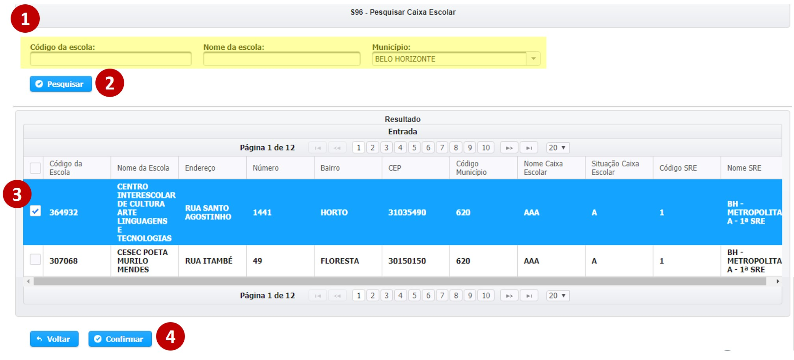
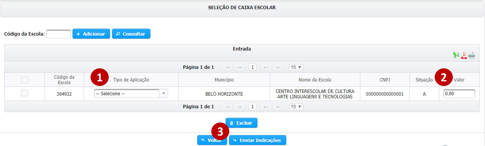

# Aplicação Direta - Caixa Escolar

A indicação do tipo “Caixa Escolar” consiste na aplicação dos recursos de emenda parlamentar na gestão de infraestrutura das escolas do ensino médio e fundamental de Minas Gerais. Por esse motivo, essa opção de indicação só estará disponível nos incisos cuja unidade orçamentária for referente à Secretaria de Estado de Educação.

A indicação de recursos do tipo “Caixa Escolar” é realizada em três etapas, quais sejam: a escolha da escola receberá os recursos, como os recursos serão aplicados e o montante que será indicado.

A escolha da escola receberá os recursos é feita pelo preenchimento do código da escola.

> **Passo-a-passo**
>
> 1.  ****Digite o código da escola
> 2. Clique em "Adicionar"

#### Pesquisa de Código da Escola

Caso o usuário não saiba previamente o código da escola, é possível realizar uma pesquisa através do município.

> **Passo-a-passo**
>
> 1.  ****Digite o nome da escola ou o município em que ela se localiza
> 2. Clique em "Pesquisar"
> 3. Selecione as escolas que serão beneficiárias
> 4. Clique em "Confirmar"

### As escolas selecionadas são exibidas na tabela “Entrada”, na qual deverão ser preenchidas as informações referente ao tipo de aplicação e ao valor de cada indicação**.**

> **Passo-a-passo**
>
> 1.  ****Selecione o tipo de  aplicação.
> 2. Preencha o valor da indicação
> 3. Clique em “Enviar Indicações”


Atenção quanto ao grupo de despesa do inciso!


Após o preenchimento correto, o sistema irá gerar uma mensagem como a abaixo

