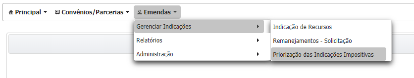
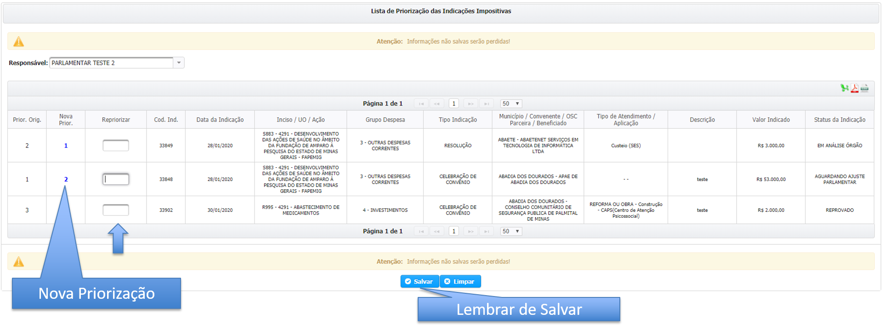

# Priorização de Indicação

A priorização pode ser acessada a partir do menu “Emendas” &gt; “Gerenciar Indicações”&gt; "Priorização das Indicações Impositivas", conforme a imagem abaixo:

Para definir uma nova prioridade da indicação insira a nova ordem no campo "Repriorizar" e clique em salvar conforme a imagem abaixo.

