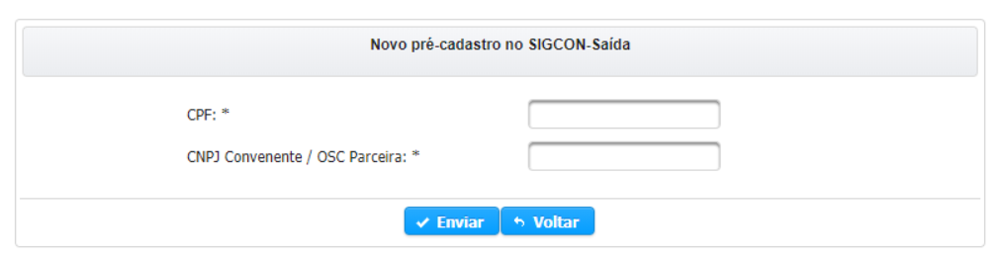
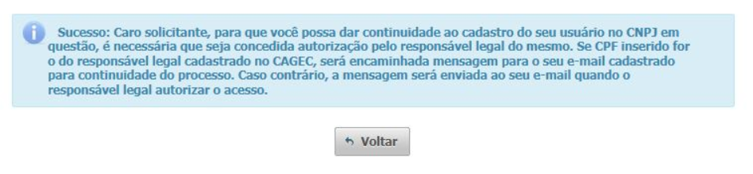
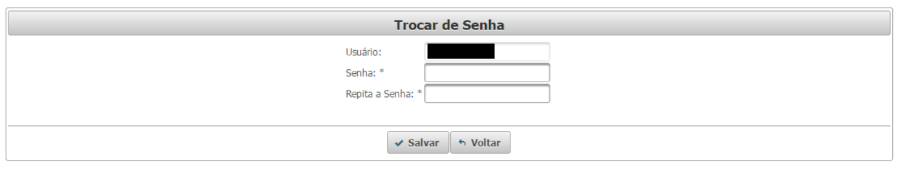

# Indicações de recursos das emendas remanejadas pela Lei nº 3.365/2019

Para indicar os recursos de emenda parlamentar individual remanejadas o usuário deve acessar o menu “Emendas &gt; Gerenciar Indicações &gt; Indicação de Recursos”, conforme a imagem abaixo:

No menu de indicação de recursos são exibidos todos incisos do parlamentar, assim como as informações relativas à unidade orçamentária, à ação, ao grupo de despesa e aos valores disponíveis para indicação. A fim de facilitar a localização de incisos, o usuário pode utilizar os campos de busca no canto direito:

**ATENÇÃO:** neste momento você precisa indicar os incisos do tipo P, caso o mesmo não esteja listado utilize a pesquisa ou a paginação.

**Utilize os campos de pesquisa para agilizar a busca por um determinado inciso.**

**Utilize a paginação para localizar os incisos.**

Para indicar os recursos, o usuário deve clicar sobre o ícone do lápis na coluna “INDICAR”, no canto direito da tabela de incisos. Já a opção de “Expandir Inciso” exibe as indicações realizadas naquele inciso e possibilita o cancelamento de indicações já aprovadas. Há quatro tipos de indicação de recursos, Caixa Escolar, Resolução, Convênio/Parceria e Execução Direta. As opções de indicação de recursos que estarão disponíveis no inciso irão depender da unidade orçamentária, da ação e do grupo de despesa daquele inciso.

## Dos procedimentos e prazos aplicados à execução de programações remanejadas de emendas parlamentares individuais

A Segov realizará, até 13 de setembro de 2019, no módulo de emendas do Sigcon-MG - Módulo Saída, a carga das programações remanejadas, com a identificação do autor, número e inciso da emenda, valor e classificação orçamentária das despesas, bem como disponibilizará o sistema para indicação.

Também será disponibilizado a lista de tipos de aplicação e de atendimento e objetos passíveis de execução orçamentária e financeira de emendas parlamentares individuais pelos órgãos e entidades gestoras e os valores mínimos de indicação, considerando critérios de ordem técnica.

A indicação em ações orçamentárias e tipos de aplicação e de atendimento e objetos não previstos na lista a ser publicada deverá ser alinhada com o órgão e entidade gestora.

  
Prazos específicos para indicações para convênios de saída ou parcerias \(MROSC\):

* Edição completa do tipo de atendimento: 19/10/2019 a 01/11/2019
* Edição apenas da categoria e da especificação: 19/10/2019 a 27/12/2019

## Indicação de Recursos

  
 


A irregularidade no CAGEC ou o bloqueio no SIAFI não impedirão a indicação, mas inviabilizarão o preenchimento de proposta de plano de trabalho pela OSC inadimplente.


1. **Celebração de Instrumento Jurídico \(Convênio ou parceria MROSC\)**

**Disponível = \(valor inciso – Indicados\)**

**Pesquise o convenente pelos campos disponíveis e depois clique em adicionar.**

**Depois de adicionar o convenentes o botão será habilitado para enviar a indicação**

1. **Execução Direta \(Doação\)**

**Pesquise o beneficiário utilizando uns dos campos disponíveis**

**Clique em adicionar o beneficiário**

**Depois de adicionar o beneficiário o botão será habilitado para enviar a indicação**

1. **Execução Direta – Caixa Escolar \(SEE\)**

**Adicione a escola pelo código ou utilize o botão consultar para buscar pelo nome**

**Clique para enviar a indicação**

1. **Resolução SES**

**Pesquise o convenente pelos campos disponíveis e depois clique em adicionar.**

**Depois de adicionar o convenentes o botão será habilitado para enviar a indicação**

## Indicação de Recursos no Período de 28 de setembro de 2019 até 11 de outubro de 2019

A indicação feita nesse período terá duas opções para selecionar o saldo de origem, sendo:

* Saldo para indicação com possibilidade de cancelamento; \(Saldo das indicações canceladas no período de 13/09/2019 até 27/09/2019\)
* Saldo para indicação sem possibilidade de cancelamento

**Saldo com possibilidade de cancelamento**

**Saldo sem possibilidade de cancelamento**

**Disponível = com possibilidade de cancelamento + sem possibilidade de cancelamento**

## Priorização das Indicações do Inciso “P”

A ordem de prioridade das indicações de emendas remanejadas é sequencial e posterior à prioridade das indicações realizadas até 11/03/2019 e sem impedimento de ordem técnica em 09/08/2019.

**Atenção**: período para priorizar as indicações é de 13/09/2019 até 11/10/2019.

**Insira a nova prioridade e clique em salvar**

## Cancelar Indicações

Caso a indicação seja realizada até 27 de setembro de 2019, o autor da emenda poderá cancelar a indicação e realizar nova, conforme seu juízo de conveniência e oportunidade, observado o prazo limite de 11 de outubro de 2019 para a indicação final.

**Aqui você pode pesquisar pelo número do inciso e da indicação**

**Clique no ícone para expandir os incisos**

**Somente é possível cancelar a indicação realizada no período 13/Set a 27/Set de 2019**

## Edição de Tipo de Atendimento

Poderá ser realizado ajuste da categoria e especificação do tipo de atendimento de indicação realizada para formalização de convênio de saída, termo de fomento ou termo de colaboração ou termo aditivo, desde que possua anuência do autor da emenda.

Prazos específicos para indicações para convênios de saída ou parcerias \(MROSC\):

* Edição completa \(gênero, categoria e especificação\): 19/10/2019 a 01/11/2019
* Edição apenas da categoria e da especificação: 19/10/2019 a 27/12/2019

**Clique no ícone para editar a indicação**

Edição completa:

**Edição completa**

Edição da Categoria e Especificação:


  
**Edição da Categoria e Especificação**

