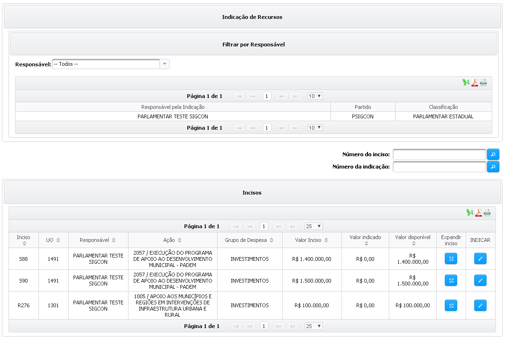

# Cancelar Indicação

O cancelamento da indicação pode ser acessado a partir do menu “Emendas” > “Gerenciar Indicações”> "Indicação de Recursos", conforme a imagem abaixo:

### Na próxima tela serão exibidos todos os incisos do parlamentar ou do bloco caso o mesmo seja responsável um bloco/bancada.


A busca pode ser feita pelo nome do responsável (_1, no lado esquerdo da tela_), por número do inciso ou número da indicação (_2, canto direto da tela_) &#x20;


<figure><figcaption>
Relação de Inciso do Parlamentar
</figcaption></figure>

### **Clique no ícone** .png>) **em expandir inciso**&#x20;


Na próxima tela serão exibidas todas as indicações para o inciso selecionado.


<figure><figcaption></figcaption></figure>

Para cancelar um indicação clica no botão "Cancelar Indicação(ões)" e insira a justificativa conforme imagem abaixo.

