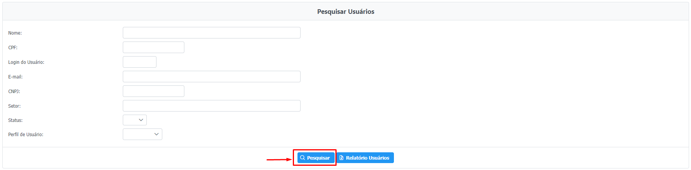

# Execução Direta e Doação de Bens

## Acessando o menu de controle de execução&#x20;

**Para gerenciar os controles de execução o usuário deve acessar o Menu**\
\
`Emendas > Gerenciar Indicações > Controle de Execução`, conforme a imagem abaixo:\

<figure><figcaption></figcaption></figure>

## 1. Cadastrando um novo controle de execução

Para cadastrar um novo controle de execução clique em "Cadastrar Controle de Execução".

<figure><figcaption></figcaption></figure>

**1.1. Preenchimento dos dados básicos - geração automática**

<figure><figcaption></figcaption></figure>

> 1. Selecione o tipo de Indicação: Aplicação Direta - Execução Direta ou Aplicação Direta - Doação de Bens.
> 2. Selecione sim no caso haver Processo de compra ou/e Registro de Preço.
> 3. No caso de haver o registro de preço, preencha o Nº de Planejamento de Registro de Preço e o Ano.
> 4. No caso de haver o nº processo de compra, preencha o Nº de Processo de Compra e o Ano.


Para facilitar o preenchimento dos campos considera-se que o **Número do processo de compra** precisa ter 17 dígitos sendo:&#x20;

* 7 dígitos referentes ao número do unidade executora(U),
* 6 dígitos que referentes ao número do processo(P)
* 4 dígitos referentes ao ano do processo de compra(A)

Exemplo: UUUUUUU PPPPPP AAAA = 1491xxx 0000001 2023

E o **Número de Planejamento de Registro de Preço** sendo:

* 7 dígitos referentes ao número da unidade executora(U),
* 10 dígitos referentes ao número do planejamento sequencial(N)
* 4 dígitos referentes ao ano do processo de compra(A)

Exemplo: UUUUUUU NNNNNNNNNN AAAA = 1021125 0000000366 2020



Ao preencher os dados básicos **não é obrigatório o preenchimento do Número de Planejamento de Registro de Preço e do Número de Processo de Compra**, entretanto **ao preencher esses campos os dados das abas "Processo de Compras" e "Registro de Preços" são automaticamente preenchidos com dados SIAD**


**1.2 Preenchimento do Processo de Compras**

No caso de doação de bens, o preenchimento desta seção é obrigatório. Por outro lado, na execução direta, pode não existir um processo de compra, e, portanto, não será necessário preencher esta seção.

<figure><figcaption></figcaption></figure>

**1.3 Preenchimento do Registro de Preço**

Informar o registro de preço não é um procedimento obrigatório a depender da maneira em que os bens foram adquiridos para execução das indicações. Portanto, nas indicações de execução direta e doação de bens em que não for sinalizado o registro de preço na aba de "dados básicos", esta aba não será disponibilizada para o preenchimento.

<figure><figcaption></figcaption></figure>

**1.4 Preenchimento da Autorização de Fornecimento ou Ordem de Serviço**

<figure><figcaption></figcaption></figure>

**1.5 Preenchimento dos dados do SEI**&#x20;


No caso de doação de bens, essa aba de preenchimento dos dados do SEI terá dois espaços: Nº de Processo SEI Compras e Nº Processo SEI Doação. Já no caso do controle execução ser execução direta terá apenas o espaço para o Nº de Processo SEI Compras.&#x20;


<figure><figcaption></figcaption></figure>

**1.6 Preenchimento dos dados do Empenho**

<figure><figcaption></figcaption></figure>

> * **É possível o cadastro de mais de 1 empenho**
> * **O nº de empenho é obrigatório se o Valor Empenhado for maior que 0.**

**1.7 Vinculação da Indicação**&#x20;

<figure><figcaption></figcaption></figure>

É possível aplicar impedimento de ordem técnica nas indicações em questão. Para fazê-lo, clique na seta para expandir as informações das indicações e selecione o motivo que justifica o impedimento de ordem técnica. É importante ressaltar que as categorias de IOT disponíveis estão especificadas na Lei de Diretrizes Orçamentárias.

<figure><figcaption></figcaption></figure>

Além disso, é possível dar Impedimento de Ordem Técnica em lote, ou seja, selecionar várias indicações e informar o Impedimento de Ordem Técnica:

<figure><figcaption></figcaption></figure>


**Condição para Impedimento de Ordem Técnica (IOT):**

Caso a condição **Valor Utilizado < Valor Indicado** seja atendida, irá gerar Impedimento de Ordem Técnica (IOT), onde será obrigatório a escolha da Justificativa de Ordem Técnica.



**Demais Condições:**

1. Valor Pago ≤ Valor Empenhado
2. Valor Empenhado ≤ Valor Utilizado
3. Uma indicação só pode ser desvinculada se houver pelo menos 2 indicações no mesmo controle de execução.


**1.8 Data de Transmissão do Bem**

<figure><figcaption></figcaption></figure>


A aba de **Data de Transmissão do Bem** estará disponível somente no caso do tipo de indicação for **Aplicação Direta - Doação de bens**


**1.9 Importação de dados em massa (Planilhas em Excel)**&#x20;

A importação de dados surge como uma alternativa ao preenchimento manual das abas.

1.9.1 Faça a escolha no Tipo de Importação a ser realizada: `Empenho ou Indicação`:

<figure><figcaption></figcaption></figure>

**Planilha Empenho:** com essa planilha é possível a importação do nº de empenho e data de registro do empenho para o controle que está sendo editado.

<figure><figcaption></figcaption></figure>

**Planilha Indicação:** com essa planilha é possível a importação do nº de indicação, valor empenhado, valor liquidado, valor pago, valor utilizado, processo SEI e valor executado para o controle que está sendo editado.

<figure><figcaption></figcaption></figure>

1.9.2  Após o preenchimento da planilha, faça o upload da mesma. Clique em `Procurar arquivo` e busque pela planilha a ser importada. Após isso, clique no botão `Importar`. Após a importação clique no Botão `Salvar` do Controle de Execução.

> Instruções para importação dos dados:&#x20;
>
> 1- Escolha o Tipo de Importação: Empenho ou Indicação;&#x20;
>
> 1.1- Dados do Empenho: Número Controle Execução, Número do Empenho e Data de Registro;&#x20;
>
> 1.2- Dados da Indicação: Número Controle Execução, Número da Indicação, Valor Empenhado, Valor Liquidado, Valor Pago; Valor Utilizado;&#x20;
>
> 1.3- Dados da Indicação Doação de Bens: Número Controle Execução, Número da Indicação, Valor Empenhado, Valor Liquidado, Valor Pago; Valor Utilizado; SEI Doação;&#x20;
>
> 1.3.1- O campo 'SEI Doação' pode ser conter números ou números com os caracteres . / - . Ex.: 1111.11.1111111/1111-11 ou 1111111111111111111&#x20;
>
> 1.3.2- Para mais registros SEI, separá-los com espaço. Ex.: 1111.11.1111111/1111-11 1111.11.1111111/1111-55 ou 1111111111111111111 1111111111111111122&#x20;
>
> 2- Realize o download do modelo da planilha para importação;&#x20;
>
> 3- Localize e importe o arquivo com os dados:&#x20;
>
> 3.1- Não alterar o nome e ordem das colunas em destaque na 1ª linha;&#x20;
>
> 3.2- Formato de campos de Valor: 9.999,99;&#x20;
>
> 3.3- Os campos de Data devem estar formatados como tipo Data: Ex.: DD/MM/YYYY;&#x20;
>
> 3.4- Formato do arquivo: Planilha deve ser salva no formato XLSX.

**1.10 Salvar/Enviar Dados**

<figure><figcaption></figcaption></figure>

## 2. Editando controle de execução existente

**2.1 Para gerenciar um controle de execução já existente selecione os filtros.**

**2.2 Clique em pesquisar.**&#x20;

**2.3 Em seguida, clique no ícone** **para editar o controle de execução em questão.**&#x20;

<figure><figcaption>
Tela inicial de Pesquisa do Controle de Execução
</figcaption></figure>

É possível, também, editar apenas os valores do controle de execução clicando em . Nesse caso será aberta a seguinte janela, com o preenchimento simplificado do controle de execução:&#x20;

<figure><figcaption>
Tela de edição de valores do controle de execução
</figcaption></figure>

**2.4 Importação de valores em massa de valores já cadastrados**

Para editar os valores dos controles de execução já cadastrados em massa é possível utilizar a importação em planilha.

2.4.1 O menu de importação estará oculto até que seja selecionado qual o tipo de indicação

<figure><figcaption></figcaption></figure>

2.4.2  Na aba de "Importação de Dados", faça o download da planilha modelo e após o devido preenchimento faça a importação. Siga as orientações destacadas para evitar erros.

<figure><figcaption></figcaption></figure>

> Instruções para importação dos dados:&#x20;
>
> 1 - Tipo de Importação: Indicação;&#x20;
>
> 2 - Dados da Indicação Doação de Bens: Número Controle Execução, Número da Indicação, Valor Empenhado, Valor Liquidado, Valor Pago; Valor Utilizado; SEI Doação; Valor Executado;&#x20;
>
> 2.1 - O campo 'SEI Doação' pode ser conter números ou números com os caracteres . / - . Ex.: 1111.11.1111111/1111-11 ou 1111111111111111111&#x20;
>
> 2.2 - Para mais registros SEI, separá-los com espaço. Ex.: 1111.11.1111111/1111-11 1111.11.1111111/1111-55 ou 1111111111111111111 1111111111111111122&#x20;
>
> 3 - Dados da Indicação Execução Direta: Número Controle Execução, Número da Indicação, Valor Empenhado, Valor Liquidado, Valor Pago; Valor Utilizado; SEI Compras;&#x20;
>
> 3.1 - O campo 'SEI Compras' pode ser conter números ou números com os caracteres . / - . Ex.: 1111.11.1111111/1111-11 ou 1111111111111111111&#x20;
>
> 3.2 - Para mais registros SEI, separá-los com espaço. Ex.: 1111.11.1111111/1111-11 1111.11.1111111/1111-55 ou 1111111111111111111 1111111111111111122&#x20;
>
> 4 - Realize o download do modelo da planilha para importação;&#x20;
>
> 5 - Localize e importe o arquivo com os dados:&#x20;
>
> 5.1 - Não alterar o nome e ordem das colunas em destaque na 1ª linha;&#x20;
>
> 5.2 - Formato de campos de Valor: 9.999,99;&#x20;
>
> 5.3 - Os campos de Data devem estar formatados como tipo Data: Ex.: DD/MM/YYYY;&#x20;
>
> 5.4 - Formato do arquivo: Planilha deve ser salva no formato XLSX.

2.4.3 Após clicar no botão de importação, o sistema realizará o processo e exibirá uma mensagem confirmando o sucesso da importação.

**2.5 Importação de dados em massa do Controle de Execução do Ano Anterior**

Além disso, é possível importar os dados em massa do Controle de Execução do Ano Anterior na página de busca/cadastro de controle de execução, para isso siga as orientações destacadas:

<figure><figcaption></figcaption></figure>

> Instruções para preenchimento da planilha:
>
> * Realize o download e utilize o modelo da planilha para importação;
> * Não alterar o nome e ordem das colunas em destaque na 1ª linha;
> * Só é permitido números nos campos. Ex.: 9999999;
> * O campo 'Número de Planejamento Registro de Preço' deve conter 21 caracteres;
> * O campo 'Ano do Registro de Preço' deve conter 4 caracteres;
> * O campo 'Número do Processo de Compra' deve conter 17 caracteres;
> * O campo 'Ano do Processo de Compra' deve conter 4 caracteres;
> * O campo 'Contrato do Processo de Compra' deve conter 6 ou 7 caracteres;
> * As colunas com asteriscos (\*) são de preenchimento obrigatório;
> * O formato do arquivo da planilha deve ser XLSX.
