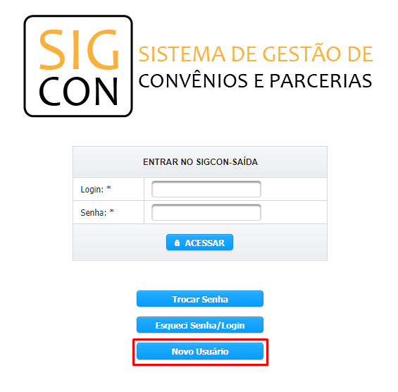

# Aplicação Direta - Execução Direta

A indicação do tipo “Execução Direta” consiste na alocação de recursos da emenda parlamentar para a execução de um determinado objeto pelo próprio Poder Executivo Estadual, como a doação de bens móveis, por exemplo.

**1.**  A indicação de recursos para a Execução Direta é realizada em duas etapas:

&#x20;    a. A **finalidade** na qual os recursos serão aplicados.

&#x20;    b. O **montante** que será indicado.

 (1).png>)


**Para indicação do tipo Aplicação Direta - Execução Direta, o beneficiário será o próprio órgão do inciso.**


**2.** Para Emendas 2021, temos como novidade a seleção da unidade administrativa (formal ou informal)/regional do órgão indicado. Caso o órgão possua mais de 1 unidade administrativa, é necessário informar o destino dos recursos. É possível indicar para mais de unidade administrativa na mesma operação:

.png>)


**Ao selecionar o Tipo de Aplicação, serão exibidos somente os tipos de acordo com o Grupo de Despesas (Outras Despesas Correntes ou Investimento).**



**REGRAS:**

* É possível escolher somente o município da unidade administrativa, caso o mesmo possua mais de 1. Nesse caso, no menu Unidade Administrativa escolha a opção `A SER DEFINIDO PELO ÓRGÃO`.
* É possível deixar a escolha para ser feita pelo órgão. Nesse caso selecione a opção A SER DEFINIDO PELO ÓRGÃO tanto no campo Município Unidade Administrativa quanto no campo Unidade Administrativa.&#x20;
* Os Tipos de Aplicação serão exibidos de acordo com o Grupo de Despesas do Inciso (Outras Despesas Correntes ou Investimento). Não é possível selecionar um Tipo de Aplicação de Investimento para um inciso com grupo de despesas de Outras Despesas Correntes.


**3.** Se houver algum engano ao adicionar uma unidade administrativa, é possível excluir a mesma. Para isso, selecione o registro a ser removido e clique no botão `Excluir`conforme tela abaixo:

.png>)

> O Sigcon-MG-Módulo Saída preenche automaticamente o campo CNPJ com o dado da sede/matriz do órgão indicado.
>
> A destinação do recurso indicado para uma unidade administrativa (formal ou informal)/regional específica, ocorre com a seleção do "nome dessa unidade" no campo "Unidade Administrativa" e o sua localização no campo "Município da Unidade Administrativa".

**4.** Caso haja uma indicação sem os dados preenchidos, o sistema verificará que o preenchimento está incompleto e não permitirá que o usuário salve os dados das demais indicações.&#x20;

**5.** Por outro lado, se o preenchimento for realizado de forma correta, o sistema exibirá uma mensagem de confirmação do envio.

 (1).png>)


A indicação deve ser aprovada pelo órgão em que foi indicada e em seguida pela SEGOV, para somente então ser concluída.


