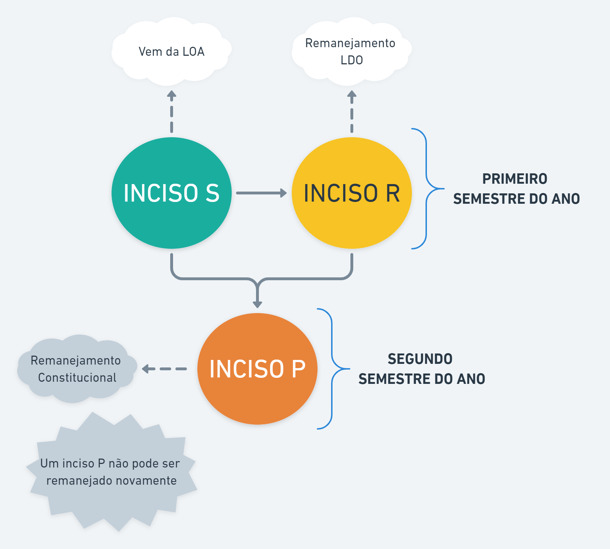

# Indicação de Recursos


**Perfil necessário**

Apenas usuários com o perfil de `“Parlamentar”` (emendas individuais). Para emendas de Bloco é necessário ser o `“Responsável pelo Bloco”`.


Para realizar indicações no SIGCON-SAÍDA, é necessário entender os tipos de inciso existentes. A figura abaixo ilustra as possibilidades.

* INCISO S: Inciso inicial que vem da LOA
* INCISO R: Inciso de remanejamento LDO
* INCISO P: Inciso de remanejamento constitucional; não pode ser remanejado novamente

Para indicar os recursos de emenda parlamentar o usuário deve acessar o menu`Emendas > Gerenciar Indicações > Indicação de Recursos`, conforme a imagem abaixo:

.png>)

No menu de indicação de recursos são exibidos os incisos do parlamentar, assim como as informações relativas à **unidade orçamentária**, à **ação**, ao **grupo de despesa** e aos **valores disponíveis** para indicação.&#x20;

## Indicações Individuais

**1.** A busca pode ser feita pelo nome do responsável (**1**), pelo n**º** do inciso ou nº da indicação (**2**).

 (1).png>)

**2.** Utilize os campos de pesquisa para agilizar a busca por um determinado inciso

## **Indicações Bloco**


Somente o **responsável pelo Bloco** pode fazer a indicação. Os **demais integrantes** podem somente visualizar.



Se o parlamentar for o responsável pelo Bloco na tabela de resultados serão mostrados os incisos do Bloco e do parlamentar.


**1.** O botão de “EXPANDIR INCISO”  exibe as indicações realizadas naquele inciso:

**2.** Para indicar os recursos, o usuário deve clicar sobre o ícone do lápis  na coluna `INDICAR`, no canto direito da tabela de incisos.&#x20;

.png>)


As **formas de execução** que estarão disponíveis no inciso irão depender da **unidade orçamentária**, **ação** e **grupo de despesa** daquele inciso


Formas de Execução:&#x20;

* **Convênios / Parcerias MROSC**
* **Aplicação Direta - Execução Direta**
* **Aplicação Direta - Caixa Escolar**
* **Transferência Fundo a Fundo (Resolução SES)**
* **Aplicação Direta - Doação de Bens**
* **Transferência Especial**
* **Celebração de Outros Instrumentos Jurídicos**

**3.** Como exemplo, após clicar em editar &#x20;

.png>)

**4.** A seguinte tela aparece com as opções permitidas para o inciso S745

 (1).png>)

## Forma de Execução

Dependendo da forma de execução a ser celebrado a indicação segue um procedimento diferente.

Clique no quadro desejado para ser encaminhado para o tipo de instrumento


[celebracao-de-convenio-parceria.md](formas-de-execucao/celebracao-de-convenio-parceria.md)



[aplicacao-direta-doacao-de-bens.md](formas-de-execucao/aplicacao-direta-doacao-de-bens.md)



[resolucao.md](formas-de-execucao/resolucao.md)



[aplicacao-direta-execucao-direta.md](formas-de-execucao/aplicacao-direta-execucao-direta.md)



[aplicacao-direta-caixa-escolar.md](formas-de-execucao/aplicacao-direta-caixa-escolar.md)



[transferencia-especial.md](formas-de-execucao/transferencia-especial.md)


