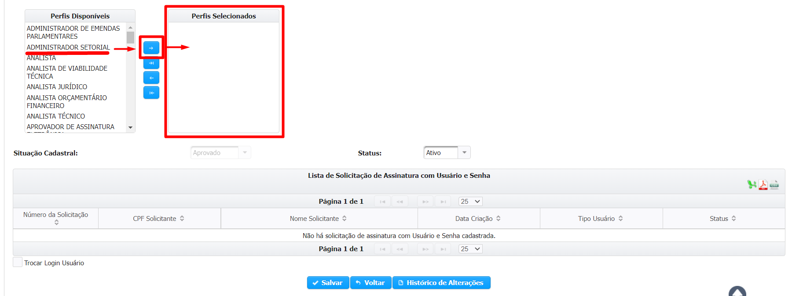

# Liberação de Perfil

## Órgãos

A [Resolução SEGOV nº 437, de maio de 2015](http://www.pesquisalegislativa.mg.gov.br/LegislacaoCompleta.aspx?cod=172293\&marc=) determina que a criação de usuários e gestão de perfis de usuários internos **deverá ser efetuada por cada órgão**.

Nessa perspectiva, cada dirigente máximo deve indicar o Administrador de Segurança do Órgão.&#x20;

Liberações de senha expirada e revogada, concessão de perfis de acesso e criação de usuário no [SIGCON Saída](https://sigconsaida.mg.gov.br/) deverão ser feitos pelo Administrador de Segurança do Órgão.


Para acessar a lista dos administradores de segurança atualizada, clique [**aqui**](https://sigconsaida.mg.gov.br/suporte-administradores-de-seguranca/).


## Representante Legal

O primeiro usuário que deve efetuar o cadastro no SIGCON é o [Representante Legal](liberacao-perfil.md#representante-legal), tendo em vista que é o responsável pela gestão dos usuários. É fundamental que o Representante legal esteja com o cadastro **atualizado** no [Portal CAGEC](https://www.portalcagec.mg.gov.br/).&#x20;

**1.** Acesse o [SIGCON Saída](https://sigconsaida.mg.gov.br/) e clique em `"Entrar"` no canto superior direito da tela inicial:

.png>)

**2**. Como representante legal, informe o usuário e senha e clique em `"Acessar"`:

<figure><figcaption></figcaption></figure>

**3**. Acesse o menu `"Administração > Perfil de Usuário"`


Restrito ao representante legal.


.png>)

**4**. Utilize o filtro de pesquisa para encontrar o usuário desejado e clique em `"Pesquisar"`:

.png>)

**5**. O sistema mostrará os usuários que atendem ao filtro utilizado. Clique no ícone da coluna `"Ação"` correspondente ao usuário desejado:

<figure><figcaption></figcaption></figure>


Além de **APROVAR** e **DAR PERFIL**, utilize essa funcionalidade para gerenciar quais  usuários continuarão a ter permissão no CNPJ.&#x20;


**6**. Confira os dados e inseridos e os campos editáveis:

.png>)

**7**. Selecione o perfil a ser desempenhado pelo usuário em `"Perfil Disponível"` e, com o uso da **seta** central, encaminhe a seleção para o `"Perfil Selecionado"`::


Se for o primeiro cadastro, a Situação Cadastral estará em **ANÁLISE** e o Status **INATIVO**. Portanto **APROVE**, **ATIVE** o usuário e clique em **SALVAR**.



O perfil permitido para liberar o cadastro da proposta é o **CADASTRADOR**.&#x20;


**8**. Todos os Representantes Legais terão sua Assinatura Eletrônica aprovada automaticamente depois de ativos no sistema em razão do seu cadastro no CAGEC:

.png>)


Caso não apareça na `"Lista de Solicitação de Assinatura com Usuário e Senha"`, saia do sistema e entre novamente.&#x20;

Se ainda não aparecer, abra um atendimento e relate em: [**atendimento@sigconsaida.mg.gov.br** ](mailto:atendimento@sigconsaida.mg.gov.br)

