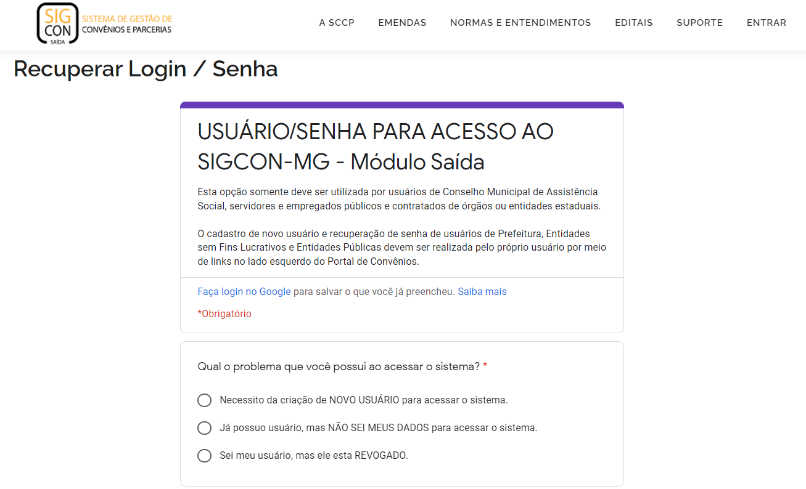

# Recuperar Login e Senha

## Esqueci Senha/Login

1\. Acesse o [SIGCON Saída](https://sigconsaida.mg.gov.br/) e clique em `"Entrar"` no canto superior direito da tela inicial

.png>)

**2.** Clique em `"Esqueci senha/login"`

.png>)

&#x20;**3.** Clique no que deseja recuperar (`"senha"` OU `"login"`)

.png>)

### Parlamentares

**4.** Clique em `"Assembleia Legislativa de Minas Gerais"` (para parlamentares)

**5.** Se tiver selecionado a recuperação do `"login"`, contate o Administrador de Segurança (TI) da Assembleia Legislativa de Minas Gerais

.png>)

**6.** Caso tenha optado por `"senha"`, clique em `"Recuperar senha"`

**7.** Preencha devidamente o formulário

**9.** Preencha o seu usuário, sua senha, a nova senha e a confirmação da nova senha


**Precondição para alterar a senha:**

* Deve ter 6 ou 8 caracteres.
* Deve começar sempre com letras.
* Deve possuir letras e números.
* Não pode possuir vogais.
* Não é possível repetir uma das últimas 16 senhas.

