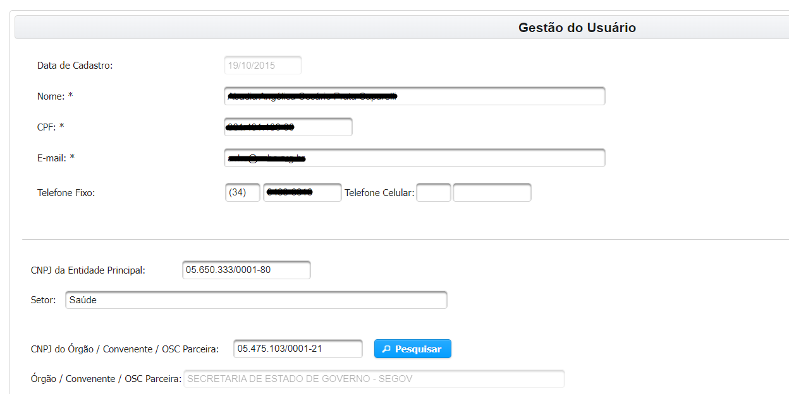
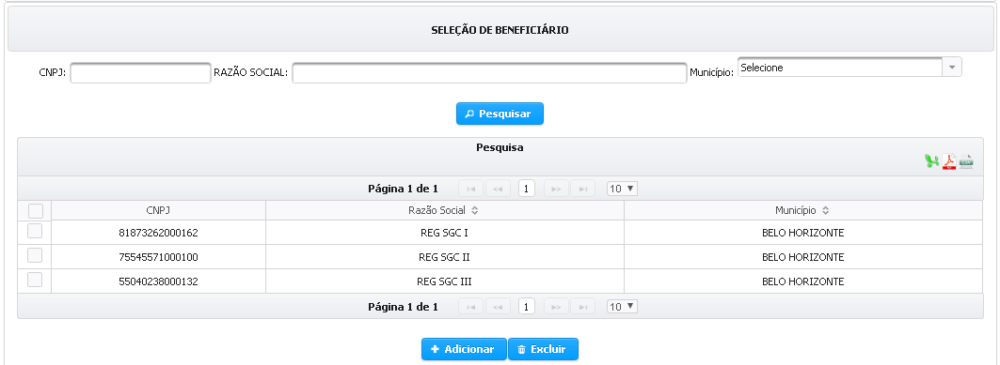
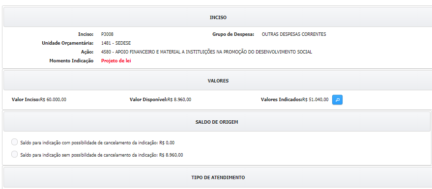
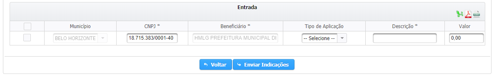
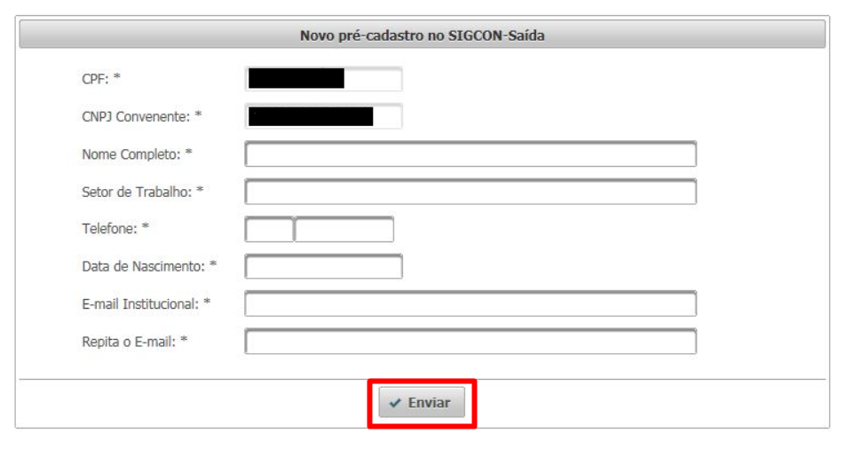
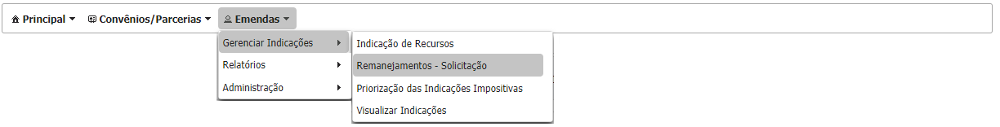
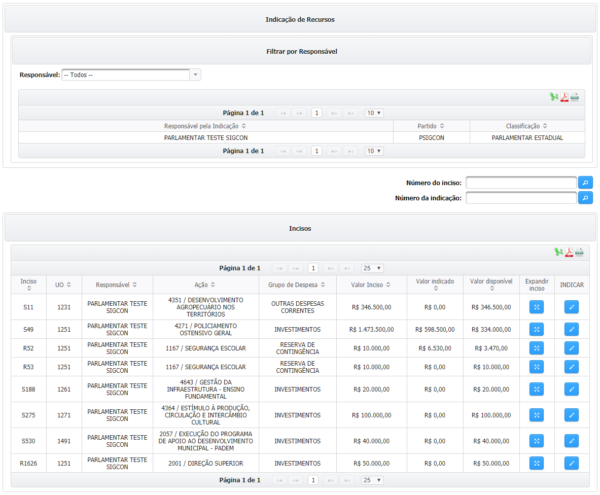
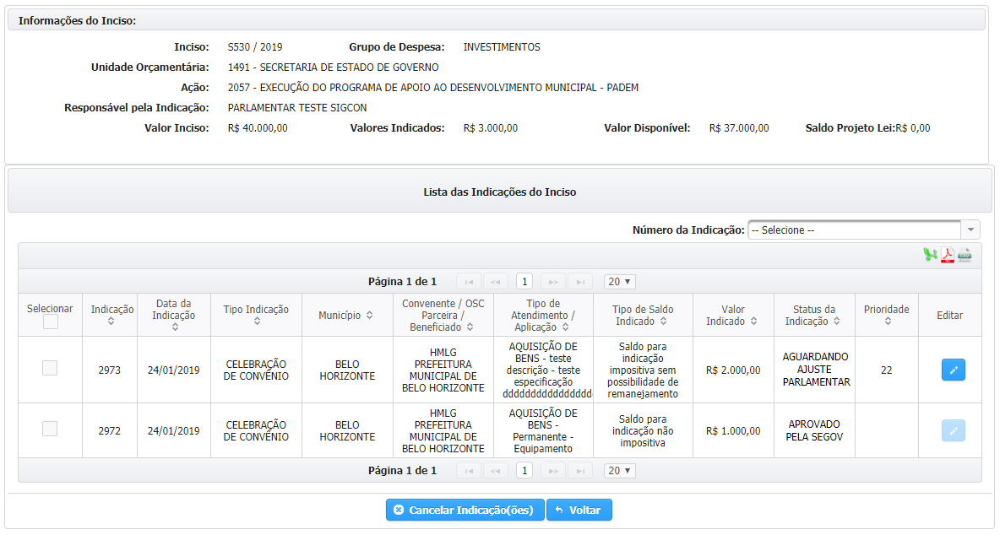
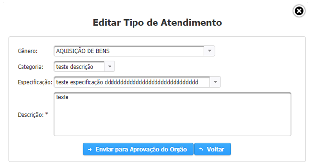

# Indicação de Recursos

Para indicar os recursos de emenda parlamentar o usuário deve acessar o menu “Emendas &gt; Gerenciar Indicações &gt; Indicação de Recursos”, conforme a imagem abaixo:

No menu de indicação de recursos são exibidos os incisos do parlamentar, assim como as informações relativas à unidade orçamentária, à ação, ao grupo de despesa e aos valores disponíveis para indicação. A fim de facilitar a localização de incisos, o usuário pode utilizar os campos de busca no canto direito:

**Utilize os campos de pesquisa para agilizar a busca por um determinado inciso.**

Para indicar os recursos, o usuário deve clicar sobre o ícone do lápis na coluna “INDICAR”, no canto direito da tabela de incisos. Já a opção de “Expandir Inciso” exibe as indicações realizadas naquele inciso e possibilita o cancelamento de indicações já aprovadas.

Há quatro tipos de indicação de recursos, Caixa Escolar, Resolução, Convênio/Parceria e Execução Direta. As opções de indicação de recursos que estarão disponíveis no inciso irão depender unidade orçamentária, da ação e do grupo de despesa daquele inciso.

## Prazos para indicação de recursos de emenda parlamentar individual com execução orçamentária e financeira obrigatória

Em função dos novos prazos e procedimentos estabelecidos pela Lei de Diretrizes Orçamentárias referente ao exercício de 2019 \([Lei 23.086/2018](https://www.almg.gov.br/consulte/legislacao/completa/completa.html?ano=2018&num=23086&tipo=LEI)\) e pela [Resolução SEGOV n° 688/2018](http://www.sigconsaida.mg.gov.br/images/resolucoes/resolucao_segov_688_2018_12_28.pdf), a indicação de recursos de emenda individual passa a ter um período específico em que pode ser solicitado pelos parlamentares para que a execução orçamentária e financeira destes recursos seja obrigatória. A data de solicitação da indicação em relação à publicação da LOA, assim como a data de uma eventual reprovação por impedimento técnico, também afetam a possibilidade de remanejamentos e novas indicações com o saldo da indicação.

Os parlamentares poderão solicitar as indicações após a liberação do SIGCON-SAÍDA, nos termos do art. 38-E, I, da LDO para 2019 e do art. 4°, I, da Resolução SEGOV n° 688/2018. Até o prazo de 30 após a liberação do SIGCON-SAÍDA, o saldo disponível para indicação será o valor do inciso, desconsiderando os valores de remanejamento e indicações que já foram solicitados – mesmo que não tenham sido aprovados ainda. Caso alguma indicação seja reprovada por impedimento técnico durante este período, o seu valor será estornado para o saldo disponível para indicações, permitindo que o usuário solicite novas indicações com ele.

As indicações realizadas em até 30 dias após a liberação do SIGCON-SAÍDA, em caso de reprovação por impedimento técnico após esta data, terão seu valor disponibilizado para novas indicações e remanejamentos. As indicações provenientes do saldo disponível para indicações com possibilidade de remanejamento, caso reprovadas em até 60 dias após a publicação da LOA, terão seu valor retornado para o mesmo saldo de origem, permitindo que o usuário solicite novas indicações e remanejamentos com ele.

Após o prazo de 30 dias da liberação do SIGCON-SAÍDA, o saldo dos incisos que não foi indicado não poderá ser remanejado, mas ainda poderá ser indicado. As indicações provenientes do saldo disponível para indicação sem possibilidade de remanejamento, caso reprovadas por impedimento técnico, será reservado para o projeto de lei a que se refere o art. 160, §8, III da Constituição Estadual, e não será disponibilizado para novas indicações e remanejamentos.

Ao solicitar uma indicação de emenda parlamentar no período compreendido entre o 31° dia após a liberação do SIGCON-SAÍDA e o 60° dia após a publicação da LOA, deverá ser selecionado o saldo que será utilizado para realiza-la, considerando-se a distinção entre os dois tipos descritos acima: com possibilidade de remanejamento e sem possibilidade de remanejamento.

Após o prazo de 60 dias da publicação da LOA não será permitida a indicação de recursos de emenda parlamentar individual com execução orçamentária e financeira obrigatória, e valor de todas as indicações reprovadas por impedimento técnico após esse período será reservado para o projeto de lei a que se refere o art. 160, §8, III da Constituição Estadual. Vale ressaltar que a reprovação por impedimento técnico poderá ocorres mesmo após a aprovação da indicação pela SEGOV, devido à problemas na celebração do instrumento jurídico proveniente da indicação.

Contudo, após o prazo de 60 dias da publicação da LOA já é possível solicitar indicações de emenda parlamentar individual sem execução orçamentária e financeira obrigatória. Portanto, o valor disponível para indicações após 60 dias da publicação da LOA corresponde ao restante dos recursos de emenda parlamentar que não foram indicados até esta data e que por isso já não tem execução orçamentária e financeira obrigatória.

A indicação de recursos de emenda parlamentar sem execução orçamentária e financeira obrigatória dependerá das diretrizes do governo, por isso o botão para enviar as solicitações de indicação ficará, a princípio, desabilitado.

## Indicação de recursos por tipo de instrumento

### **Indicação Instrumento Jurídico**

A indicação de recursos do tipo “Instrumento Jurídico” resultará na disponibilização de recursos para a celebração de convênios ou parcerias entre o Estado, que repassará os recursos indicados pelo parlamentar, e a prefeitura, consórcio ou OSC definidos como beneficiários da indicação, que irão executar o serviço, evento, obra ou aquisição para qual a indicação foi realizada. Antes de selecionar a opção de indicação do tipo “Instrumento Jurídico”, convém verificar no anexo da Resolução SEGOV n° 688/2018 se o mesmo item não está disponível através da opção “Execução Direta”.

A indicação de recursos para a celebração de convênios e parcerias é realizada em três etapas, quais sejam: a definição de como os recursos serão utilizados, quem receberá os recursos, e o montante que será indicado.

A definição de como os recursos serão utilizados é feita através do preenchimento do tipo de atendimento e da descrição do objeto. É importante ressaltar que as opções de preenchimento do tipo de atendimento são exibidas conforme o grupo de despesa do inciso, por exemplo: Se o grupo de despesa do inciso for “Investimentos”, não será possível selecionar a combinação de gênero e categoria como “AQUISIÇÃO DE BENS – Consumo”, pois essa classificação configura uma despesa de custeio.

**As opções disponíveis na escolha do tipo de atendimento variam conforme o grupo de despesa do inciso.**

**As opções de escolha da Categoria variam conforme o Gênero selecionado.**

**As opções de escolha da Especificação variam conforme a Categoria selecionada.**

Para selecionar o beneficiário da indicação de recursos, o usuário pode realizar uma pesquisa pelo CNPJ, pela Razão Social ou pelo Município do convenente ou OSC, os resultados são exibidos na tabela. Para selecionar um beneficiário é necessário marcar a checkbox ao lado esquerdo do CNPJ, inclusive é possível selecionar mais de um beneficiário de uma vez, e em seguida clicar no botão “+ Adicionar”.

**1.Clique em pesquisar após preencher a razão social ou o município do beneficiário da indicação**

**2.Selecione no resultado da pesquisa para quem será indicado os recursos \(pode ser selecionada mais de uma opção\).**

**3.Clique em “Adicionar” para realizar indicações para os beneficiários selecionados**

Os beneficiários adicionados são exibidos na tabela “Entrada”, na qual também são dispostos os dados do tipo de atendimento, e na qual é preenchido o valor da indicação de recursos. Após preencher o valor das indicações é necessário marcar a checkbox e depois clicar em “Enviar Indicações”.

**1. Preencha o valor da indicação**

**Ao clicar sobre os ícones do CAGEC e do SIAFI são exibidas as irregularidades.**

**2.Clique em “Enviar Indicações”.**

O sistema verifica se todas as informações foram preenchidas corretamente e exibe uma mensagem confirmando que a operação foi realizada com sucesso.

A indicação deve ser aprovada pelo órgão em que foi indicada e em seguida pela SEGOV, para somente então ser disponibilizada durante o cadastro de convênios ou parcerias pelo beneficiário da indicação.

### **Indicação Execução Direta**

A indicação do tipo “Execução Direta” consiste na alocação de recursos da emenda parlamentar para a execução de um determinado objeto pelo próprio Estado, como a doação de bens móveis, por exemplo.

A indicação de recursos para a Execução Direta é realizada em três etapas, quais sejam: a escolha de quem receberá os recursos, a finalidade na qual os recursos serão aplicados e o montante que será indicado.

A escolha de quem receberá os recursos é feita através da seleção de beneficiários. Para cada indicação deve ser selecionado apenas um beneficiário.

**1. Preencher o CNPJ, a razão social ou o município do beneficiário**

**2.Clicar em “Pesquisar”.**

É possível selecionar mais de um beneficiário, o que pode ser útil, caso se pretenda cadastrar mais de uma indicação de execução direta naquele inciso para beneficiários do mesmo município, já que isso agiliza a pesquisa.

**1. Selecione os beneficiários.**

**2. Clique em “Adicionar”.**

Os beneficiários adicionados são exibidos na tabela de “Entrada”, na qual devem ser preenchidas as informações relativas à finalidade na qual os recursos serão aplicados e o montante que será indicado para isso.

**1. Selecione o tipo de aplicação. Cuidado para selecionar um tipo de aplicação que não condiz com o grupo de despesa do inciso – na dúvida, consultem a Resolução SEGOV n. 666/2018.**

**2.Preecnha o valor da indicação**

**3.Clique em “Enviar Indicações”.**

Caso haja uma indicação sem os dados preenchidos, o sistema verificará que o preenchimento está incompleto e não permitirá que o usuário salve os dados das demais indicações. Por outro lado, se o preenchimento for realizado de forma correta, o sistema exibirá uma mensagem de confirmação do envio.

A indicação deve ser aprovada pelo órgão em que foi indicada e em seguida pela SEGOV, para somente então ser concluída.

### **Indicação Resolução**

A indicação do tipo “Resolução” consiste na transferência de recursos da emenda parlamentar para um fundo municipal de saúde ou para alguma unidade do sistema de saúde. Devido as suas características, a opção de indicação do tipo “Resolução” só está habilitada caso a unidade orçamentária do inciso seja referente à Secretaria de Estado de Saúde.

A indicação de recursos do tipo “Resolução” é realizada em três etapas, quais sejam: a escolha de quem receberá os recursos, a finalidade na qual os recursos serão aplicados e o montante que será indicado.

A escolha de quem receberá os recursos é feita através da seleção de beneficiários. Para cada indicação deve ser selecionado apenas um beneficiário.

**1. Preencher o CNPJ, a razão social ou o município do beneficiário**

**2.Clicar em “Pesquisar”.**

É possível selecionar mais de um beneficiário, o que pode ser útil, caso se pretenda cadastrar mais de uma indicação de execução direta naquele inciso para beneficiários do mesmo município, já que isso agiliza a pesquisa.

**1. Selecione os beneficiários.**

**2. Clique em “Adicionar”.**

Os beneficiários adicionados são exibidos na tabela de “Entrada”, na qual devem ser preenchidas as informações relativas à finalidade na qual os recursos serão aplicados e o montante que será indicado para isso.

**1. Selecione o tipo de aplicação. Cuidado para selecionar um tipo de aplicação que não condiz com o grupo de despesa do inciso – na dúvida, consultem a Resolução SEGOV n. 688/2018.**

**2.Preecnha o valor da indicação**

**3.Clique em “Enviar Indicações”.**

A indicação deve ser aprovada pelo órgão em que foi indicada e em seguida pela SEGOV, para somente então ser concluída.

### **Indicação Caixa Escolar**

A indicação do tipo “Caixa Escolar” consiste na aplicação dos recursos de emenda parlamentar na gestão de infraestrutura das escolas do ensino médio e fundamental de Minas Gerais. Por esse motivo, essa opção de indicação só estará disponível nos incisos cuja unidade orçamentária for referente à Secretaria de Estado de Educação.

A indicação de recursos do tipo “Caixa Escolar” é realizada em três etapas, quais sejam: a escolha da escola receberá os recursos, como os recursos serão aplicados e o montante que será indicado.

A escolha da escola receberá os recursos é feita pelo preenchimento do código da escola.

**1. Digite o código da escola.**

**Caso o usuário não saiba o código da escola, é possível pesquisa-lo.**

**2.Clique em “Adicionar”.**

Caso o usuário não saiba previamente o código da escola, é possível realizar uma pesquisa através do município.

**1.Digite o nome da escola ou município dela.**

**2.Clique em “Pesquisar”.**

1.Selecione as escolas que serão beneciárias

2.Clique em “Confirmar”.

As escolas selecionadas são exibidas na tabela “Entrada”, na qual deverão ser preenchidas as informações referente ao tipo de aplicação e ao valor de cada indicação**.**

**1.Selecione o tipo de aplicação. Atenção quanto ao grupo de despesa do inciso!**

**2.Preencha o valor da indicação.**

**3.Clique em “Enviar Indicações”.**

### Ajustar indicação

Após o período de 60 dias da publicação da LOA, não será mais permitido a indicação de recursos de emenda parlamentar individual com execução orçamentária e financeira obrigatória. Não obstante, nos termos do art. 38-E, §3°, I, da LDO para o exercício de 2019, caso ocorra algum impedimento de ordem técnica relacionado ao tipo de atendimento da indicação, o órgão poderá retornar a indicação para que o parlamentar proceda com o ajuste necessário.

Assim que o órgão retornar a indicação para ajuste do tipo de atendimento o SIGCON-SAÍDA enviará um e-mail automaticamente para o parlamentar, justificando a necessidade do ajuste. Segue abaixo o modelo do e-mail:

## SECRETARIA DE ESTADO DE GOVERNO - SEGOV

Prezado\(a\) informamos que a indicação nº: 2973, da emenda parlamentar de autoria de PARLAMENTAR TESTE SIGCON, foi retornada para ajuste.

Será permitida, neste momento, somente a modificação do tipo de atendimento, observada a legislação.

Seguem abaixo os dados relativos à indicação correspondente:

* Código de indicação: 2973
* Nº do Inciso / Nº da Emenda: S530 / 175
* Beneficiário: HMLG PREFEITURA MUNICIPAL DE BELO HORIZONTE
* Tipo de indicação: CELEBRAÇÃO DE CONVÊNIO
* Tipo de atendimento / Tipo de aplicação: AQUISIÇÃO DE BENS - Permanente - Equipamento
* Valor: R$ 2.000,00
* Responsável: FERNANDO KATSUMI DE ABREU HADA - [fernando.hada@governo.mg.gov.br](mailto:fernando.hada@governo.mg.gov.br)
* Data/Hora: 24/01/2019 12:00:35
* Justificativa: Tipo de atendimento inadequado em relação ao projeto apresentado pelo convenente

Atenciosamente,

COORDENAÇÃO DO SIGCON-SAÍDA

Para proceder com o ajuste o usuário deve acessar o menu “Emendas &gt; Gerenciar Indicações &gt; Indicação de Recursos”, conforme a imagem abaixo:

Em seguida, o usuário deverá identificar o inciso que contém a indicação a ser ajustada e clicar sobre o ícone para “Expandir Inciso”:

**Clique sobre o ícone “Expandir Inciso”**

O SIGCON-SAÍDA exibirá as indicações cadastradas inciso selecionado, o usuário identificará aquela que necessita ser ajustada pelo status “Aguardando ajuste parlamentar”.

**Clique sobre o ícone “Editar”.**

Após clicar em “Editar”, o sistema exibirá a interface para que o tipo de atendimento seja alterado:

**Clicar em “Enviar para Aprovação do Órgão” após alterar as informações do tipo de atendimento da indicação.**

Após o ajuste da indicação é necessário que o órgão para qual ela foi indicada aprove a alteração.

Vale ressaltar que, conforme o art. 5°, III e VI, da Resolução SEGOV n° 688/2018, o ajuste de indicações deverá ser realizado em até 80 após a publicação da LOA, excetos nos casos em que o ajuste trate apenas da edição da categoria e especificação da indicação, neste caso o ajuste poderá ser realizado em até 110 dias após a publicação da LOA. Ou seja, a funcionalidade de ajuste de indicações estará disponível após 60 dias da publicação da LOA; em até 80 dias da publicação da LOA será permitida a alteração do “Gênero” do tipo de atendimento; no período compreendido entre 81 e 110 dias da publicação da LOA será permitida a alteração somente da categoria e da especificação.

