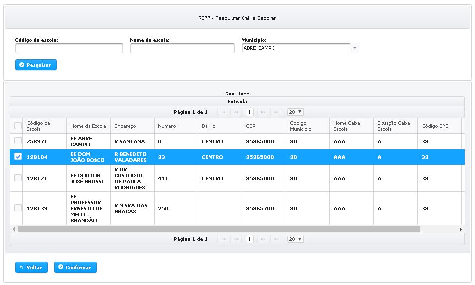

# Indicação Caixa Escolar

### \*\*\*\*

A indicação do tipo “Caixa Escolar” consiste na aplicação dos recursos de emenda parlamentar na gestão de infraestrutura das escolas do ensino médio e fundamental de Minas Gerais. Por esse motivo, essa opção de indicação só estará disponível nos incisos cuja unidade orçamentária for referente à Secretaria de Estado de Educação.

A indicação de recursos do tipo “Caixa Escolar” é realizada em três etapas, quais sejam: a escolha da escola receberá os recursos, como os recursos serão aplicados e o montante que será indicado.

A escolha da escola receberá os recursos é feita pelo preenchimento do código da escola.

**1. Digite o código da escola.**

**Caso o usuário não saiba o código da escola, é possível pesquisa-lo.**

**2.Clique em “Adicionar”.**

Caso o usuário não saiba previamente o código da escola, é possível realizar uma pesquisa através do município.

**1.Digite o nome da escola ou município dela.**

**2.Clique em “Pesquisar”.**

1.Selecione as escolas que serão beneciárias

2.Clique em “Confirmar”.

As escolas selecionadas são exibidas na tabela “Entrada”, na qual deverão ser preenchidas as informações referente ao tipo de aplicação e ao valor de cada indicação**.**

**1.Selecione o tipo de aplicação. Atenção quanto ao grupo de despesa do inciso!**

**2.Preencha o valor da indicação.**

**3.Clique em “Enviar Indicações”.**

