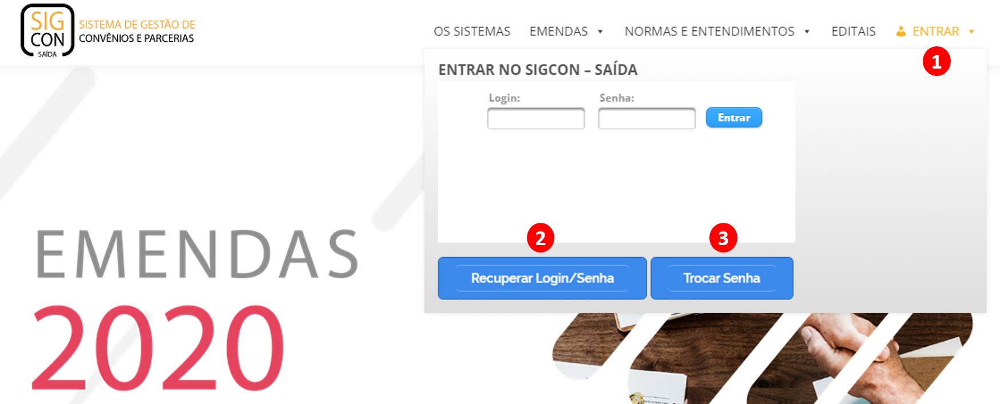
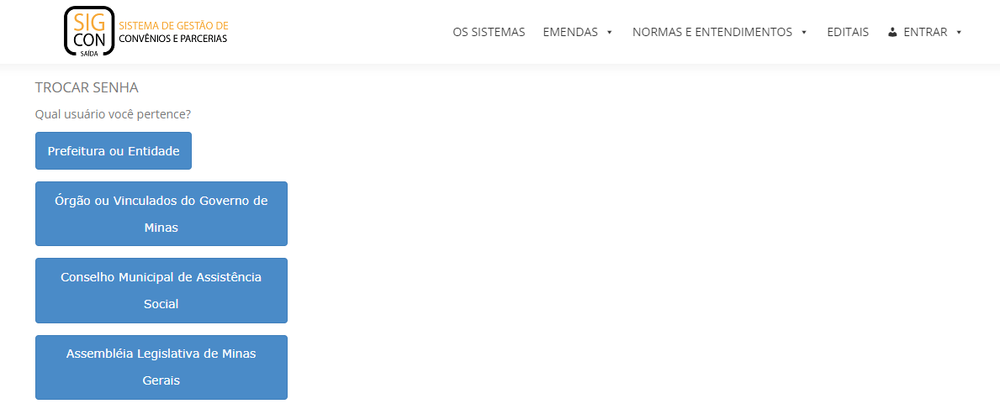
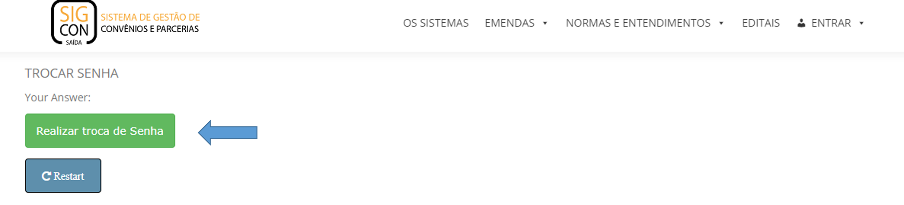
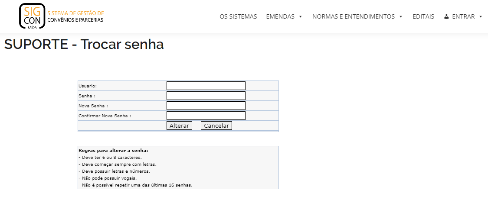

# Cadastro de Usuários - PARLAMENTARES

## CADASTRO NO SIGCON-SAÍDA

> Caso o usuário seja antigo e tenha perdido seu acesso ou a senha revogada, siga para a página de [Recuperação de Senha](recuperar-login-senha-parlamentares.md)

Para ter acesso ao SIGCON – Saída, é necessário primeiramente que o parlamentar ou seus respectivos assessores tenham um registro no **ADSEG \(Sistema de Administração Descentralizada de Segurança\)**. O registro no ADSEG é de responsabilidade do Administrador Setorial de Segurança da ALMG.


Com o registro já efetuado no ADSEG basta entrar no Portal do SIGCON – Saída digitando o login registrado no ADSEG e a senha do mesmo.


Acesse o portal [sigconsaida.mg.gov.br](www.sigconsaida.mg.gov.br) e clique em "ENTRAR" no canto direito da tela.

### 2 - Após ter clicado "Recuperar Login/Senha", você será redirecionado para uma página e deverá selecionar no menu "Preciso solicitar meu cadastro"

Em seguida, selecione a opção "Usuário da Assembleia Legislativa do Governo de Minas"

Então, clique em "Abrir Chamado"

### 3 - Trocar Senha


Na próxima tela escolha qual usuário você pertence.



Clique no botão Realizar troca de Senha



Preencha o Formulário


## ASSOCIAR ASSESSORES

A princípio, somente o usuário do parlamentar poderá solicitar remanejamentos e indicações, bem como acompanhar o andamento das solicitações realizadas no SIGCON-SAÍDA. No entanto, como a delegação dessas tarefas é algo comum, o parlamentar poderá autorizar seus assessores a realizar essas tarefas com o usuário deles no SIGCON-SAÍDA. Dessa forma, o desempenho dessas atividades pode ser realizado sem a necessidade de compartilhar o usuário do parlamentar com diversas pessoas, o que é prejudicial para a segurança das informações.

Primeiramente, é necessário que os assessores estejam cadastrados no SIGCON-SAÍDA. O procedimento para cadastro dos usuários dos assessores no SIGCON-SAÍDA é idêntico ao dos usuários dos parlamentares.

Em seguida, o parlamentar deverá acessar o SIGCON-SAÍDA com o seu usuário e associar o assessor através do menu “Emendas” &gt; “Administração” &gt; “Associar Assessor

Na tela para associar o assessor, o parlamentar deverá preencher o usuário do assessor que será associado, e o sistema verificará se o usuário informado está devidamente cadastrado no SIGCON-SAÍDA. Se o cadastro do usuário do assessor não estiver concluído, será exibida uma mensagem de alerta

Se o usuário do assessor estiver devidamente cadastrado no SIGCON-SAÍDA, o sistema exibirá o nome dele na tela. Por fim, o usuário deverá clicar em “Associar Assessor”.

O sistema exibirá a mensagem de sucesso, e os assessores associados podem ser visualizados na tabela “Assessores Cadastrados”.

