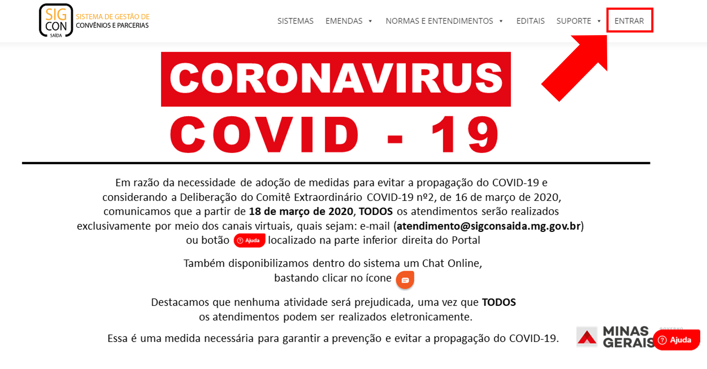
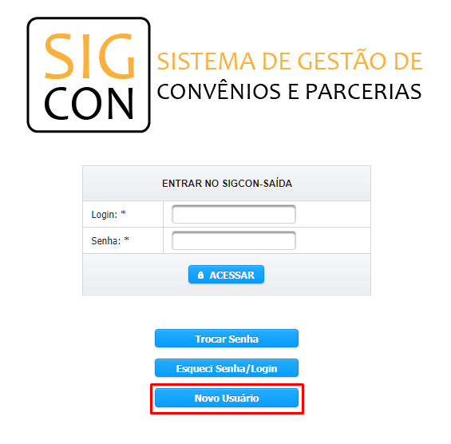
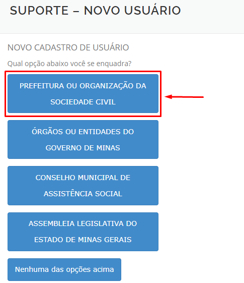
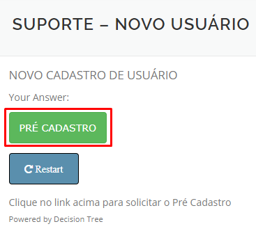
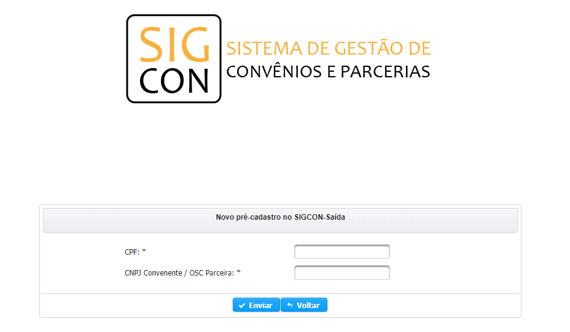

# Novo Usuário

## Opa, é sua primeira vez acessando o SIGCON-Saída? O sistema comporta diversos tipos de usuários. Siga o passo-a-passo que corresponda ao seu tipo de usuário

#### Para acessar os sub-menus dessa página, clique nas opções ao lado direito

## LOGIN CPF

> Usuários que utilizam seu CPF como login pertencem à prefeituras ou OSCs \(Organização da Sociedade Civil\)

**Passo 1 -** O usuário deverá abrir uma nova janela no Google Chrome , Mozilla Firefox  ou Internet Explorer ; Depois disso, deverá digitar na barra de endereço [www.sigconsaida.mg.gov.br](http://www.sigconsaida.mg.gov.br/) e clicar em ENTRAR \(no canto superior direito da tela\)

**Passo 2 -** Depois de ser redirecionado para a página de login, o usuário deverá clicar em  

**Passo 3 -** O usuário deverá clicar em "Prefeituras e Organizações da Sociedade Civil"

**Passo 4 -** Então, o usuário deve clicar em  

**Passo 5 -** O usuário deve preencher os campos corretamente:


O CPF deve ser do usuário e o CNPJ da Prefeitura ou OSC Parceira


**Passo 6** - O usuário receberá um email com o link para criação da senha. Clicar nele: ****

  
****

**Passo 7 -** O usuário deverá digitar sua senha atendendo aos seguintes critérios de segurança:     

> **- Mínimo de 6 caracteres alfanuméricos \(inclui letras maiúscula/minúscula e caracteres especiais\)**
>
>  **- A senha deve conter pelo menos uma letra e um número.**

  
**Passo 8 -**  O usuário deverá repetir a nova senha criada.

**Passo 9 -** Clicar em “Salvar”. 

\*\*\*\*

> **ATENÇÃO:** O login de acesso só é liberado para o usuário após a aprovação do Responsável Legal da entidade. O usuário passará a acessar a nova versão com o NOVO login \(seu CPF\) e com a nova senha criada.

## REPRESENTANTE LEGAL

> Colocar significado


 **ANTES DE SOLICITAR O CADASTRO, CONFIRA SE O CAGEC ESTÁ COM O NOME DO REPRESENTANTE LEGAL ATUALIZADO** [**http://www.cagec.mg.gov.br/convenente-web/consultaParceiros**](http://www.cagec.mg.gov.br/convenente-web/consultaParceiros)\*\*\*\*


**Passo 1** - ****O Prefeito/Representante Legal do convenente deverá abrir uma nova janela no Google Chrome, Mozilla Firefox  ou Internet Explorer 

**Passo 2** - O Prefeito/Representante Legal do convenente deverá digitar na barra de endereço: [http://www.sigconsaida.mg.gov.br](http://www.sigconsaida.mg.gov.br)

**Passo 3** - O Prefeito/Representante Legal do convenente deverá passar o mouse em cima da palavra ENTRAR e clicar em Recuperar Login/Senha:

**Passo 4** - O Prefeito/Representante Legal do convenente deverá clicar em “**Preciso solicitar meu cadastro**”:

**Passo 5** - Clique em "Prefeituras e Organizações da Sociedade Civil":

**Passo 6** - Clique em Pré Cadastro:

**Passo 7** - O Prefeito/Representante Legal do convenente deverá preencher o CPF e CNPJ:

  
**Passo 8** - O Prefeito/Representante Legal do convenente deverá preencher todos os campos \(CPF; CNPJ do convenente; Nome Completo; Setor de Trabalho; Telefone; Data de Nascimento; E-mail Institucional; e Repita o E-mail\). O Prefeito/Representante Legal do convenente deverá clicar em “Enviar”:

**Passo 9** -  Irá aparecer a mensagem abaixo confirmando o cadastro:

  

**Passo 10.** O Prefeito/Representante Legal receberá no e-mail registrado no CAGEC mensagem com o link para a geração de senha pessoal.

**Passo 11.**  O Prefeito/Representante Legal do convenente deverá acessar o e-mail cadastrado no CAGEC.

**Passo 12.**  O Prefeito/Representante Legal do convenente deverá clicar no link contido na mensagem.

**Passo 13.** Será exibida tela com o CPF do Prefeito/Representante Legal como usuário:

  
******Passo 14.**   O Prefeito/Representante Legal do convenente deverá digitar sua senha atendendo aos seguintes critérios de segurança:


 - Mínimo de 6 caracteres alfanuméricos \(inclui letras maiúscula/minúscula e caracteres especiais\) 

- A senha deve conter pelo menos uma letra e um número.


                  ****

**Passo 13.**     O Prefeito/Representante Legal do convenente deverá repetir a nova senha criada.

**Passo 14.**     Clicar em “Salvar”.

> O Prefeito/Representante Legal passará a acessar a nova versão do SIGCON-MG - Módulo Saída com o novo login \(seu CPF\) e com a nova senha criada.

## **ÓRGÃO**

\*\*\*\*

