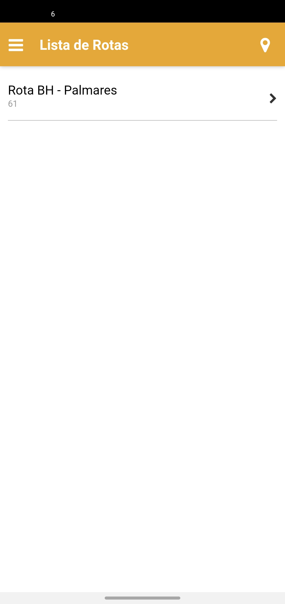
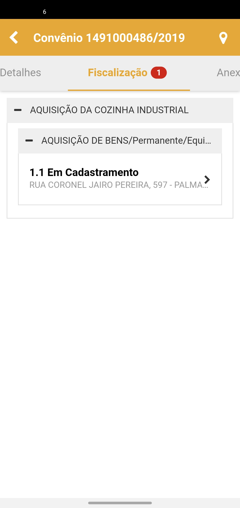
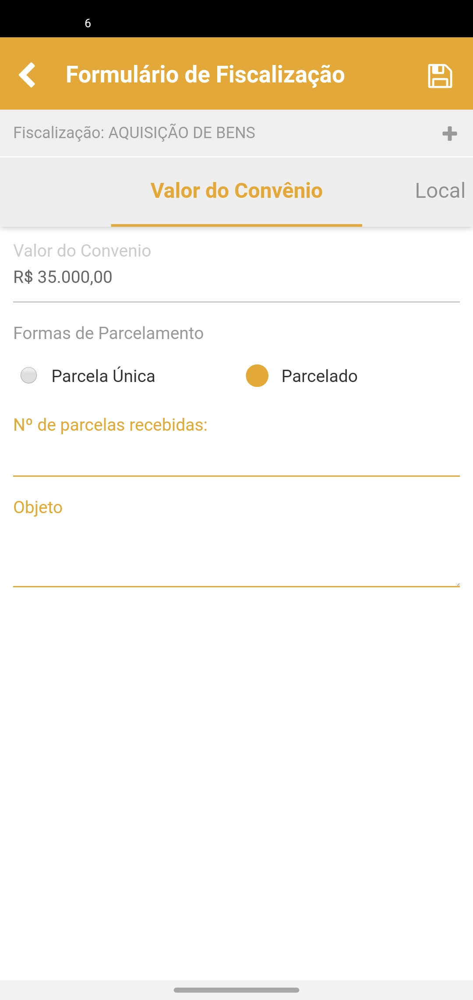
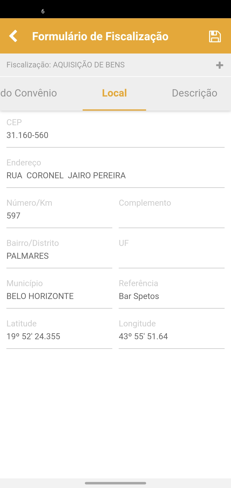
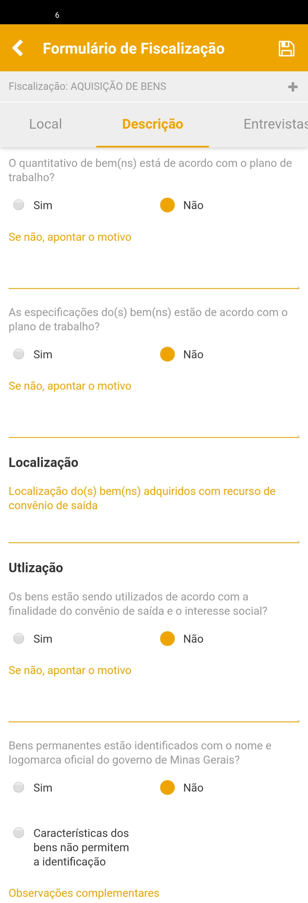
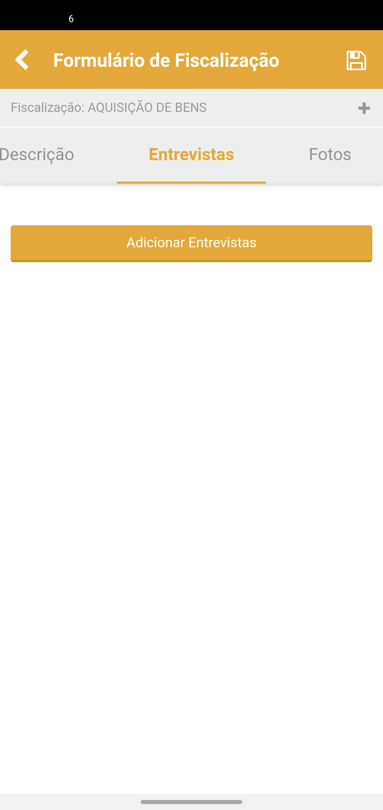
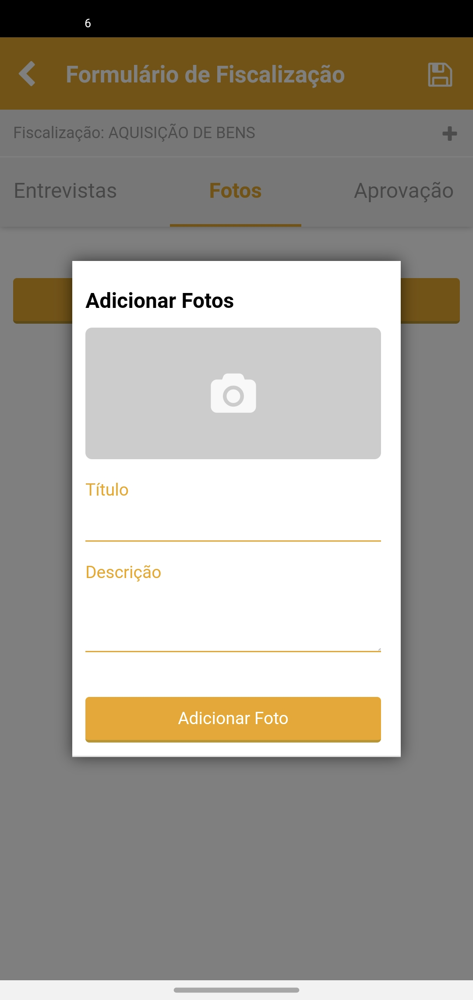
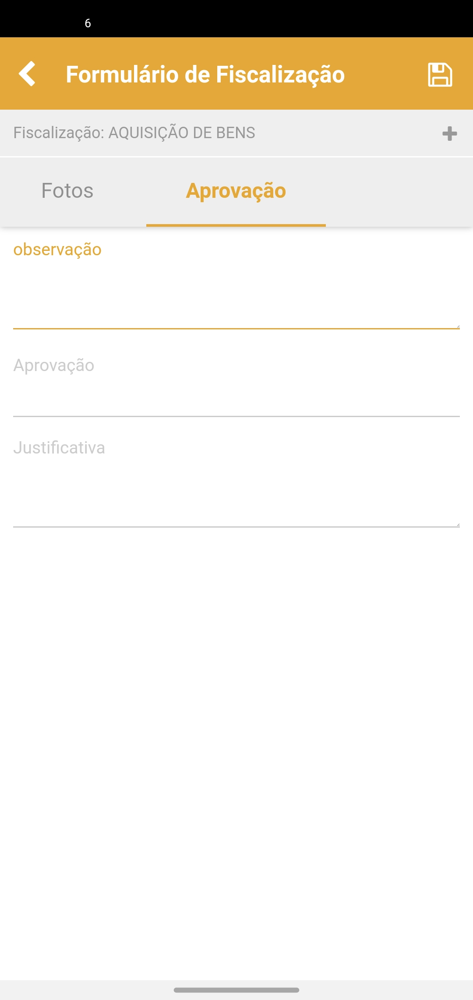
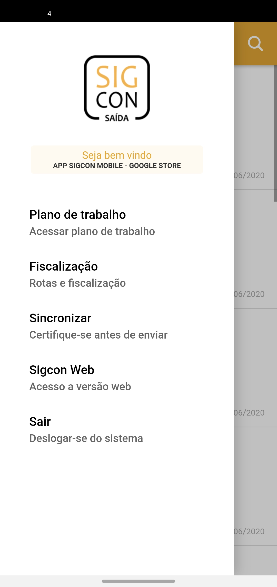
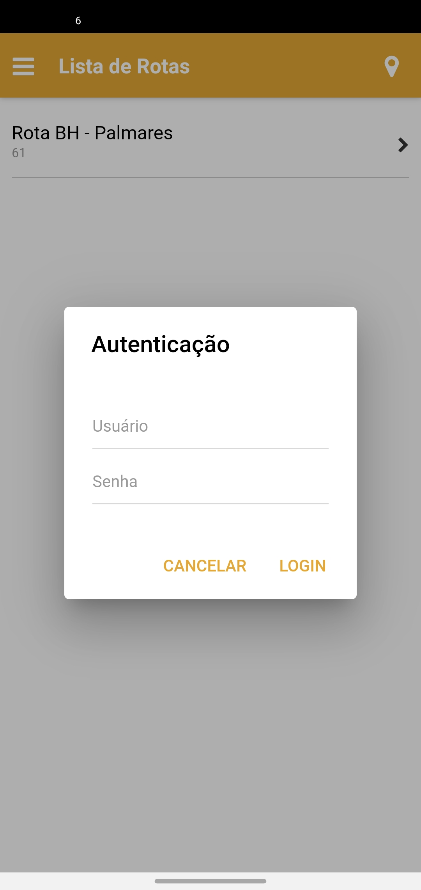

# Fiscalização


**Precondições**

O usuário deverá possuir **rotas para fiscalizar** e possuir o perfil de **Vistoriador** associado a algum órgão na versão web do Sigcon Saída.


#### Para acessar a tela de lista de rotas você precisa clicar no ícone conforme a imagem abaixo:

#### E depois clica no menu Fiscalização

#### Tela lista de rotas

Selecione uma rota para realizar a fiscalização do convênio.

#### Selecione um convênio

#### Na próxima tela será exibido os detalhes do convênio

Na  Aba Fiscalização clique no tipo de atendimento que você deseja fiscalizar

#### Em Valor do Convênio preencha os dados solicitados

#### Na aba Local você pode verificar o endereço que será feito a fiscalização

#### Na Aba Descrição preencha o formulário de fiscalização

#### Na Aba Entrevistas clique no botão para adicionar Entrevistas e no formulário que será aberto preencha os campos conforme solicitado

#### Adicione fotos do local da vistoria na Aba Fotos

#### Na aba Aprovação preencha os campos solicitados e clique no botão salvar no canto superior direito


**IMPORTANTE**

É preciso clicar no botão de **salvar** para que os dados não seja perdidos e depois acessar o menu principal e clicar em sincronizar.


#### Clica em salvar o formulário

#### Para sincronizar acesse o menu 

#### E depois clique no menu sincronizar

#### Na próxima tela insere o seu usuário e senha

