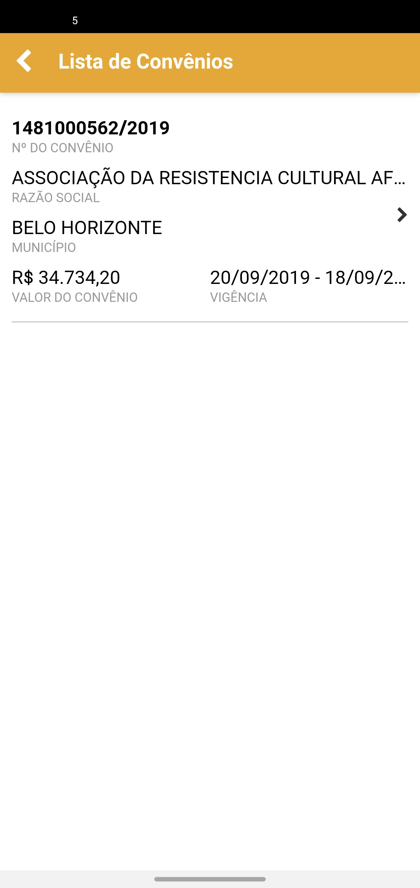

# 🟢 Fiscalização


**Precondições**

O usuário deverá possuir **rotas para fiscalizar** e possuir o perfil de **Vistoriador** associado a algum órgão na versão web do Sigcon Saída.


#### Tela lista de rotas

Selecione uma rota para realizar a fiscalização do convênio.

#### Tela Lista de Convênios

Selecione um convênio

