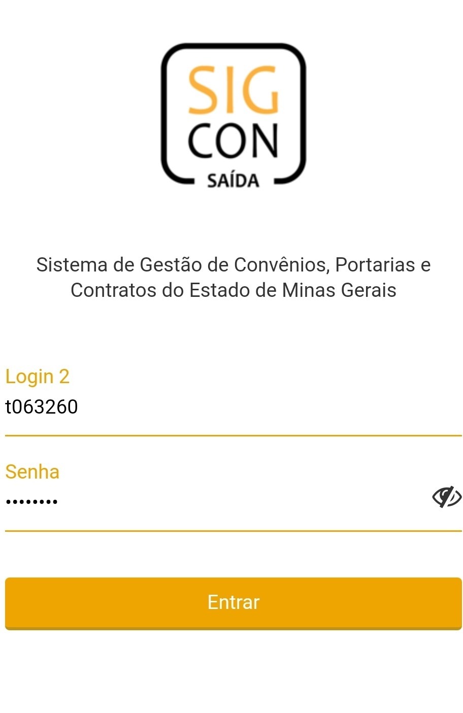

# 🟢 Login


**Precondições**

O usuário deverá ter um Login aprovado e ativo no SIGCON-MG Módulo Saída na versão web.

O usuário deverá possuir Login e Senha do sistema SIGCON-MG Módulo Saída na versão web.

O usuário deverá possuir perfil de **Vistoriador** ou **Coordenador** associado a algum órgão na versão web.

O dispositivo deverá possui conexão com a internet para autenticar e sincronizar.


