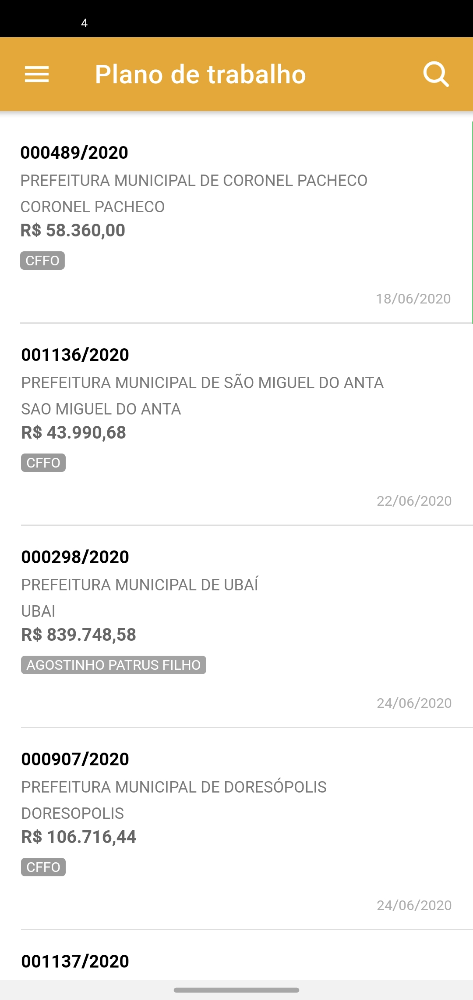
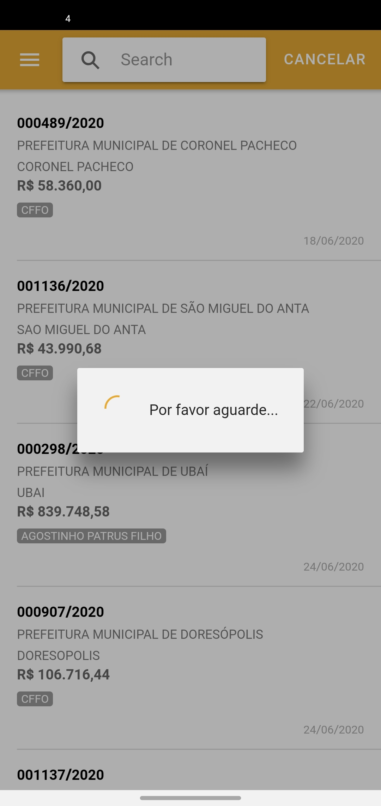
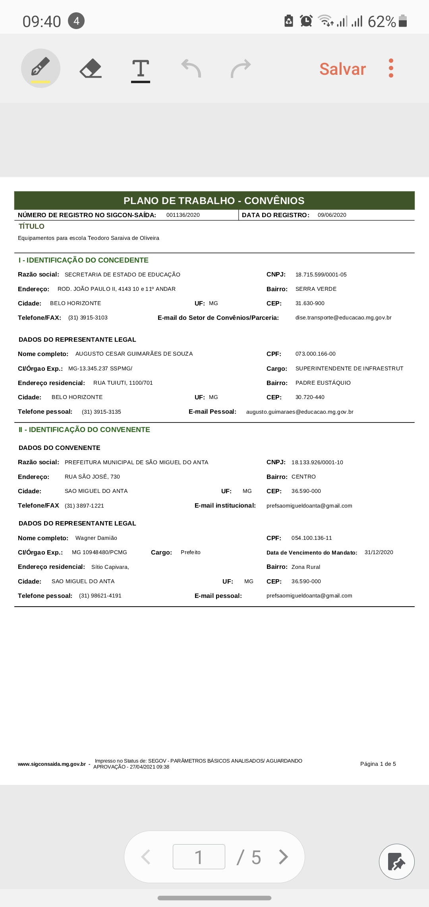
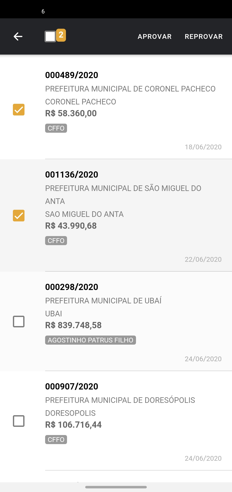
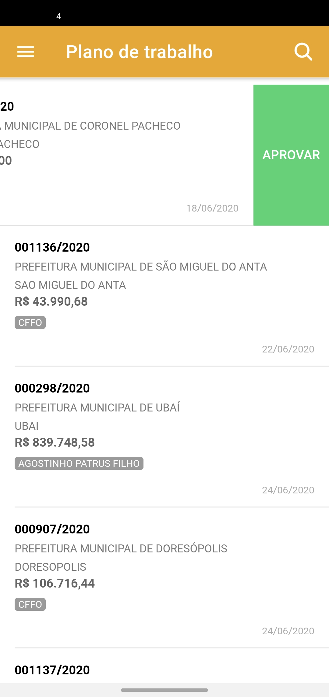

# 🟢 Plano de trabalho


**Precondições**

O SIGCON-MG Módulo Saída precisa ter pelo menos um plano de trabalho cadastrado.


#### O SIGCON-MG Mobile exibe os dados do plano de trabalho

#### Para pesquisar um plano de trabalho clique na lupa e digite o número do plano desejado. Por Exemplo: 000489/2020

#### Gerar relatório do convênio


Para gerar o relatório do convênio, primeiro você precisa clicar no convênio desejado e depois fazer o Download do PDF.


#### Aprovar plano de trabalho

Existe duas formas de Aprovar um plano de trabalho:

1. Pressione o dedo sobre o plano e depois selecione um plano de trabalho e clique no menu APROVAR

2. Deslize o dedo para a esquerda até aparecer o botão verde APROVAR. Clique em aprovar para efetuar a aprovação do plano.

#### Reprovar plano de trabalho

Existe duas formas de Reprovar um plano de trabalho:

1. Pressione o dedo sobre o plano e depois selecione um plano de trabalho e clique no menu REPROVAR

2. Deslize o dedo para a direita até aparecer o botão vermelho REPROVAR. Clique em reprovar para efetuar a reprovação do plano.

