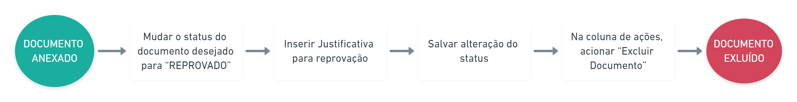

# Excluir documentos

Para excluir documentos da aba de "Documentos Anexados" é necessário que aquele documento seja **REPROVADO** pelo usuário antes de prosseguir com a ação.


**Não poderão ser excluídos os documentos tipo:**

* PROPOSTA DE PLANO DE TRABALHO
* PLANO DE TRABALHO
* ALTERAÇÃO DO INSTRUMENTO
* ANÁLISE TÉCNICA
* ANÁLISE JURÍDICA
* CANCELAMENTO CONVÊNIO
* EQUIPE DE TRABALHO
* IMAGEM DA FISCALIZAÇÃO
* TERMO DE DESIGNAÇÃO DO GESTOR DE PARCERIA
* RESOLUÇÃO PARA DESIGNAÇÃO DE COMISSÃO DE MONITORAMENTO E AVALIAÇÃO
* TERMO ATUAÇÃO EM REDE
* ATO ESPECIFICO DO DIRIGENTE MAXIMO
* PUBLICAÇÃO DO INSTRUMENTO JURÍDICO
* EXTRATO DO INSTRUMENTO GERADO PELO SISTEMA


#### Esses documentos são gerados pelo sistema e para modificar qualquer um deles é necessário fazer isso direto na aba correspondente.


Quando um instrumento passa de fase, **não é possível** mexer nos documentos anexados anteriormente.


## Fluxo para a exclusão dos documentos

**1.** Selecione o documento a ser excluído e na coluna `"Alterar Status"`, selecione a opção "**REPROVADO**"&#x20;

<figure><figcaption></figcaption></figure>

**2.** Clique em `"Justificativa de documento(s) reprovado(s)"` e preencha o campo. Em seguida, clique em `"Salvar justificativa"`&#x20;

<figure><figcaption></figcaption></figure>

<figure><figcaption></figcaption></figure>

**3.** Salve as suas modificações clicando em `"Salvar alterações status"`

<figure><figcaption></figcaption></figure>

**4.** A coluna "Status Atual" o status estará como **"REPROVADO"**.  Em seguida, clique em `"Ações > Excluir documento"` e confirme a exclusão

<figure><figcaption></figcaption></figure>


Se necessário, **atualize** a página para que as alterações sejam apresentadas corretamente.

