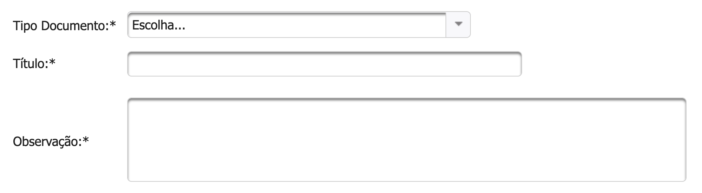

# Documento em Branco

Ao clicar em  selecione a opção de **Documento em Branco.**

1 - Escolha o Tipo de Documento que você carregou


Caso você não encontre o Tipo que deseja, entre em contato com o Concedente que deseja propor ou encaminhar a proposta por e-mail para atendimento@sigconsaida.mg.gov.br.


2 - Dê um Título para o Documento

3 - Caso necessário, você pode adicionar alguma observação ao Documento

4 - Após o preenchimento dos campos obrigatórios clicar em .png>)  e verificar se o sistema exibe mensagem de sucesso.  

5 -  Após exibir a mensagem de Sucesso você já pode voltar ao fluxo anterior que o Documento aparecerá na aba [**Documentos Anexados**](../../convenios/proposta/documentos-anexados.md)****
