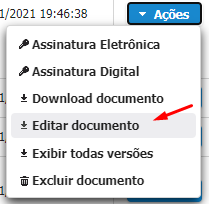
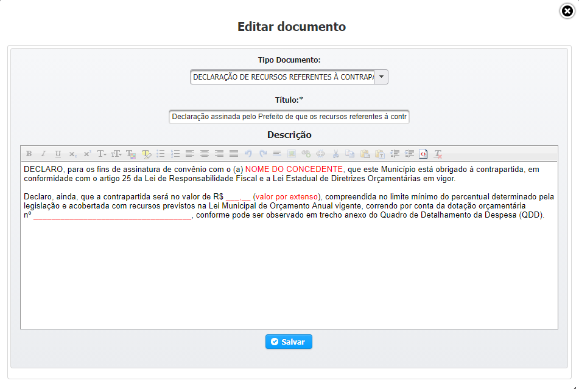

# Documento Modelo

## INSERIR DOCUMENTO DE UM MODELO

Ao clicar em  selecione a opção de **Documento Modelo**

Basta você selecionar o Modelo que deseja que ele será carregado para edição, podendo ser alterado na maneira que desejar.

Após o preenchimento dos campos obrigatórios clicar em  e verificar se o sistema exibe mensagem de sucesso. 

Após exibir a mensagem de Sucesso você já pode voltar ao fluxo anterior que o Documento aparecerá na aba [**Documentos Anexados**](../../convenios/proposta/documentos-anexados.md)**.**

## EDITAR DOCUMENTO MODELO

Para editar um documento modelo inserido basta você localizar o Documento na listagem de documentos anexados, clique no botão de  ****e selecionar **EDITAR DOCUMENTO**  

A janela de editar documento será aberta e você poderá prosseguir com suas edições.

Após realizar as alterações necessárias e clicar em  para salvar suas alterações.

> OBS 1: Somente é permitido **EDITAR** um documento anexado em Proposta quando a mesma encontra-se no Status de **Cadastramento.**
>
> OBS 2: Caso o Documento  tenha sido Assinado \([Assinar Documento](../assinar-documento.md)\) anteriormente, o sistema irá perguntar, ao SALVAR, se você deseja que as Assinaturas sejam Invalidadas;


Sempre que você edita um Documento já Assinado, ele perde as Assinaturas realizadas anteriormente.


## EXCLUIR DOCUMENTO

Caso você deseje excluir um documento, clique no botão de e selecione **Excluir Documento**

Na tela de confirmação, selecione  

Caso a ação seja efetivada, o sistema irá mostrar uma mensagem de excluído com sucesso

