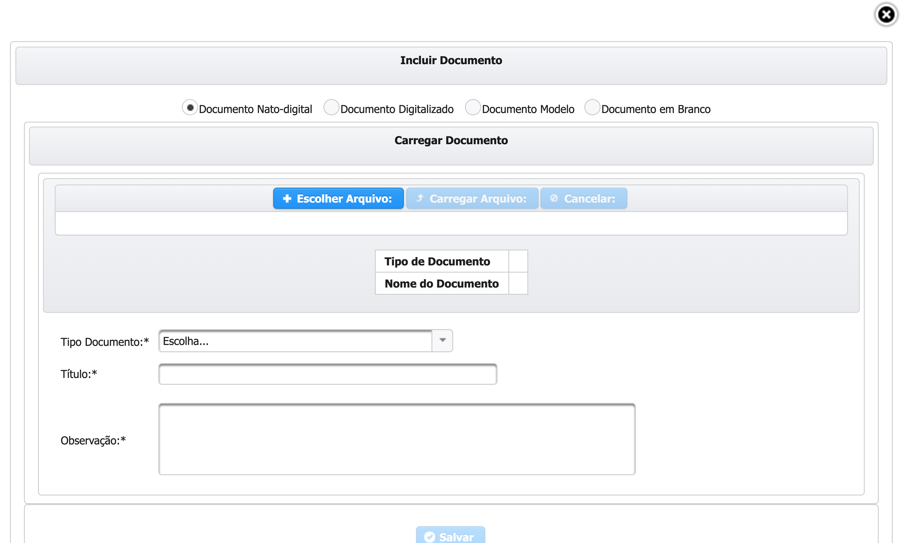
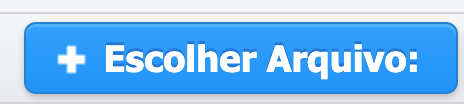
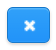
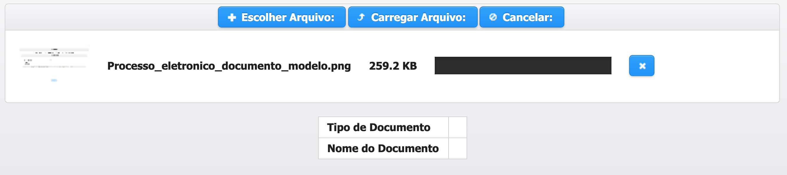
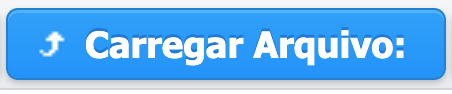
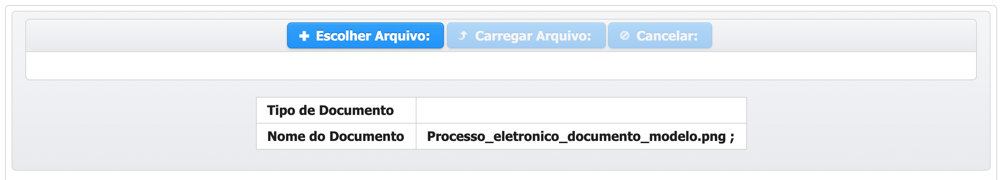

# Documento Nato-Digital

  
Necessário selecionar a opção de **Documento Nato-Digital.**

1 - Clicar em  

2 - Ira abrir uma janela para que você possa escolher o arquivo a ser Carregado.

3 - Após a escolha do arquivo ele sera exibido na página para sua conferência, caso não seja o arquivo que deseja pode ser excluído clicando no ao lado do arquivo.

4 - Clicar em  para que o arquivo possa ser carregado. Para verificar se o arquivo foi carregado corretamente basta ver se em **Nome do Documento** existe o nome do arquivo carregado, veja exemplo na imagem abaixo

5 - Escolher o Tipo de Documento que você esta Carregando, caso você não encontre o Tipo que deseja por gentileza entrar em contato com o Concedente que deseja propor ou encaminhar e-mail para atendimento@sigconsaida.mg.gov.br.

6 - Dê um Título para o Documento.

7 - Caso necessário você pode adicionar alguma observação ao Documento a ser carregado.

8 - Após o preenchimento dos campos obrigatórios clicar em   e verificar se o sistema exibe mensagem de sucesso.  . Após exibir a mensagem de Sucesso você ja pode voltar ao fluxo anterior que o Documento ja aparecerá em **Documentos Anexados.**











