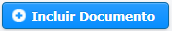
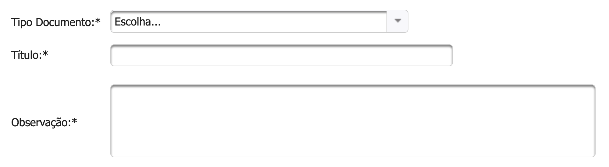

# Documento Nato-Digital

## PASSO-A-PASSO


Para a definição de documento Nato-digital, acesse [aqui](https://manual.sigconsaida.mg.gov.br/processo-eletronico/processo-eletronico#documento-nato-digital)


Ao clicar em  selecione a opção de **Documento Nato-Digital.**

  
1 - Clique em  

2 - Irá abrir uma janela para que você escolha o arquivo a ser carregado.

3 - Após a escolha do arquivo, ele será exibido na página para sua conferência. Caso não seja o arquivo que deseja pode ser excluído clicando no ao lado do arquivo.

4 - Clique em  para que o arquivo possa ser carregado. Para verificar se o arquivo foi carregado corretamente basta ver se em **Nome do Documento** existe o nome do arquivo carregado. Veja um exemplo na imagem abaixo

> Extensões de Documentos aceitos: doc\|docx\|xls\|xlsx\|pdf\|txt\|png\|jpeg
>
> Tamanho máximo do arquivo permitido: 15M

5 - Escolha o Tipo de Documento que você carregou


Caso você não encontre o Tipo que deseja, entre em contato com o Concedente que deseja propor ou encaminhar a proposta por e-mail para atendimento@sigconsaida.mg.gov.br.


6 - Dê um Título para o Documento

7 - Caso necessário, você pode adicionar alguma observação ao Documento

8 - Após o preenchimento dos campos obrigatórios clicar em   e verificar se o sistema exibe mensagem de sucesso.  

9 -  Após exibir a mensagem de Sucesso você já pode voltar ao fluxo anterior que o Documento aparecerá na aba [**Documentos Anexados**](../../convenios/proposta/documentos-anexados.md)**.**

