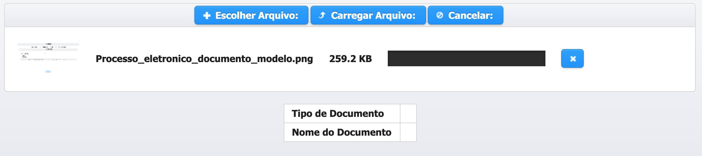

# Inserir documento para peticionar Proposta de Plano de Trabalho


A proposta deve estar no Status de ANÁLISE - CHECKLIST DE CELEBRAÇÃO


**PASSO 1** - Clique em  na parte inferior da Proposta.

**PASSO 2** - Cada íten do check-list tem a opção de inserir os arquivos solicitados, bastando clicar no botão  .

**PASSO 3** - Clique em  

**PASSO 4** - Irá abrir uma janela para que você escolha o arquivo a ser carregado.

**PASSO 5** - Após a escolha do arquivo, ele será exibido na página para sua conferência. Caso não seja o arquivo que deseja pode ser excluído clicando no ao lado do arquivo.

**PASSO 6** - Clique em  ou **UPLOAD** para que o arquivo possa ser carregado. 

**PASSO 7** - Após ter adicionado todos os Documentos Necessários você terá que clicar em na parte inferior do Checklist.

