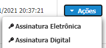
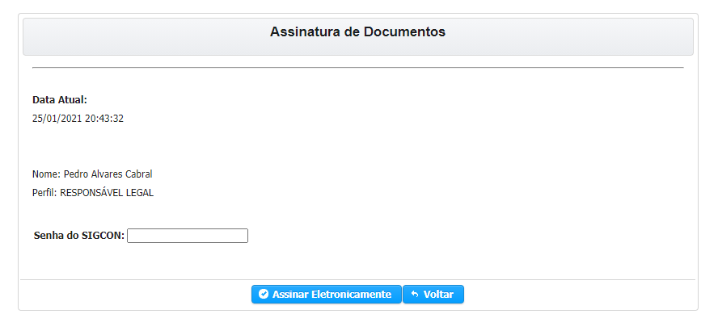
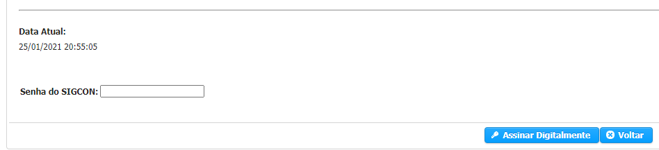
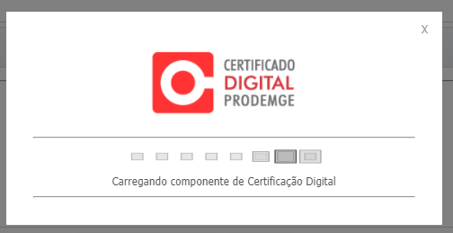

# 🟢 ASSINAR DOCUMENTO

## Assinatura Eletrônica

> A assinatura eletrônica do SIGCON-SAÍDA, é a definida como [Assinatura Eletrônica Avançada](https://manual.sigconsaida.mg.gov.br/processo-eletronico/processo-eletronico#assinatura-eletronica-avancada). Para que você possa utilizar essa modalidade você deve ter permissão \(veja como [Solicitar Assinatura Eletrônica](solicitar-assinatura-login-senha/)\)

PASSO-A-PASSO para assinar documentos 

1 - Selecionar o Documento que você deseja Assinar, clicar no botão de Ações e em seguida **Assinatura Eletrônica.**

Na tela que se abre você deve verificar se é seu nome e o Perfil correto para assinar o documento e digitar sua senha.

Clicar em **ASSINAR ELETRONICAMENTE**.

## ASSINATURA ELETRÔNICA QUALIFICADA \(Token\)

1 - Selecionar o Documento que você deseja Assinar, clicar no botão de Ações e em seguida **Assinatura Digital.**

Você deverá digitar sua senha e clicar em **Assinar Digitalmente**.

Você será solicitado, caso não tenha, a instalação do Componente SIGNA da PRODEMGE. Clicar no link [https://wwws.prodemge.gov.br/suporte/instalacao-token-cartao](https://wwws.prodemge.gov.br/suporte/instalacao-token-cartao) para saber como proceder com a Instalação e Assinatura via Token.

