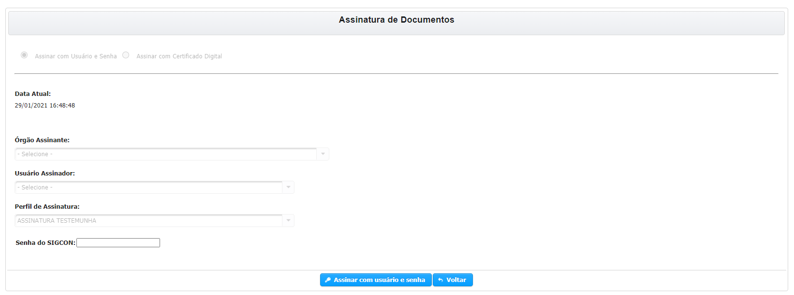

# Assinatura \(Testemunha\)

## ASSINAR COMO TESTEMUNHA


**PRÉ-REQUISITO:** O usuário pode ter qualquer perfil no sistema desde que não seja Responsável Legal do Convenente nem Representante Legal do Concedente.

O usuário também deve ter permissão de Assinar com Login e Senha \([SOLICITAR ASSINATURA LOGIN e SENHA](../solicitar-assinatura-login-senha/)\)


**PASSO 1** - Após entrar no Plano de Trabalho  \(Celebração e Alterações dos Instrumentos\) você deve ir para parte inferior da tela e clicar no botão  .

> Você somente poderá assinar como testemunha apenas uma vez.

**PASSO 2** - Na tela que se abre você deve digitar novamente sua senha e clicar em **ASSINAR COM USUÁRIO E SENHA.**

