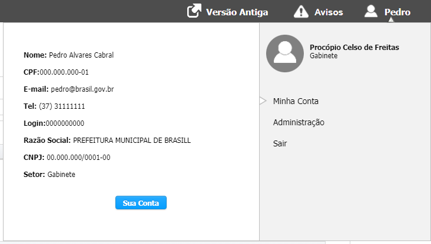
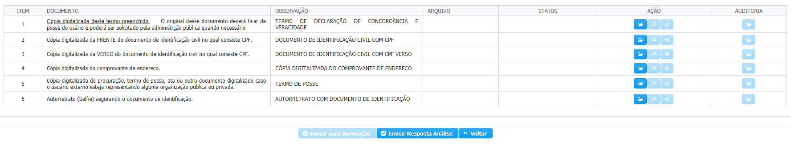

# SOLICITAR ASSINATURA ELETRÔNICA

**PASSO 1 -** Para Solicitar Assinatura eletrônica no SIGCON-Saída você deve clicar no _**Seu Nome**_ localizado na parte superior direita da tela, ir para Minha Conta e clicar no botão de **SUA CONTA**.

**PASSO 2 -** Clique na Aba de Lista solicitação Assinatura Eletrônica e clicar em  


Você deve manter seus dados atualizados.


**PASSO 3 -** Selecione a caixa para solicitar assinatura eletrônica e clique em  

### **PASSO 4 -** Será necessário Anexar os documentos para completar a solicitação.

Para cada um dos itens, siga as orientações

Você necessitará baixar o  que esta no item 1 dos documentos, imprimir o Termo, assiná-lo e anexar através do Botão de Ação do item 1

1. Baixe o **Termo de Declaração de Concordância e veracidade,** imprima o Termo, assine, digitalize e anexe o documento no

**PASSO 5 -** Após ter anexado os documentos você deve clicar em  **Enviar para Aprovação.**

Sua solicitação será encaminhada para análise e aprovação pelo Governo de Minas, bastando você acompanhar pelo e-mail cadastrado no sistema que será encaminhado para você.

Caso a análise seja retornada para 

