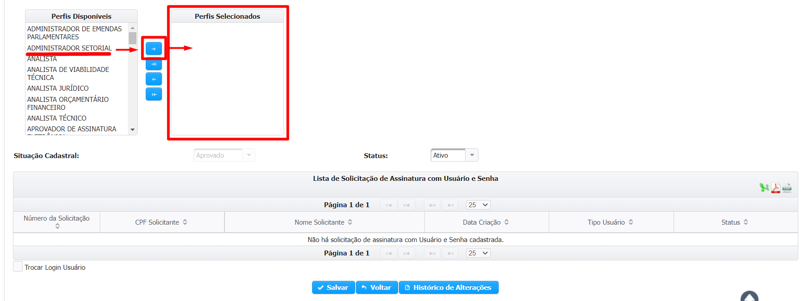

# Propostas saneadoras e reprogramação dos impedimentos de ordem técnica

Após o recebimento das indicações e da respectiva documentação, o Poder Executivo deverá proceder com a análise e, nos casos em que identificar irregularidades que ensejem impedimentos de ordem técnica para a execução da indicação, justifica-los em até 120 dias da publicação da LOA. Nos termos do art. 160, §10, II da Constituição do Estado de Minas Gerais de 1989, após o fim do prazo para a apresentação das justificativas dos impedimentos de ordem técnica pelo Poder Executivo, o Poder Legislativo deverá indicar as propostas saneadoras para os impedimentos identificados ou, se o impedimento for insuperável, solicitar a reprogramação dos recursos.

Da mesma forma que os impedimentos de ordem técnica, a indicação das propostas saneadoras e a reprogramação dos recursos serão realizadas através do SIGCON-SAÍDA. Os impedimentos de ordem identificados pelos órgãos, assim como a diferença entre o valor das indicações e o valor utilizado na celebração dos instrumentos, serão exibidos para que parlamentar apresente as propostas de saneamento ou indique a dotação para remanejamento através de Projeto de Lei.

Além disso, para realizar o saneamento e o remanejamento dos recursos através do Projeto de Lei mencionado no §10º, art. 160 da Constituição do Estado de Minas Gerais de 1989, também é preciso considerar o montante de recursos indicados pelo parlamentar na LOA cuja execução orçamentária e financeira é obrigatória. Conforme o art. 160, §4º da Constituição do Estado de Minas Gerais de 1989, “as emendas individuais apresentadas ao Projeto de Lei do Orçamento Anual serão aprovadas no limite de 1,0% \(um por cento\) da receita corrente líquida prevista no projeto encaminhado pelo Poder Executivo”, não obstante, nos termos do art. 140, I, do ADCT do referido diploma legal, “as programações incluídas por emendas individuais na Lei do Orçamento Anual do exercício de 2019 serão de execução orçamentária e financeira obrigatória em montante correspondente a 0,70% \(zero vírgula setenta por cento\) da receita corrente líquida realizada no exercício anterior”. Depreende-se da leitura das normas supracitadas que o valor previsto na LOA 2019 é diferente do valor cuja execução orçamentária e financeira é obrigatória\*, de modo que é necessário realizar no SIGCON-SAÍDA o ajuste correspondente a diferença entre eles.

\*Execução orçamentária e financeira obrigatória: para facilitar a leitura, iremos nos referir a esse termo como “Impositividade”.

## Adequação do valor orçamentário de execução obrigatória

O valor orçamentário indicado na LOA pelos parlamentares corresponde à aproximadamente R$5.574.448,00, e o valor cuja execução orçamentária e financeira obrigatória corresponde à aproximadamente à R$5.122.313,16. Ou seja, essa diferença no saldo indicado na LOA não será considerada de execução orçamentária e financeira obrigatória. Como será feita a identificação desse valor sem impositividade no SIGCON-SAÍDA?

Primeiramente, há que se verificar se o parlamentar já possui algum saldo indicado na LOA que não possui impositividade, em função do descumprimento do art. 160, §8° da Constituição do Estado de Minas Gerais de 1989 – não encaminhar ao Poder Executivo as indicações referentes às programações incluídas por emendas individuais em até 60 dias após a publicação da LOA. Caso o Parlamentar já possua um saldo de indicação na LOA que não possui mais impositividade, esse saldo deverá ser contabilizado no valor que deverá ser ajustado. Por exemplo:

| \(A\) Valor das emendas na LOA 2019 | R$ 5.522.000,00 |
| :--- | :--- |
| \(B\) Valor com execução obrigatória | R$ 5.100.000,00 |
| \(C\) Valor bruto a ser ajustado \(A - B\) | R$ 422.000,00 |
| \(D\) Saldo sem impositividade \(descumprimento do art. 160, §8°\) | R$ 200.000,00 |
| \(E\) Valor líquido a ser ajustado \(C - D\) | R$ 222.000,00 |

O valor indicado a ser reajustado, cuja execução orçamentária e financeira não será obrigatória, será subtraído do saldo indicado com impedimentos de ordem técnica disponível para saneamento e remanejamento. O saldo de impedimento de ordem técnica deverá ser sanado ou remanejado através de projeto de lei e o montante desse saldo que não for direcionado para nenhuma dessas opções perderá a impositividade, por isso restringir o saldo disponível para saneamento e remanejamento dos parlamentares é, indiretamente, uma forma de retirar a obrigatoriedade de execução de indicações que já foram reprovadas. Esse procedimento atende o disposto art. 160, §§10º e 11º da Constituição Estadual, além de permitir que o parlamentar decida a forma como seus recursos perderão a impositividade \(falaremos mais sobre esse tópico na seção “[Saneamento de Indicações]()”\).

| \(A\) Valor das emendas na LOA 2019 | R$ 5.522.000,00 |
| :--- | :--- |
| \(B\) Valor com execução obrigatória | R$ 5.100.000,00 |
| \(C\) Valor bruto a ser ajustado \(A - B\) | R$ 422.000,00 |
| \(D\) Saldo sem impositividade \(descumprimento do art. 160, §8°\) | R$ 200.000,00 |
| \(E\) Valor líquido a ser ajustado \(C - D\) | R$ 222.000,00 |
| \(F\) Saldo com impedimento de ordem técnica | R$ 300.000,00 |
| \(G\) Saldo com impedimento de ordem técnica disponível para saneamento ou reprogramação \(F – G\) | R$ 78.000,00 |

No entanto, é possível que o Saldo com Impedimento de Ordem Técnica seja inferior ao Valor Líquido a ser Ajustado, nesse caso a restrição do primeiro seria insuficiente para cobrir o montante de recursos que deveria perder a obrigatoriedade de execução orçamentária e financeira:

| \(A\) Valor das emendas na LOA 2019 | R$ 5.522.000,00 |
| :--- | :--- |
| \(B\) Valor com execução obrigatória | R$ 5.100.000,00 |
| \(C\) Valor bruto a ser ajustado \(A - B\) | R$ 422.000,00 |
| \(D\) Saldo sem impositividade \(descumprimento do art. 160, §8°\) | R$ 200.000,00 |
| \(E\) Valor líquido a ser ajustado \(C - D\) | R$ 222.000,00 |
| \(F\) Saldo com impedimento de ordem técnica | R$ 100.000,00 |
| \(G\) Saldo com impedimento de ordem técnica disponível para saneamento ou reprogramação \(F – G\) | R$ - 122.000,00 ?! |

A solução será reprovar uma indicação que não possui impedimento de ordem técnica. Para isso, o parlamentar deverá acessar o SIGCON-SAÍDA, no menu “Emendas &gt; Solucionar Impedimento de Ordem Técnica &gt; Adequação Valor de Execução Orçamentária Obrigatória”.

Na interface de adequação do valor com impositividade é exibido o Limite Constitucional e Valor Total Utilizado das Indicações Aprovadas, que correspondem, respectivamente:

**Limite Constitucional:** Montante de execução orçamentária e financeira obrigatória previsto no § 6º do art. 160 da Constituição do Estado, nos termos previstos no § 4.

**Valor Total Utilizado das Indicações Aprovadas:** Somatório dos valores que não tiveram impedimento de ordem técnica de todas as indicações aprovadas.

Caso o Valor Total Utilizado das Indicações Aprovadas seja superior ao Limite Constitucional, o parlamentar deverá selecionar indicações que estão aprovadas para eliminar essa diferença. O valor das indicações que deverá ser reprovado corresponde ao Valor Mínimo a ser Adequado, e o “Valor Adequado” corresponde ao valor das indicações que o parlamentar selecionou para realizar a reprovação. Importante ressaltar que é possível que o valor das indicações selecionadas para reprovação pelo parlamentar seja um pouco superior ao “Valor Mínimo a Ser Adequado”, essa diferença poderá ser reaproveitada na interface de [Saneamento de Indicações]().

O “Valor Adequado” corresponde às indicações selecionadas pelo parlamentar e pode ser superior ao “Valor Mínimo a Ser Adequado”, a diferença poderá ser reaproveitada pelo Parlamentar.

O usuário seleciona as indicações que serão reprovadas até que o “Valor Mínimo a Ser Adequado” seja atingido, depois disso o sistema restringe a seleção de outras indicações.

Após a seleção das indicações que serão reprovadas, o usuário deverá clicar no comando “Finalizar Adequação”. Depois de executar essa operação o sistema exibirá a relação das indicações selecionadas e exigirá que o usuário confirme a reprovação dessas indicações, informando a impossibilidade de reverter essa decisão depois que ela for concluída. Esse é um ponto importante e afeta diretamente as demais operações referentes ao saldo das indicações com impedimento de ordem técnica, por isso os alertas são exibidos inúmeras vezes nesse processo.

Depois de confirmar a reprovação das indicações o parlamentar já terá realizado a adequação dos valores de emenda parlamentar com impositividade, e essa interface permanecerá disponível apenas para consulta. Em seguida, ele poderá proceder à indicação das propostas saneadoras e a reprogramação das dotações orçamentárias.

Saneamento de Indicações

Conforme mencionado anteriormente, em até 30 dias após o envio das justificativas dos impedimentos de ordem técnica pelo Poder Executivo, o Poder Legislativo deverá indicar as propostas saneadoras para os impedimentos identificados solicitar a reprogramação dos recursos, nos termos do art. 160, §10, II da Constituição. No SIGCON-SAÍDA, esse procedimento só estará disponível se o parlamentar tiver realizado a [adequação dos valores com execução orçamentária e financeira obrigatória](), nos casos em que essa adequação for necessária. Isso feito, os parlamentares deverão acessar o SIGCON-SAÍDA no menu “Emendas &gt; Solucionar Impedimentos de Ordem Técnica &gt; Saneamento”.

Nessa tela será exibido o saldo de impedimento de ordem técnica que o usuário possui para indicar o saneamento ou a reprogramação da dotação orçamentária, bem como as informações por inciso. É importante ressaltar que esse saldo não corresponde ao valor total dos impedimentos de ordem técnica, pois parte desse saldo foi comprometido para atender à adequação do valor com execução orçamentária e financeira obrigatória \(exceto nos casos em que o valor das indicações aprovadas foi superior ao saldo com impositividade e o ajuste foi realizado na [adequação dos valores com execução orçamentária e financeira obrigatória](), ou nos casos em que o parlamentar já possui um saldo sem impositividade superior ao montante que teria que ser ajustado\). Além disso, esse saldo diminui à medida em que o usuário realiza as propostas saneadoras ou indica que fará o remanejamento da programação orçamentária.

**Saldo com impedimento de ordem técnica disponível \(A\) = B – C – D**

**B\)** somatório do valor de todas as indicações com impedimento de ordem técnica, incluídas aquelas cujo valor indicado foi superior ao previsto para execução de seu objeto;

**C\)** valor cuja impositividade teve de ser ajustada em função da diferença entre o valor indicado no orçamento e o percentual estabelecido no art. 140, I, ADCT da Constituição Estadual;

**D\)** valor que já foi sanado ou reprogramado.

A indicação das propostas saneadoras e do montante que será remanejado através do Projeto de Lei será realizada por inciso:

Para definir o saneamento ou a reprogramação das dotações orçamentárias, o usuário deve clicar sobre o ícone na coluna “Ação”.

Em cada inciso será exibido o saldo com impedimento de ordem técnica daquele inciso, bem como o saldo total de impedimento de ordem técnica do parlamentar. Conforme mencionado, saldo total de impedimento de ordem técnica do parlamentar pode ser inferior ao somatório dos impedimentos de ordem técnica dos incisos, pois há um valor com impositividade que teve ser adequado. Dessa forma, o montante disponível para realizar proposta saneadoras ou realizar o remanejamento através do Projeto de Lei, por inciso, será sempre o menor entre esses dois valores.

O usuário pode clicar em “Expandir Inciso” para visualizar mais informações, como o valor do inciso que perdeu a impositividade.

Para apresentar a proposta saneadora de uma indicação: o usuário deverá selecionar a indicação, o sistema exibirá uma mensagem de confirmação e o campo para preenchimento da proposta saneadora que o usuário deverá preencher, em seguida o campo para preenchimento do valor a ser sanado ficará habilitado para preenchimento. O preenchimento das informações só é confirmado depois que o usuário acionar o comando “Salvar”, na parte inferior da tela. Para informar o valor que será remanejado através do Projeto de Lei: basta preencher o valor no campo “Projeto de Lei” e acionar o comando “Salvar”, na parte inferior da tela.

Nesse campo o usuário preencherá a parcela do impedimento de ordem técnica daquele que inciso que será remanejada através do PL.

O usuário deverá selecionar a indicação que deseja sanear, preencher a proposta saneadora e depois preencher o valor que será sanado.

As informações só serão gravadas depois que o usuário clicar sobre o comando “Gravar”.

Ao clicar sobre o status da indicação é possível visualizar o impedimento de ordem técnica dela.

O valor a sanear que será preenchido pelo usuário não poderá ser superior ao valor não utilizado da indicação

**ATENÇÃO:** o parlamentar deve estar atento ao disposto no art. 160, §§ 4° e 6° da Constituição Estadual, segundo o qual 50% dos recursos de emenda parlamentar individual deverão ser executados na Saúde. Caso esse percentual não seja cumprido o SIGCON-SAÍDA impedirá o saneamento das indicações das demais unidades orçamentárias.

Após realizar as etapas descritas acima, o usuário já indicou as propostas saneadoras para as indicações selecionadas e o valor que será remanejado através do Projeto de Lei. No entanto, apesar de já ter informado o valor que será remanejado através do projeto de lei, ainda é preciso informar as dotações orçamentárias para ele. O preenchimento das dotações orçamentárias que serão remanejadas poderá ser realizado na interface de “[Projeto de Lei]()”, para poder realizar esse preenchimento é preciso que o usuário acione o comando “Concluir Saneamento”.

O montante do “Saldo com Impedimento de Ordem Técnica Disponível” para o qual o parlamentar não apresentar proposta saneadora ou apontar que esse recurso será remanejado

É preciso que o usuário clique no comando “Concluir Saneamento” para que possa preencher as dotações orçamentárias do Projeto de Lei.

**ATENÇÃO:** O montante do “Saldo com Impedimento de Ordem Técnica Disponível” para o qual o parlamentar não apresentar proposta saneadora ou apontar que esse recurso será remanejado, no prazo de 150 dias após a publicação da LOA \(9 de Junho de 2019\), perderá a impositividade!

Remanejamento das programações orçamentárias

Após definir o valor que será sanado das indicações com impedimento de ordem técnica e o valor que será remanejado através do projeto de lei, o parlamentar ainda deverá definir para quais dotações orçamentárias o remanejamento será realizado. Para isso, o parlamentar deverá acessar SIGCON-SAÍDA no menu “Emendas &gt; Solucionar Impedimento de Ordem Técnica &gt; Projeto de Lei”:

Nos termos do art. 160, §§ 4° e 6º, da Constituição do Estado de Minas Gerais, 50% das emendas parlamentares individuais deverão ser executadas na Saúde. Dessa forma, as escolhas de saneamento e/ou remanejamento devem respeitar esse percentual. A fim de orientar as escolhas de remanejamento do usuário, nessa tela são exibidos quatro saldos:

**Saldo Projeto de Lei**: é a parcela do saldo com impedimento de ordem técnica para o qual o parlamentar indicou que fará o remanejamento da programação orçamentária, conforme as orientações da seção “Saneamento de Indicações”;

**Saldo disponível Projeto de Lei**: parcela do "Saldo Projeto de Lei" para o qual o parlamentar já informou o remanejamento da dotação orçamentária;

9

**Valor mínimo Saúde Projeto de Lei**: parcela do "Saldo Projeto de Lei" cuja solicitação da reprogramação orçamentária deverá ser feita obrigatoriamente para as Unidades Orçamentárias relacionada à Saúde, a fim de cumprir o disposto no art. 160, §4°, da Constituição Estadual. O cálculo desse campo é realizado pela fórmula: Valor com impositividade \(R$ 5.122.313.16\)/2 – somatório do valor utilizado das indicações aprovadas da Saúde – somatório do valor sanado das indicações da Saúde;

**Valor Saúde Projeto de Lei**: parcela do "Saldo Projeto de Lei" para o qual o parlamentar solicitou a reprogramação da dotação orçamentária para uma das Unidades Orçamentárias da Saúde.

A fim de atender a execução mínima da Saúde, o parlamentar só poderá remanejar para outras Unidades Orçamentárias após realizar o remanejamento para as Unidades Orçamentárias da Saúde no montante correspondente à, no mínimo, o “Valor mínimo Saúde Projeto de Lei”. Assim, até que o remanejamento para as Unidades Orçamentárias da Saúde seja realizado o sistema só exibirá as Unidades Orçamentárias da Saúde para remanejamento.

O campo “Unidade Orçamentária” só exibirá as outras opções após a inclusão das programações orçamentárias com a Unidade Orçamentária da Saúde com o valor correspondente à, no mínimo, o “Valor Mínimo Saúde Projeto de Lei”.

**ATENÇÃO:** mesmo que o usuário tenha apontado quais recursos serão remanejados através do Projeto de Lei, é imprescindível que ele inclua para quais Unidades Orçamentárias esse remanejamento será realizado. Caso contrário, após o encerramento do prazo de 150 dias da publicação da LOA \(9 de junho de 2019\), o montante remanescente do “Saldo Disponível Projeto de Lei” perderá a impositividade, nos termos do art. 160, § 11°, da Constituição Estadual.

Caso o usuário deseje alterar as informações do saneamento e do montante direcionado para o remanejamento, conforme preenchido orientado na [seção anterior](), é necessário que ele clique no comando “Refazer Saneamento”. Contudo, essa opção irá apagar os registros das programações orçamentárias que o usuário já preencheu no remanejamento.

